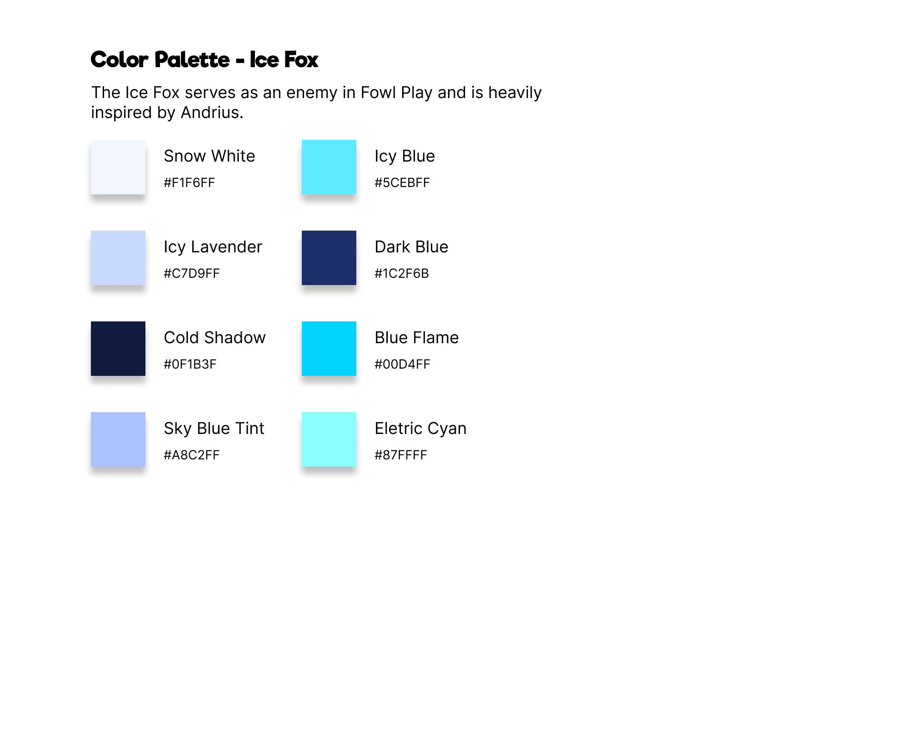

Boreass is a common enemy in Fowl Play and is modeled, textured, rigged and animated in Blender 4.4.0.

### Add-ons

During the creation process, Blender add-ons were used to smoothen the workflow:

1. [Easy Weight Tool][1] – for symmetrical weight painting across mirrored bones
2. [Rigify][2] – for manually adding armature structure
3. [Node Wrangler][3] – to speed up material and shaders

## Model

For most of the body parts, the Mirror Modifier was used, allowing symmetry to be maintained throughout the modeling process, which helped make the workflow both faster and more efficient.

The model of Boreass can be divided into the following sections:

- Body
- Head
- Tail
- Front Legs
- Back Legs
- Eyes
- Ears

The reason for this seperation during modeling was to allow for more precision later on while texturing the model. Since each part was a seperate mesh, it became easier to assign and manage materials individually. It also allowed different UV maps to be applied to specific parts without interfering with others, providing greater control over the final structure layout of Boreass.

## Texturing

The overall vision for Boreass was to give it a snow-like, icy appearance with a mix of white and azure to create that frosty aesthetic. A custom color palette was created as a reference, which proved helpful during the texturing process.

### UVs

For each individual mesh, a UV map was created. This provided greater control during texturing, allowing materials and shaders to align properly with the model's geometry.

### Shaders

Instead of manually texture painting the look of the model, shaders were used to generate the base colors and visual details. This method allowed for a more procedural approach, offering flexibility to adjust the appearance of each part of the model quickly and non-destructively.

### Baking

Since the shaders were only visible inside Blender, they were baked onto a new image texture. This process preserved the visual look of the shaders and enabled exporting them as standard textures. The baked image was then used as a material and applied to the previously unwrapped UVs, allowing the shader details to be retained even outside of Blender.

## Rigging

The rigging for Boreass was done manually. Since the model isn’t a humanoid character, automatic rigging tools like Mixamo weren’t suitable. The armature bones were added individually, aligning them with the reference image.

### Bone Hierachy

| Level | Parent Bone              | Child Bones                                     |
| ----- | ------------------------ | ----------------------------------------------- |
| 0     | **Pelvis** (Root)        | Spine_1, Tail_1, Back_Hip_Left, Back_Hip_Right  |
| 1     | **Spine_1**              | Spine_2                                         |
| 2     | **Spine_2**              | Neck, Front_Shoulder_Left, Front_Shoulder_Right |
| 3     | **Neck**                 | Head                                            |
| 3     | **Front_Shoulder_Left**  | Front_UpperArm_Left                             |
| 4     | **Front_UpperArm_Left**  | Front_Forearm_Left                              |
| 5     | **Front_Forearm_Left**   | Front_Wrist_Left                                |
| 6     | **Front_Wrist_Left**     | Front_Paw_Left                                  |
| 3     | **Front_Shoulder_Right** | Front_UpperArm_Right                            |
| 4     | **Front_UpperArm_Right** | Front_Forearm_Right                             |
| 5     | **Front_Forearm_Right**  | Front_Wrist_Right                               |
| 6     | **Front_Wrist_Right**    | Front_Paw_Right                                 |
| 1     | **Tail_1**               | Tail_2                                          |
| 2     | **Tail_2**               | Tail_3                                          |
| 1     | **Back_Hip_Left**        | Back_Thigh_Left                                 |
| 2     | **Back_Thigh_Left**      | Back_Shank_Left                                 |
| 3     | **Back_Shank_Left**      | Back_Paw_Left                                   |
| 1     | **Back_Hip_Right**       | Back_Thigh_Right                                |
| 2     | **Back_Thigh_Right**     | Back_Shank_Right                                |
| 3     | **Back_Shank_Right**     | Back_Paw_Right                                  |

### Anatomy

Since Boreass is a fast-moving enemy in the game, its rig was designed to match the anatomy of a real fox. This was important for creating smooth and natural animations — especially since the character would be extremely agile, with fluid running and attacking motions.

### Inverse Kinematics

During the rigging process, while testing how the rig behaved, there were a couple problems with the limbs not aligning properly. To fix this problem, Inverse Kinematics were used, as it allowed for more control of the position and rotation of the bones more efficiently. This technique was essential for the particular model that was being creating, as it ensures smooth and natural movement.

To further refine the rig, a Pole Target was added, which acts as a guide to control the rotation of the limbs, ensuring they remained properly oriented as the character moved.

## Animations

All animations are set to run at 30 FPS, with the exception of Walk and Sprint, which run at 24 FPS.

### Idle

### Jump

### Fall

### Dash

### Walk

### Sprint

[1]: https://extensions.blender.org/add-ons/easyweight/
[2]: https://docs.blender.org/manual/en/latest/addons/rigging/rigify/index.html
[3]: https://docs.blender.org/manual/en/latest/addons/node/node_wrangler.html
