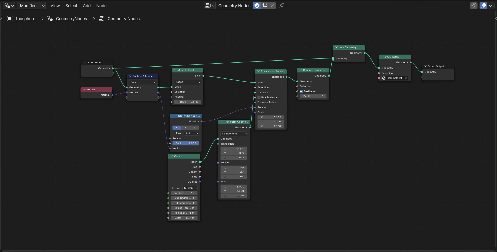

Environmental Hazards are designed to increase the strategtic depth of combat encounters in Fowl Play. Their purpose is to encourage players to navigate the arena carefully, avoiding hazards while simultaneously engaging in combat with the enemy.

Since the arena in Fowl Play has a grim, bloody, sewer-like aesthetic, all environmental hazards are textured with rusted metal, dark colors, and splashes of blood to reinforce this atmosphere during gameplay.

**All models for the Environmental Hazards are made in Blender 4.4.0**

## UV

Before starting with shading or texturing, it is important to unwrap the UVs of any models onto a new 2D image. This will later help in applying the correct material. UV unwrapping was done using Blender's **Smart UV Project**, which saved time compared to doing it manually. The following values were used while UV unwrapping:

| Setting            | Value                          |
|--------------------|--------------------------------|
| Angle Limit        | 66 degrees                     |
| Margin Method      | Scaled                         |
| Rotation Method    | Axis-aligned (vertical)        |
| Island Margin      | 0.050                          |
| Area Weight        | 0.000                          |
| Correct Aspect     | Checked                        |
| Scale to Bounds    | Unchecked                      |

## Shading

Majority of shading of environmental hazards were done using Blender's **Principled BSDF** shader, which allows for a realistic representation of materials. The reason for choosing this shader is that it combines different shading techniques into one, making it very flexible and easy to use. 

## Texturing

For all environmental hazards, the texturing process involved using Blender's **Bake** functionality to transfer the shading onto a new image texture. This texture was then applied as a material to each hazard model. Slight modifications to the UV unwrap texturing were made as needed for each model, ensuring that the final texture captured the desired look for all hazards in the game.

## Regular Spike

Spikes are a very straightforward hazard in the game and their purpose is to make players think twice before crossing them. They cause both the player and enemy to take a set amount of damage each time they stand on them while the spikes are in their attacking state.

With this in mind, while modeling the spikes, we deliberately chose to keep them slightly detached from the base, allowing for an animation where they retract and extend at fixed intervals.

### Array Modifier

To maintain a non-destructive workflow, two **Array Modifiers** were used to duplicate the spikes along both the X and Y axes in Blender. This allowed for efficient placement by automatically filling the grid with a consistent relative offset, reducing the time needed to manually position each spike on the base.

## Ground Saw

The ground saw is an environmental hazard that continuously rotates in the game and applies damage over time. For this reason, the idea was to add textures that resemble some sort of blood or poisoning to the saw itself, indicating that it is a hazard that can deal gradual damage over a set duration.

### Mirror Modifier

While modeling the ground saw, the **Mirror Modifier** was used to maintain symmetry on both sides of the model, allowing for efficient and consistent modeling.

### Subdivision Surface Modifier

To make the ground saw model less jagged and more rounded, the **Subdivision Surface Modifier** was used to smooth the shape. It adds extra detail to the geometry, softening hard edges for a cleaner finish.

## Spike Ball

We wanted to introduce another environmental hazard with a different impact on the game. While the first two hazards are mainly focused on dealing damage, the spike ball not only deals damage, but also applies knockback upon contact. To enhance this, we added a swinging animation to the spike ball, where it swings continuously from point A to point B.

For the design of the spike ball, we chose to create very sharp spikes attached to a ball held by chains. Typically, this environmental hazard is suspended from the ceiling, forcing the player to move carefully to avoid it. Getting hit by the spike ball's knockback can also reposition the player, adding an additional challenge to navigation.

### Subdivision Surface Modifier

To achieve a smoother and more refined look for the chains holding the spike ball, the **Subdivision Surface Modifier** was applied. This helped soften any harsh edges, making the chains appear more polished and fluid.

### Array Modifier

By applying the **Array Modifier**, multiple chains holding the spike ball were quickly duplicated. This approach saved time by automatically generating the chains, ensuring consistency and reducing the need to manually add each one.

### Geometry Nodes

To make the spikes pop out of the Icosphere, we used **Geometry Nodes**. This allowed us to control where and how the spikes are placed on the Icosphere. By using nodes, we could evenly space and rotate the spikes around the ball without manually positioning each one.

Geometry Nodes also made it easy to adjust the number, angle, and spacing of the spikes, allowing for quick changes during the design process.

