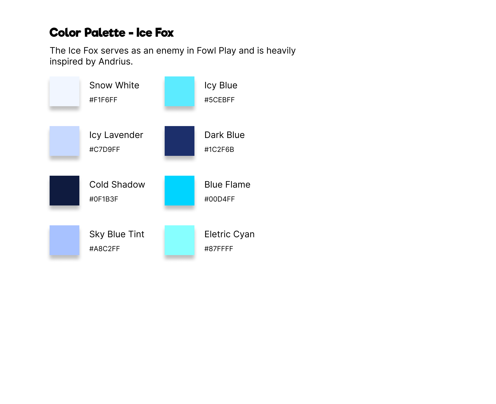
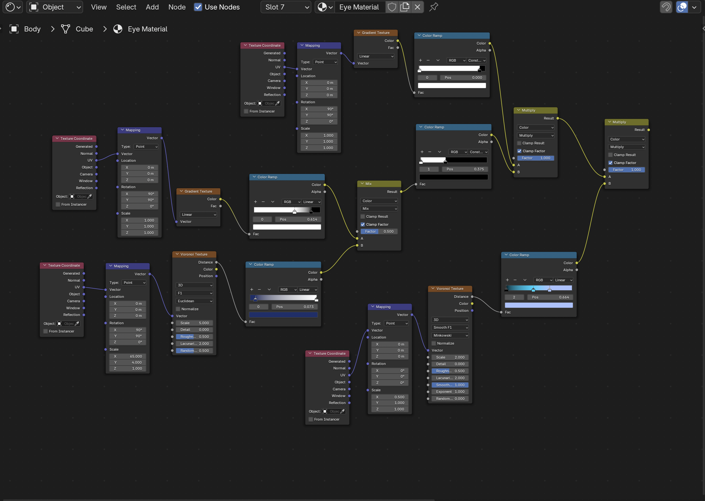
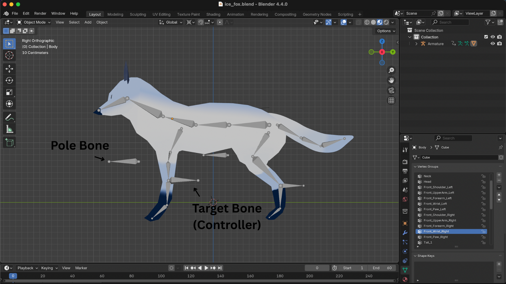

The Ice Fox is a common enemy in Fowl Play and is modeled, textured, rigged and animated in Blender 4.4.0.

### Add-ons

During the creation process, Blender add-ons were used to smoothen the workflow:
1. [Easy Weight Tool][1] – for symmetrical weight painting across mirrored bones
2. [Rigify][2] – for manually adding armature structure
3. [Node Wrangler][3] – to speed up material and shaders

## Model

For most of the body parts, I used the Mirror Modifier. This allowed me to maintain symmetry throughout the modeling process, which made the workflow faster and more efficient. 

The model of the Ice Fox can be divided into the following sections:

- Body
- Head
- Tail
- Front Legs
- Back Legs
- Eyes
- Ears

The reason for this seperation during modeling was to allow for more precision later on while texturing the model. Since each part was a seperate mesh, it became easier to assign and manage materials individually. It also allowed me to apply differnt UV maps to a specific part without interfering with another, giving me more control over the final structure layout of the Ice Fox.

## Texturing

My overall vision for the Ice Fox was to give it a snow-like, icy appereance with a mix of white and azure to create that frosty aestethic. To achieve this, I created a custom color palette as a reference, which helped during the texturing process.

### UVs

For each individual mesh, I created a UV map. This gave me more control while texturing, allowing materials and shaders to align properly with the model's geometry.

### Shaders

Instead of manually texture painting the look of the model, I used shaders to generate the base colors and visual details. This method allowed for a more procedural approach, giving me flexibility to adjust the look of each part of the model quickly and non-destructively.

### Baking

Since the shaders were only visible inside Blender, I had to bake them onto a new image texture. This allowed me to preserve the visual look of the shaders and export them as a standard textures. The baked image was then used as a material and applied to the UVs I had unwrapped, making it possible to retain the shader details even outside of Blender.

## Rigging

The rigging for the Ice Fox was done manually. Since the model isn’t a humanoid character, automatic rigging tools like Mixamo weren’t suitable. I added the armature bones individually, aligning them with the reference image.

### Bone Hierachy

| Level | Parent Bone               | Child Bones                                       |
|-------|----------------------     |--------------------------------------             |
| 0     | **Pelvis** (Root)         | Spine_1, Tail_1, Back_Hip_Left, Back_Hip_Right    |
| 1     | **Spine_1**               | Spine_2                                           |
| 2     | **Spine_2**               | Neck, Front_Shoulder_Left, Front_Shoulder_Right   |
| 3     | **Neck**                  | Head                                              |
| 3     | **Front_Shoulder_Left**   | Front_UpperArm_Left                               |
| 4     | **Front_UpperArm_Left**   | Front_Forearm_Left                                |
| 5     | **Front_Forearm_Left**    | Front_Wrist_Left                                  |
| 6     | **Front_Wrist_Left**      | Front_Paw_Left                                    |
| 3     | **Front_Shoulder_Right**  | Front_UpperArm_Right                              |
| 4     | **Front_UpperArm_Right**  | Front_Forearm_Right                               |
| 5     | **Front_Forearm_Right**   | Front_Wrist_Right                                 |
| 6     | **Front_Wrist_Right**     | Front_Paw_Right                                   |
| 1     | **Tail_1**                | Tail_2                                            |
| 2     | **Tail_2**                | Tail_3                                            |
| 1     | **Back_Hip_Left**         | Back_Thigh_Left                                   |
| 2     | **Back_Thigh_Left**       | Back_Shank_Left                                   |
| 3     | **Back_Shank_Left**       | Back_Paw_Left                                     |
| 1     | **Back_Hip_Right**        | Back_Thigh_Right                                  |
| 2     | **Back_Thigh_Right**      | Back_Shank_Right                                  |
| 3     | **Back_Shank_Right**      | Back_Paw_Right                                    |

### Anatomy

Since the Ice Fox is a fast-moving enemy in Fowl Play, I needed to ensure its rig matched the anatomy of a real fox. This was important for creating smooth, natural animations — especially since the character would be extremely agile, with fluid running and attacking motions.

### Inverse Kinematics

During the rigging process, when I was testing how the rig behaved, I ran into a problem with the limbs not aligning properly. To fix this, I used Inverse Kinematics, as it allowed me to control the position and rotation of the bones more efficiently. This technique was essential for the particular model I was creating, as it ensures smooth and natural movement.

To further refine the rig, I added a Pole Target, which acts as a guide to control the rotation of the limbs, ensuring they remained properly oriented as the character moved.

## Animations

All animations are set to run at 30 FPS, with the exception of Walk and Sprint, which run at 24 FPS.

### Idle

### Jump

### Fall

### Dash

### Walk

### Sprint

[1]: https://extensions.blender.org/add-ons/easyweight/
[2]: https://docs.blender.org/manual/en/latest/addons/rigging/rigify/index.html
[3]: https://docs.blender.org/manual/en/latest/addons/node/node_wrangler.html
