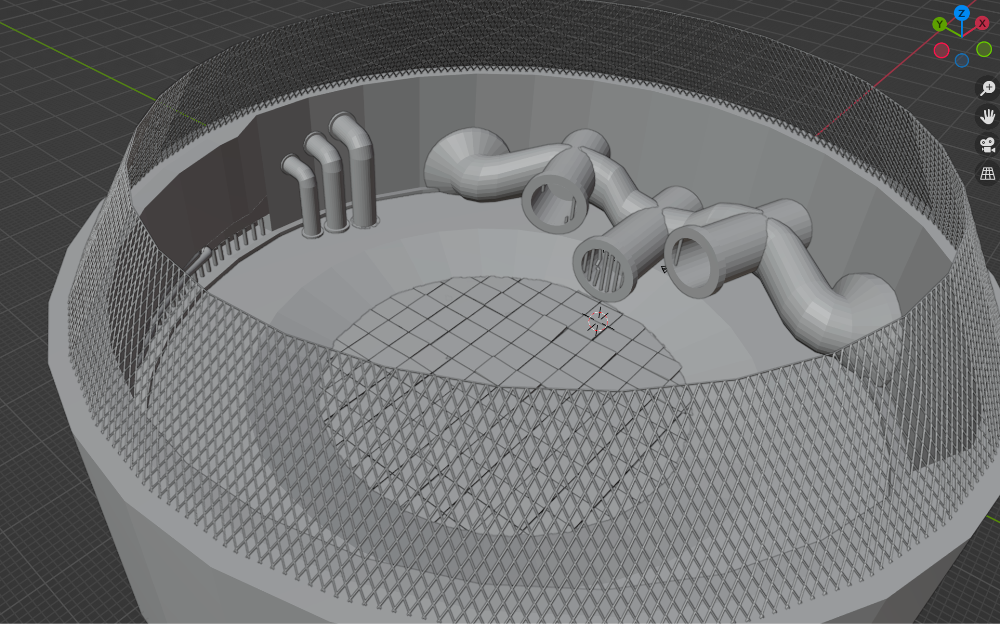
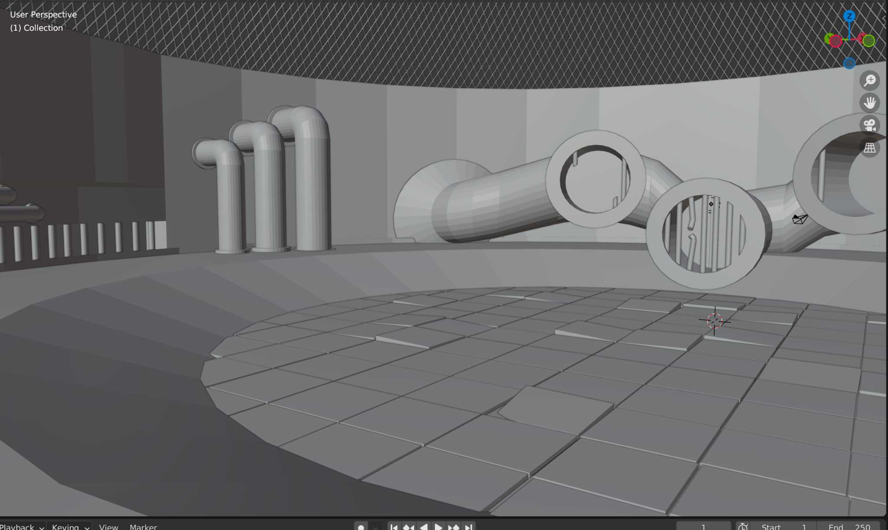
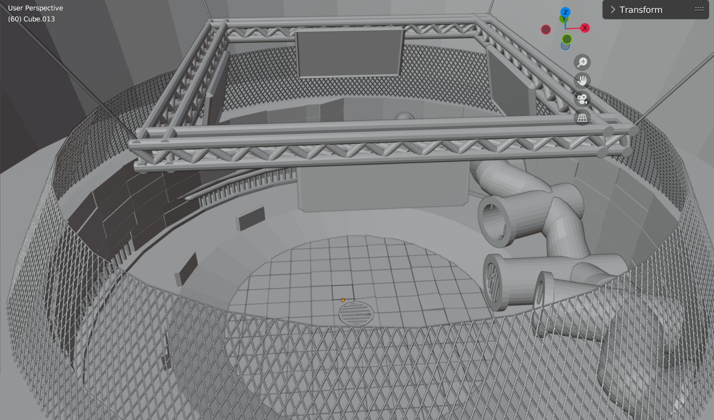
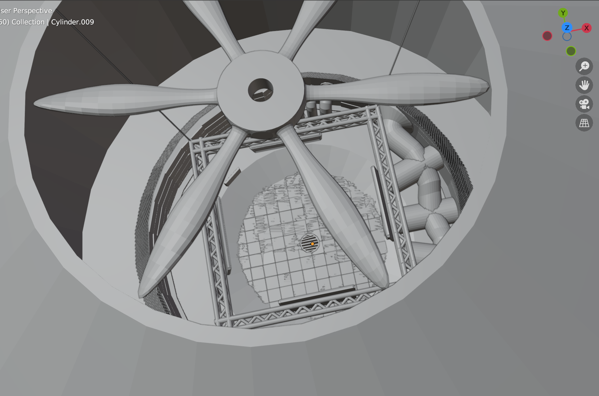
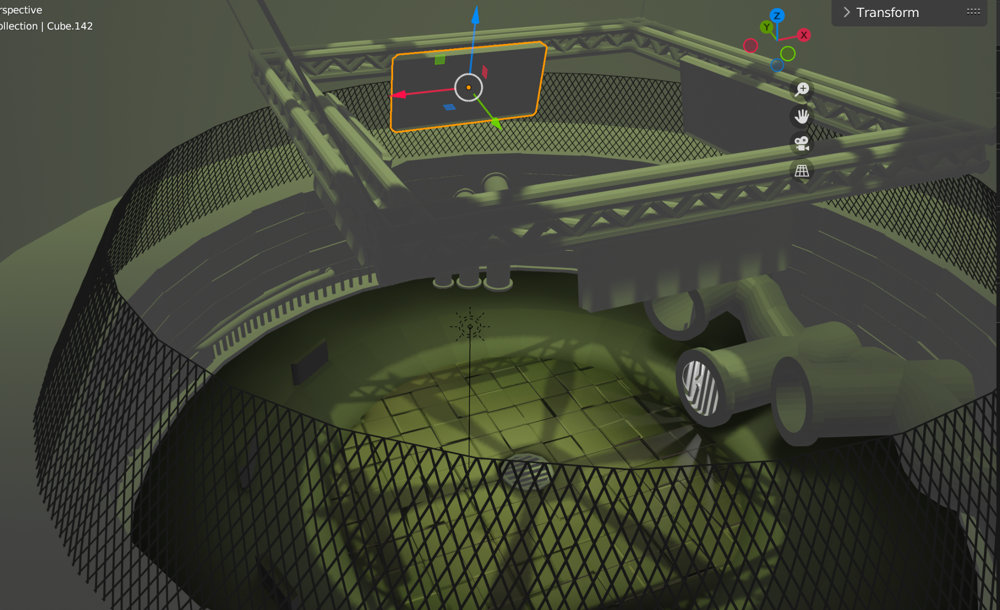

## Sewer Arena

This is some early render of our sewer arena, with pipes, an overhead fence for the audience to watch the fight behind and more. We tried giving it a rugged feel, like the broken/loose tiles. With the texturing we’re planning on adding rustic colors and effects to things like the pipes and walls. Giving it overall a nasty/morbid feel.

Here we looked at the lighting, seeing how lit we would like the arena, and what colors we’re going for. We’ll also be working with shadows, like the overhead fan that will be spinning. We feel like this will make the player feel even smaller.
