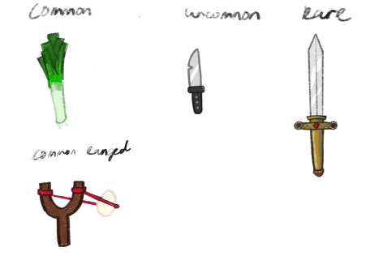

import ImageGrid from "../../../../../components/ImageGrid.astro";
import butterKnifeImage from "../../../../../assets/fowl-play/art/concept-art/weapons/butter_knife.png";
import daggerImage from "../../../../../assets/fowl-play/art/concept-art/weapons/dagger.png";
import minigunImage from "../../../../../assets/fowl-play/art/concept-art/weapons/minigun.png";

<ImageGrid
  images={[
    {
      src: butterKnifeImage,
      alt: "A butter knife with a shiny blade and a simple handle",
      title: "Butter Knife",
    },
    {
      src: daggerImage,
      alt: "A sleek dagger with a sharp blade",
      title: "Dagger",
    },
    {
      src: minigunImage,
      alt: "A large minigun with multiple barrels and a sturdy grip",
      title: "Minigun",
    },
  ]}
  columns={3}
/>

Here are some concepts for the weapons we’re gonna be implementing in our game. These here are some of the more common weapons since we’ll be working with a common to legendary weapon system.

Common -> Uncommon -> Rare -> Legendary
