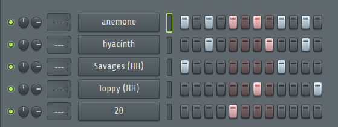
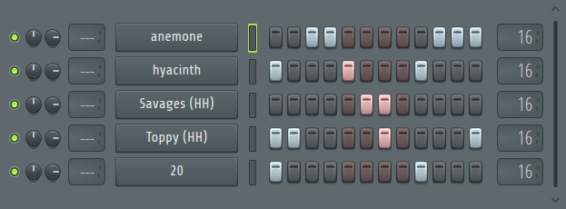
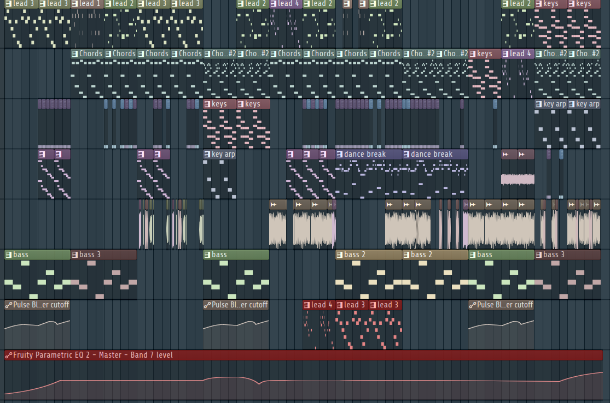

## Technical Specifications

| Specification | Details      |
| ------------- | ------------ |
| Software      | FL Studio 24 |
| BPM           | 135          |
| Length        | 4:17 minutes |
| Purpose       | Upbeat       |
| Diegetic      | No           |

All fight music is diegetic and plays through `speakers` in the arena.

## Philosophy

The "Fight One Theme" was composed to embody the adrenaline and intensity of arena combat. Our goal was to create a soundscape that not only energizes the player but also immerses them in the spectacle of the fight. Drawing inspiration from real-world sports events, the music is intentionally diegetic and blares from arena speakers. Of course, our music keeps playing during the fight, unlike real life sport events, where the music stops when the fight starts.

We wanted the music to figure as a sort of radio, like in real life sport events. This means themes are not coupled to specific opponents, but randomized. We feel this enhances the immersion and makes the player feel like they are in a real arena, where the music is not tailored to them, but rather a generic fight theme.

### Connection to Game Themes

- **Fast-Paced Combat:** The fast BPM and rhythm mirror the game's emphasis on quick reflexes and constant movement.
- **Arena Spectacle:** By making the music diegetic, we reinforce the feeling of being in a public, competitive space, where every fight is a show and every player is a contender.

## Musical Parts

## Instruments and Sound Design

### Instruments

- **Chords**: Warm 80s inspired synth chords
  - _Kepler Expo_: customized preset
  - _Mixer Track_: 1
- **Chords2**: Warm 80s inspired synth chords
  - _Kepler Expo_: customized preset
  - _Mixer Track_: 4
- **Lead 1** && **Lead 2**: Plucky, high-pitched and slightly distorded sound
  - _Kepler Expo_: C64 Arp
  - _Mixer Track_: None
- **Lead 3**: Plucky, low-pitched and slightly distorded sound
  - _Polymode Syntesizer_: Delicate Ensamble
  - _Mixer Track_: None
- **Lead 4**: Distorted guitar-like lead
  - _Kepler Expo_: customized preset
  - _Mixer Track_: 4
- **Support**: Distorded, growling phaser
  - _Flex_: Blasternoise
  - _Mixer Track_: 3
- **Bass**: Distorted EDM bass, lifted from the [Main Menu Theme](/fowl-play/art/music/main-menu)
  - _Flex_: Pulse Blower
  - _Mixer Track_: 4
- **Bass 2**: Phaser EDM Bass
  - _Vital_: VLT Future Gun
  - _Mixer Track_: 5
- **Bass 3**: Distorted low saw bass, reminicent of a ship horn blowing
  - _Flex_: Black Ashes
  - _Mixer Track_: 4
- **Dance Break**: Chord pattern, same instrument and mixer track as **Lead 4**
  - _Kepler Expo_: customized preset
  - _Mixer Track_: 4
- **Keys**: Simple chord pattern
  - _FL Keys_: Grand Piano
  - _Mixer Track_: 6
- **Key Arp**: Simple bass for over **Keys**, using same as **lead 1**
  - _Kepler Expo_: C64 Arp
  - _Mixer Track_: None

### Drum Patterns

- **Drum Pattern 1**: Basic drum pattern
  - 4 high hat variations
  - snare
    
- **Drum Pattern 2**: Basic drum pattern
  - 4 high hat variations
  - snare
    

### Sounds

The following sounds were sampled in the fight one song:

- **Shet**: Distorted yell
  - _Mixer Track_: 2
- **Shet 2**: Reversed **shet**
  - _Mixer Track_: 2
- **Money Counter**: Money counter sound, distorted
  - _Mixer Track_: 2
- **a**: drumm roll
- **Swag dnb Loop**: Drum and bass loop
- **Swag dnb Loop - Part 1**: reversed **Swag dnb Loop**
- **speeeeeed hatz**: High hat drum roll

### Arrangement

## Mixing and Mastering

### Mixing

- **Track 1**
  - ChameleonX V2: Splits the sound in 8 parts, and then replays and rebuilds them with configurable sliders. Transforms the sound, in this case slightly destroying it.
- **Track 2**
  - ChameleonX V2: Splits the sound in 8 parts, and then replays and rebuilds them with configurable sliders. Transforms the sound, in this case slightly destroying it.
  - Fruity Chorus: Thickens the sound by adding slightly detuned and delayed copies, creating a wider or shimmering effect.
  - Fruity Blood Overdrive: Distorts the sound
  - Fruity Stereo Enhancer: Enhances the stereo separation
  - Fruity Parametic EQ 2: Removing the mids, lowegin the highs and boosting the lows
- **Track 3**
  - Fruity Stereo Shaper: Changes the stereo image of the sound
  - Gross Beat: Distorting the time of the sound
  - Soundgoodizer: Enhances the sound saturation, makes it sound fuller and _better_
  - Fruity Blood Overdrive: Distorts the sound
  - Fruity Multiband Compressor: Compresses the sound
- **Track 4**
  - Fruity Blood Overdrive: Distorts the sound
  - Fruity Limiter: Compresses the sound
- **Track 5**
  - Gross Beat: rapidly changing volume, phaser effect
- **Track 6**
  - Soundgoodizer: Enhances the sound saturation, makes it sound fuller and _better_
  - Fruity Delay 3: Adds delay to the sound
  - Fruity Reeverb 2: Adds reverb to the sound
  - Fruity Limiter: Compresses the sound

### Mastering

- Fruity Limiter: To limit the overall volume of the song
- Fruity Parametric EQ 2: To take out the high ends
