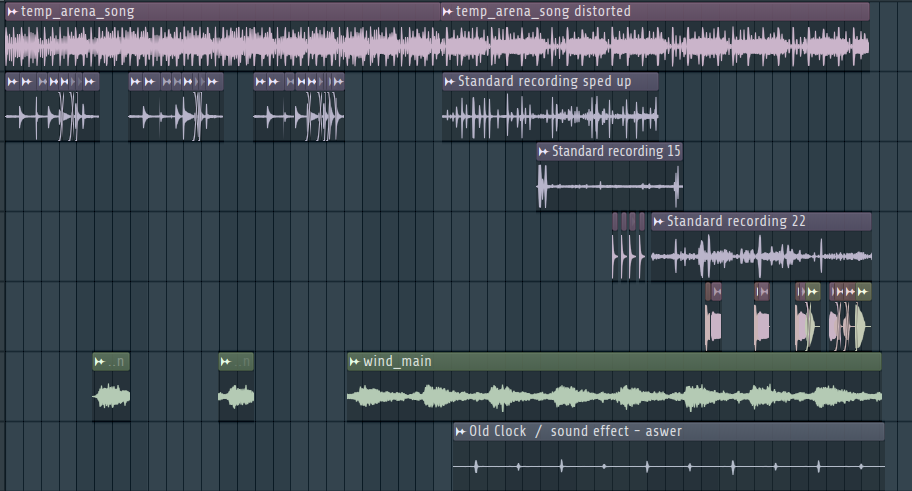

import AudioPlayer from "../../../../../components/AudioPlayer.astro";

## Audio

<AudioPlayer
  src="/music/fight-song-three.mp3"
  title="Fight Song Three"
  description="Eery, disjointed Arena battle theme, composed to remind players of the game's dark themes."
/>

### Technical Specifications

| Specification | Details      |
| ------------- | ------------ |
| Software      | FL Studio 24 |
| BPM           | 160          |
| Length        | 1:39 minutes |
| Purpose       | Eery         |
| Diegetic      | Yes          |

All fight music is diegetic and plays through `speakers` in the arena.

## Philosophy

The third fight theme was composed with the intent to immerse players in the unsettling, morally ambiguous world of underground chicken fighting and to remind them of the gruesome realities of the world they inhabit.
The music’s eery and disjointed qualities reflect the chaos and unpredictability of the arena, while its use of real-world samples and distorted sounds blurs the line between the familiar and the grotesque.
The goal was to create a soundscape that not only heightens tension during battles but also reinforces the game’s atmosphere of desperation, exploitation, and dark humor.

### Connection to Game Themes

This theme is tightly connected to the game’s core ideas of survival, exploitation, and the blurred boundaries between humanity and brutality.
The unsettling melodies and unpredictable structure echo the emotional turmoil faced by both the Poultry Man and his chickens, reinforcing the narrative’s focus on moral ambiguity and the cost of survival.

## Musical Parts

This theme can be divided into two parts:

1. **Beginning**: The song starts with a simple beat, layered with a xylophone like sound, interjected by the wind used in the [poultry menu theme](/fowl-play/art/music/poultry-menu-theme).
2. **Ending**: Distorted version of the beat, with a bunch of slowed down and sped up sounds, to create a disjointed feeling. The wind sound is more prominent here. Some additional normal samples are placed throughout, like bass notes and a bell like sound.

## Instruments and Sound Design

### Instruments

This song does not make any use of VST's.

### Drum Patterns

The beat used throughout the song was made in an online DAW by Cenker.

### Sounds

The following sounds were sampled in the fight three song:

- **Standard Recording 14**: Xylophone sounds were recorded in a playground forest, and then cut up and rearranged to create the melody.
  - _Mixer Track_: 2
- **Standard Recording sped up**: Sped up version of standard recording 14, used in the ending.
  - _Mixer Track_: 4
- **Temp Arena Song**: Beat made by Cenker, used throughout the song.
  - _Mixer Track_: 1
- **Temp Arena Song Distorted**: Distorted version of the temp arena song, used in the ending.
  - _Mixer Track_: 3
- **Standard Recording 15**: Ambient bird sounds, recorded in a field. Sped up and used in the ending.
  - _Mixer Track_: 4
- **Standard Recording 22**: Chicken sounds, recorded in a petting zoo. Sped up and used in the ending.
  - _Mixer Track_: 4
- **Classic Hyperpop 808**: Bass sound
  - _Mixer Track_: 5
- **Weird Hyperpop 808**: Bass sound
  - _Mixer Track_: 5
- **Soft Hard 808**: Bass sound
  - _Mixer Track_: 5
- **Dubstep Effect 10**: High-pitched bell like sound
  - _Mixer Track_: 5
- **Wind**: Wind sound used in the poultry menu theme, used throughout the song.
  - _Mixer Track_: None
- **[Old Clock / Sound Effect](https://www.youtube.com/watch?v=y-FJZSaFh80)**: Old clock sound effect, slowed down
  - _Mixer Track_: None

### Arrangement

## Mixing and Mastering

### Mixing

#### Mixer Effects

- **Track 1**:
  - No effects, just used for audio leveling
- **Track 2**:
  - Spreader: Used to create a wider stereo image
  - Fruity Multiband Compressor: Used to compress the sound and make it more punchy
  - Fruity Delay 3: Used to create a delay effect
  - Fruity Reeverb 2: Used to create a reverb effect
  - Parametic EQ 2: Used to cut out a specific frequency range in the high end, since it was too harsh
- **Track 3**:
  - WaveShaper: Used to distort or reshape the audio signal for added character.
- **Track 4**:
  - Distructor: Adding distortion with some flair
- **Track 5**:
  - ChameleonX V2: Splits the sound in 8 parts, and then replays and rebuilds them with configurable sliders. Transforms the sound, in this case slightly destroying it.
  - Soundgoodizer: Enhances the sound saturation, makes it sound fuller and _better_
  - Fruity Reeverb 2: Adds reverb to the sound

## Mastering

No master effects were used on this song.
