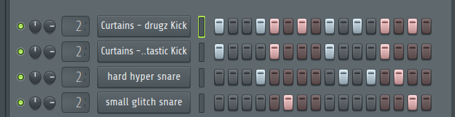
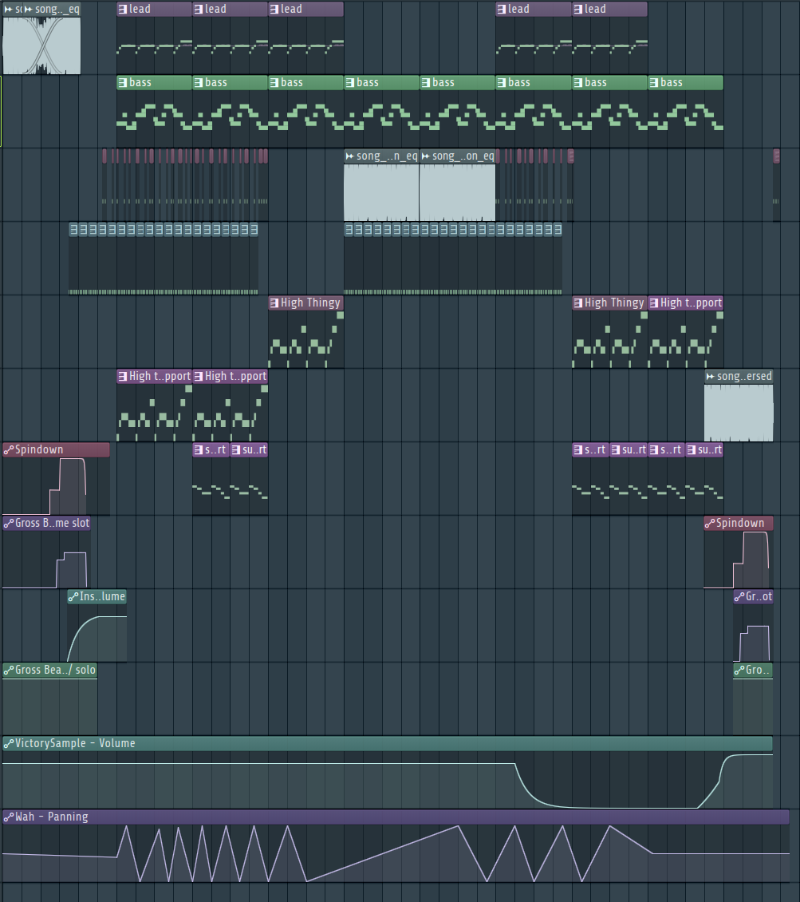

import AudioPlayer from "../../../../../components/AudioPlayer.astro";

## Audio

<AudioPlayer
  src="/music/fight-song-two.mp3"
  title="Fight Song Two"
  description="Arena battle theme, composed to energize and immerse players in the intensity of combat. This track features fast-paced drums and loud bass."
/>

### Technical Specifications

| Specification | Details      |
| ------------- | ------------ |
| Software      | FL Studio 24 |
| BPM           | 160          |
| Length        | 2:04 minutes |
| Purpose       | Upbeat       |
| Diegetic      | Yes          |

All fight music is diegetic and plays through `speakers` in the arena.

## Philosophy

The "Fight Two Theme" was composed to embody the unsettling chaos and grim reality of Fowl Play's advanced arenas. The track is fast paced and loud.

A core concept was to weave the game's _Game Over_ and _Victory_ themes directly into the combat music. This creates a sense of psychological tension, constantly reminding the player that success and failure are intrinsically linked in this brutal cycle.

### Connection to Game Themes

- **Cyclical Violence:** The track's structure, which begins and ends with variations of the _Game Over_ theme, reinforces the inescapable and cyclical nature of the fights.
- **High-Stakes Desperation:** The fast 160 BPM and driving EDM drum patterns amplify the intensity of combat, pushing a feeling of urgency and desperation that reflects the high stakes of each match.

## Musical Parts

The fight two theme can be divided into five parts:

1. **Beginning**: The song starts with a mix of the [game over theme](/fowl-play/art/music/game-over) and a distorted [victory theme](/fowl-play/art/music/victory-theme).
2. **Mid Section One**: The song transitions into a more upbeat section, with a fast-paced drum beat, consisting of mainly EDM sounds. This is paired with a heavy bass line and an 80s inspired lead.
3. **Mid Section Two**: The bass line and drums stay, but the lead is replaced with a Gross Beat version of the [game over theme](/fowl-play/art/music/game-over).
4. **Mid Section Three**: The song transitions back to the mid section one, but with a slightly different arrangement.
5. **Ending**: The song ends with a reversed [game over theme](/fowl-play/art/music/game-over), to tie it back to the beginning.

## Instruments and Sound Design

### Instruments

- **Wah**: EDM (hyperpop) style pluck-ish sound
  - _Flex_: Bijou Blips
  - _Mixer Track_: 7
- **Bass**: Loud Bass
  - _Vital_: Growl Bass Sidechain
  - _Mixer Track_: 6
- **Lead**: 80s inspired lead, slightly pitch shifted at certain moments
  - _Flex_ : Eighties Movie
  - _Mixer Track_: 4
- **High Thingy**: Mystical high-pitched sound, sounds egyptian themed
  - _Vital_ : Moving Harmonics
  - _Mixer Track_: 5
- **High Thingy Support**: Chip-Tune slightly distorted bass sound
  - _Flex_: Crazy Clash
  - _Mixer Track_: 4
- **Support**: Chiptune 80s phaser sound
  - _Kepler Expo_: Gaming Lead
  - _Mixer Track_: No Mixer Track

### Drum Patterns

- **Drum Pattern 1**: Fast-paced drum beat, consisting of mainly EDM sounds. Contains two kicks and two snares.
  - _Mixer Track_: 7
    

### Arrangement

## Mixing and Mastering

Automation tracks have been used to create the 'glitch' effect and the transitions between the [game over theme](/fowl-play/art/music/game-over), the [victory theme](/fowl-play/art/music/victory-theme) and the rest of the song.
Most instruments are sidechained to the drum pattern, to give the drums a more punchy and prominent feel.
'Wah' has been automated to alternate panning between left and right.

### Mixer Effects

- **Track 1**:
  - _Hardcore_: Distortion to create a more aggressive and guitar like sound
  - _Hyper Chorus_: Creates multiple, slightly detuned versions of the sound, to create a more full sound
  - _Izotope Vinyl_: Adds a vinyl effect to the sound, to make it sound more old school. Also used for the 'glitch' spindown effect at the end of the song
  - _Parametic EQ 2_: Used to cut out the high frequencies, to make the sound more muffled
  - _Gross Beat_: Used to create the 'glitch' effect at the end of the song
- **Track 2**:
  - No effects have been used on this track, it is only used as input for the sidechain effect
- **Track 3**:
  - _Fruity Limiter_: To create the sidechain effect
- **Track 4**:
  - No effects have been used on this track, it is used to combine the other tracks before sending it into **track 3** for sidechaining
- **Track 5**:
  - _Parametic EQ 2_: To take out some higher frequencies, to make the sound less grating to the ears.
- **Track 6**:
  - _Parametic EQ 2_: To boost low frequencies, to make the bass sound more punchy
  - _Soundgoodizer_: To make the bass sound more punchy and loud
- **Track 7**:
  - _Fruity Delay 3_: To create a delay effect on the Sound
  - _Maximus_: Compression and limiting
  - _Parametic EQ 2_: Boosting the high frequencies to make the sound more crisp and bright. Taking out the lows to clash less with the already bass heavy song
