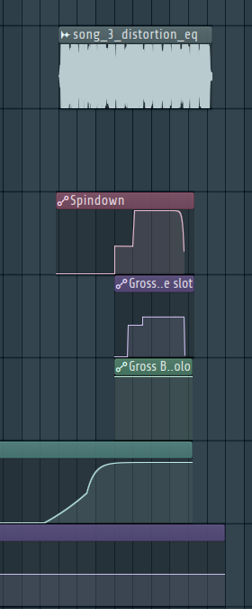

import AudioPlayer from "../../../../../components/AudioPlayer.astro";

## Audio

<AudioPlayer
  src="/music/game-over-song.mp3"
  title="Game Over Song"
  description="Altered sped-up and distorted version of the victory theme, to signify the player losing the battle."
/>

### Technical Specifications

| Specification | Details        |
| ------------- | -------------- |
| Software      | FL Studio 24   |
| BPM           | 160            |
| Length        | 0:14 minutes   |
| Purpose       | Misery |
| Diegetic      | No             |

The theme is not diegetic.

## Philosophy

This song is supposed to be fast and distorted, to celebrate the victory of the player.
To be in line with the other songs, this song once again features old school synths and a lot of 80s inspired sounds. The song ends by 'glitching'

### Connection to Game Themes

This song is not really connected to the game themes, besides being based on the [victory theme](/fowl-play/art/music/victory-theme).

## Instruments and Sound
This song is a distorted and sped up version of the [victory theme](/fowl-play/art/music/victory-theme/), and thus shares the same instruments and sound

### Instruments

- **Chords**: 80s inspired synth chords
  - _Kepler Expo_: Velvetric
  - _Mixer Track_: 5
- **Piano Support**: Bigg brass sound
  - _Kepler J106_: SoftStrings
  - _Mixer Track_: 4
- **Bass**: Plucky sound used as bass
  - _Vital_: VLT Future Gun
  - _Mixer Track_: 2
- **Lead**: Oscelator using chicken sounds as wavetable. Creating a high pitched sound
  - _Vital_: Text To Wavetable
  - _Mixer Track_: 2

### Sounds

The following sounds were sampled in the fight one song:

- **Chicken Sounds**: Chicken sounds sourced from [youtube](https://www.youtube.com/watch?v=dZB7vWsb1Co)
  - _Mixer Track_: 3
- **Swag dnb Loop**: Drum and bass loop
  - _Mixer Track_: 6

### Arrangement

## Mixing and Mastering

The victory theme has been distorted and sped up to 160 BPM, from the original 140 BPM.
Automation tracks have been used to create the 'glitch' effect at the end of the song, by automating Izotope Vinyl and Gross Beat

### Mixer Effects
- **Track 1**:
  - **Hardcore**: Distortion to create a more aggressive and guitar like sound
  - **Hyper Chorus**: Creates multiple, slightly detuned versions of the sound, to create a more full sound
  - **Izotope Vinyl**: Adds a vinyl effect to the sound, to make it sound more old school. Also used for the 'glitch' spindown effect at the end of the song
  - **Parametic EQ 2**: Used to cut out the high frequencies, to make the sound more muffled
  - **Gross Beat**: Used to create the 'glitch' effect at the end of the song