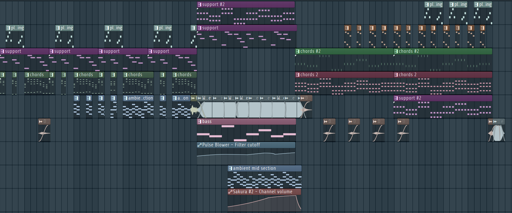

import AudioPlayer from "../../../../../components/AudioPlayer.astro";

## Audio

<AudioPlayer
  src="/music/main-menu-song.mp3"
  title="Main Menu Music"
  description="The main menu theme sets the emotional tone for the game, blending distorted synths, plucky banjo, and deep bass to create a soundscape that is both unsettling and hopeful. This track introduces players to the world of underground chicken fighting, balancing tension and resolution to reflect the game's unique mix of psychological horror and determination."
/>

### Technical Specifications

| Specification | Details                        |
| ------------- | ------------------------------ |
| Software      | FL Studio 24                   |
| BPM           | 120                            |
| Length        | 2:20 minutes                   |
| Purpose       | Main menu track, relaxed tempo |
| Diegetic      | No                             |

The main menu is not diegetic, meaning it does not exist within the game world but serves as background music for the main menu.

## Philosophy

This is the main menu track, since it incorporates multiple aspects of our chicken fighting game. The track sets an unsettling yet hopeful tone, reflecting the emotional journey of the player. It balances tension and resolution, creating a soundscape that mirrors the game's themes of struggle and progression.

### Connection to Game Themes

The main menu music deliberately reflects the game's core elements:

1. **Underground Fighting**: The distorted sounds and reverb create a sense of being in an enclosed, hidden space, emphasizing the gritty nature of the arena and poultry man area.
2. **Psychological Horror**: Distorted chords and ambience create unease and tension, which fits with the game's darker undertones.
3. **Hope**: The end of the music conveys a sense of hope, representing the player's determination to overcome challenges.
4. **Contrast**: Like the game's visual design, the music contrasts cartoonish elements with darker undertones. The song is broken up by lighter sounds and ends on a positive note.

## Musical Parts

The main menu theme can be divided into three parts:

1. **The Beginning**: Distorted chords, broken up by pluck sounds, set the grim introduction. The rhythmic interplay between the chords and pluck synth adds complexity and intrigue.
2. **Mid Section**: White noise and a deep bass line gradually build despair. Automation is used to increase tension over time, reflecting the player's growing unease within the arena.
3. **End**: The calmest part of the track, but bittersweet. It gives hope to the player, with a buildup that deliberately avoids a drop or real payoff, since the chickens in the arena will end up dying either way.

The three parts mirror the player's journey. Entering the arena for the first time is unsettling. This is followed by experiencing the despair of the arena (mid-section), and finally subtle hope of victory(the end).

## Instruments and Sound Design

### Key Instruments

- **Chords & Chords #2**: Heavily distorted synthesizer chords.
  - _Eight Voice_: Vintage Square
  - _Mixer Track_: 1
- **Support & Support #2**: High-pitched, clear synth
  - _DCO-106_: Ambient Keys
- **Pluck Thing**: A plucky banjo sound.
  - _Sakura_: STR Mountain Man Banjo FG
- **Piano Support**: High-pitched warm 80s inspired synth chords
  - _Kepler Expo_: Lead 1
- **Chords 2**: Warm Piano chords. Slightly detuned.
  - _Kepler Expo_: Electric Piano
- **Bass**: Deep rumbly bass sound
  - _Flex_: Pulse Blower
- **Ambient Mid Section**: Metallic, glitchy sound.
  - _Sakura_: SFX Ice Cube the Great FG
  - _Mixer Track_: 2

### Sounds

- **Kid Urban Trans 2**: Car crash sound effect used to signify the change from **section 1** to **section 2**.
- **White Noise**: Supporting **section 2** and at the end of the song, in **section 3**.
- **Dubstep Crash 3**: Used as a _mysterious reoccuring sound_ throughout **section 1** and **section 3**.

### Automation

- **Bass**: The filter cutoff of the `Pulse Blower` is automated to increase the intensity of the sound during **section 2**.
- **Ambient Mid Section**: The volume of the `SFX Ice Cube the Great FG` is automated to have it slowly fade in during **section 2**.

### Arrangement

The transitions between the three parts are intentionally fairly harsh.

## Mixing and Mastering

### Mixing

#### Mixer Effects

- **Track 1**
  - Fruity blood overdrive: To make the chords distorted.
  - Fruity limiter: So the chords don't overpower within the song.
- **Track 2**
  - Fruity Reeverb 2: Reverb
  - Soundgoodizer: makes it sound fuller.
  - Gross Beat: Used to create a stuttering effect by automating volume patterns. This effect causes the sound to rapidly alternate between higher and lower levels.
  - Fruity Multiband Compressor: Compression
  - Parametric EQ 2: To take out the lows and highs.
  - Fruity limiter: To mix it better within the song.

### Mastering

- Fruity limiter: To ensure sound levels don't become too high and prevent clipping.
