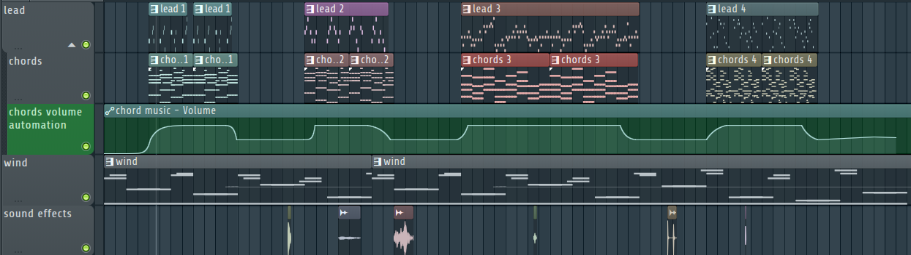

import AudioPlayer from "../../../../../components/AudioPlayer.astro";

## Audio
<AudioPlayer 
	src="/music/poultry-man-song.mp3"
	title="Poultry Man Menu Music"
	description="A haunting, ambient theme designed to evoke loneliness and mystery in the underground sewers. Built on a foundation of continuous wind and layered with ethereal synths and plucky keys, this track immerses players in the desolate world of the Poultry Man, blending diegetic and non-diegetic elements for a deeply atmospheric experience."
/>

### Technical Specifications

| Specification | Details                                      |
| ------------- | -------------------------------------------- |
| Software      | FL Studio 24                                 |
| BPM           | 100                                          |
| Length        | 5:49 minutes                                 |
| Purpose       | Ambience, sense of loneliness and desolation |
| Diegetic      | Partially                                    |

The Poultry Man Menu Theme is partially diegetic. The ambient wind sound is diegetic, simulating wind in the underground sewer system, but the ambient tracks playing on top are not diegetic.

## Philosophy

The Poultry Man Menu Theme is composed of several loosely connected musical fragments, all designed to evoke a sense of abandonment and isolation. At its core lies a continuous wind sound, emulating the desolate atmosphere of the underground sewer where the Poultry Man area is set.

Additional ambient tracks are layered on top, at random intervals. These pieces are slow and ethereal, built around chord progressions. Each segment lasts between 40 and 80 seconds. Once a track finishes, only the wind remains. In addition, sound effect play at random intervals, such as footsteps, to add to the atmosphere. Rivalling Poultry Men are also preparing for their next fight.

### Connection to Game Themes

The music’s sparse and minimal design fits with its area:

1. **Abandonment**: The persistent wind and minimal instrumentation convey emptiness and neglect.
2. **Mystery**: The unpredictability of random intervals mirrors the Poultry Man's elusive presence. Little is known about the Poultry Man.
3. **Isolation**: Long stretches with little to no melody emphasize the solitary atmosphere of the setting.

## Musical Parts

The Poultry Man Menu Theme is structured around a layering system:

1. **Base Layer**: A continuous wind sound forms the backdrop. Subtle variation in notes ensures the wind sound varies and doesn't become too tiring.
2. **Ambient Tracks**: Currently, four distinct tracks are randomly triggered over the base layer. While they share similar instrumentation, each features unique chord progressions and arrangements to add variety and depth. The ambient tracks are designed to complement the base layer, enhancing the overall atmosphere and emotional impact of the theme.

## Instruments and Sound Design

### Instruments

- **Chords 1-4**: Warm 80s inspired synth chords, with ethereal elements. Consisting of 3 instruments played at the time:

  - 1. _Kepler Expo_: Warmnest
    - _Mixer Track_: 4
  - 2. _UVI WorkStation_: Hyper Majestic
    - _Mixer Track_: 4
  - 3. _Vital_: Drake Pad
    - _Mixer Track_: 5

- **Lead 1-4**: Plucky, ethereal keys

  - _Vital_: Distant Majestic lead
  - _Mixer Track_: 5

- **Wind**: A continuous wind sound, emulating the desolate atmosphere of the underground sewer. Consists of 3 'instruments':
  - 1. _Flex_: Wind
    - _Mixer Track_: 1
  - 2. _Flex_: Wind 2
    - _Mixer Track_: 1
  - 3. _Flex_: Flute
    - _Mixer Track_: 3

## Arrangement

## Mixing and Mastering

### Mixing

- Automation is used for the sound level of the chords, to have them fade in and out.

Note: Some other mixer tracks are used for [sound effects](/fowl-play/art/sound/poultry-man-menu), which play at randomized intervals.

#### Mixer Effects

- **Track 1**:
  - Fruity Stereo Shaper: Creates variation between the left and right channels.
  - Fruity Delay 3: Adds delay
  - Fruity Parametic EQ 2: To take out the highs and heavily boost the lows
- **Track 2**:
  - Mirror: Adds reversed delay
  - Fruity Reeverb 2: Adding reverb
  - Fruity Multiband Compressor: Compression
  - Fruity Parametic EQ 2: Slightly boosting lows and mids and slightly lower highs
- **Track 3**:
  - Fruity Reeverb 2: Adding reverb
  - Fruity Compressor: Compression
  - Fruity Love Philter: Modulates the sound
  - Equo: Equalizer, boosting the medium-highs and lowering the highest frequencies. Also slightly boosting the lows.
  - Spreader: Stereo widening
- **Track 4**:
  - Soundgoodizer: Enhances the sound saturation, makes it sound fuller and _better_
  - Izotope Vinyl: Adds a vinyl effect
- **Track 5**:
  - Vintage Chorus: Creates a warm analogue sound
  - Vintage Phaser: Phaser
  - Fruity Parametic EQ 2: Removing the highs, and some additional harsh frequencies

### Mastering

- Fruity limiter: To ensure sound levels don't become too high and prevent clipping.
