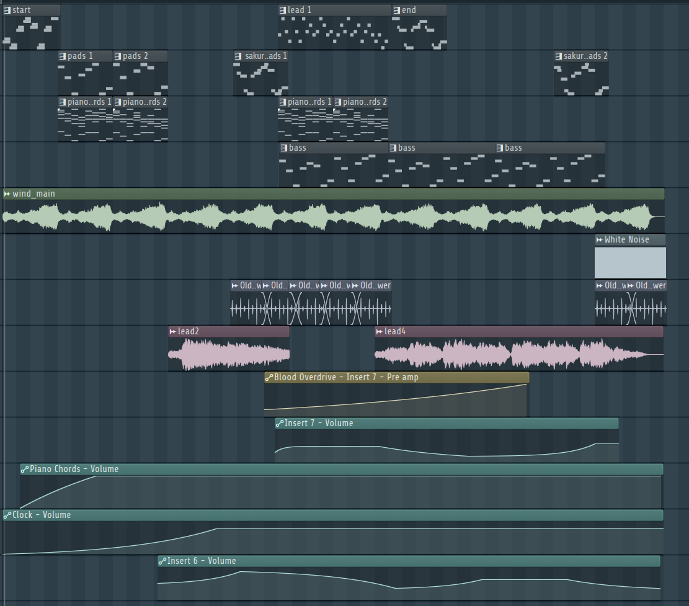

import AudioPlayer from "../../../../../components/AudioPlayer.astro";

## Audio

<AudioPlayer
  src="/music/training-area-song.mp3"
  title="Training Area Music"
  description="A haunting, eery and ambient theme designed to evoke loneliness and mystery. Heavily based on the poultry menu theme."
/>

### Technical Specifications

| Specification | Details       |
| ------------- | ------------- |
| Software      | FL Studio 24  |
| BPM           | 130           |
| Length        | 5.56 minutes  |
| Purpose       | Eery, ambient |
| Diegetic      | No            |

## Philosophy

The Training Area theme is designed to evoke loneliness and reflection, serving as a somber pause between battles. Its ambient, melancholic soundscape mirrors the Poultry Man’s conflicted role. The music’s references to the menu theme create a sense of continuity and quiet tension.

### Connection to Game Themes

This theme reinforces the game’s focus on survival, moral ambiguity, and exploitation.

## Musical Parts

This theme can be divided into three parts:

- **Beginning**: The song starts very light, with the wind used in the [poultry menu theme](/fowl-play/art/music/poultry-menu-theme), with some string sounds layered on top.
- **Middle**: The song becomes more busy, using vocoded effects and sampling lead 2 from the [poultry menu theme](/fowl-play/art/music/poultry-menu-theme).
- **Ending**: The song becomes more eery, adding white noise and sampling lead 4 from the [poultry menu theme](/fowl-play/art/music/poultry-menu-theme).

## Instruments and Sound Design

### Instruments

- **piano chords 1 & 2**: Soft, sad piano chords. Slightly detuned
  - _Vital_: Keystation
  - _Mixer Track_: 2
- **start & end**: Detuned sad string ambient melody
  - _Sakura_: STR Fiola FG
  - _Mixer Track_: 8
- **lead 1**: 80s inspired lead, but in the song it is vocoded and used more as a pad
  - _Kepler Expo_: LowStrings
  - _Mixer Track_: 5
- **pads 1-3**: Ambient pads, used to fill the soundscape. Same instrument and effects as the piano chords
  - _Vital_: Keystation
  - _Mixer Track_: 2
- **sakura pads 1&2**: Ambient pads, used to fill the soundscape. Same instrument and effects as the start & end
  - _Sakura_: STR Fiola FG
  - _Mixer Track_: 8
- **bass**: Distant growling bass, sounding a bit like throat singing
  - _Flex_: Boomer Bomber
    _Mixer Track_: 7

### Sounds

Within this theme, the following sounds are sampled:

- **Lead 2**: Piano part from the [poultry menu theme](/fowl-play/art/music/poultry-menu-theme), slowed down
  - _Mixer Track_: 6
- **Lead 4**: Piano part from the [poultry menu theme](/fowl-play/art/music/poultry-menu-theme), slowed down
  - _Mixer Track_: 6
- **[Old Clock / Sound Effect](https://www.youtube.com/watch?v=y-FJZSaFh80)**: Old clock sound effect, slowed down and normalized
  - _Mixer Track_: 9

### Arrangement

## Mixing and Mastering

### Mixing

This theme makes use of two vocoders

#### Mixing Effects

- **Track 1**:
  - Parametic EQ 2: Cut off a specific low frequency and most of the high end
  - Fruity Delay 3: Delay effect
- **Track 2**:
  - No effects, used as input for the two vocoders (as modulator)
- **Track 3**:
  - Vocodex: Vocoder effect, using track 2 as modulator and track 1 as carrier
- **Track 4**:
  - VocalSynth 2: Vocoder effect, using track 2 as modulator and track 5 as carrier
- **Track 5**:
  - Fruity Reeverb 2: Reverb effect
  - Soundgoodizer: Used to make the sound _better_
  - Parametic EQ 2: Cut off a specific low frequency and most of the high end
- **Track 6**:
  - Izotope Vinyl: Vinyl effect, used to make the sound more lo-fi and adding crackling
  - Gross Beat: Very quickly alternating the volume, creating a stuttering effect
  - Pitch Shifter: Used to shift the pitch of the sound down
  - Mirror: Reverse Delay
  - Spreader: Used to create a wider stereo image
  - Parametic EQ 2: Boosting mids, cutting off low and high end
  - Fruity Compressor: Used to compress the sound and make it more punchy
- **Track 7**:
  - Blood Overdrive: Distortion effect
  - Parametic EQ 2: Boosting low end, lowering mid and high end
  - Fruity Delay 3: Delay effect
- **Track 8**:
  - Vintage Phaser: Phaser effect
  - Spreader: Used to create a wider stereo image
  - Fruity Reeverb 2: Reverb effect
- **Track 9**:
  - Parametic EQ 2: Cut off low and high end, boosting mid
  - Mirror: Reverse Delay

### Mastering

- Fruity Limiter: Used to limit the sound and prevent clipping
