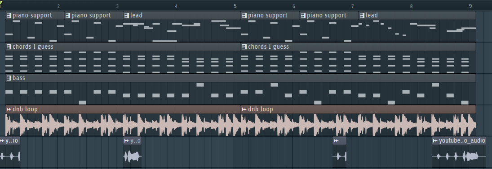

import AudioPlayer from "../../../../../components/AudioPlayer.astro";

## Audio

<AudioPlayer
  src="/music/victory-song.mp3"
  title="Victory Music"
  description="Upbeat short song that plays when you win an arena run"
/>

### Technical Specifications

| Specification | Details        |
| ------------- | -------------- |
| Software      | FL Studio 24   |
| BPM           | 140            |
| Length        | 0:14 minutes   |
| Purpose       | Celebrationary |
| Diegetic      | No             |

The victory theme is not diegetic.

## Philosophy

This song is supposed to be short and upbeat, to celebrate the victory of the player. This means major chords, fast tempo and a lot of energy.
To be in line with the other songs, this song once again features old school synths and a lot of 80s inspired sounds. The song is short, but has a lot of energy and is very catchy.
The drum and bass loop adds an additional layer of energy to the song, making it feel truly like a celebration.

### Connection to Game Themes

This song is not really connected to the game themes, but it does fit the overall theme of the game. The song is upbeat and celebratory, which fits the theme of victory. Chicken sounds are used in the song, which is a sort of cheating way to connect it to the game.

## Instruments and Sound

### Instruments

- **Chords**: 80s inspired synth chords
  - _Kepler Expo_: Velvetric
  - _Mixer Track_: 5
- **Piano Support**: Big brass sound
  - _Kepler J106_: SoftStrings
  - _Mixer Track_: 4
- **Bass**: Plucky sound used as bass
  - _Vital_: VLT Future Gun
  - _Mixer Track_: 2
- **Lead**: Oscelator using chicken sounds as wavetable. Creating a high pitched sound
  - _Vital_: Text To Wavetable
  - _Mixer Track_: 2

### Sounds

The following sounds were sampled in the fight one song:

- **Chicken Sounds**: Chicken sounds sourced from [youtube](https://www.youtube.com/watch?v=dZB7vWsb1Co)
  - _Mixer Track_: 3
- **Swag dnb Loop**: Drum and bass loop
  - _Mixer Track_: 6

### Arrangement

## Mixing and Mastering

### Mixing

- All mixer tracks, except **Track 2 and 3** (the bass and chicken sounds), are sidechained based on **Track 6** (the drum pattern), to give the drum pattern more weight.

#### Mixer Effects

- **Track 1**:
  - _Hardcore_: Distorting the sound and transforming it closer to an electric guitar.
  - _Parametic EQ 2_: Boosting lows, lowering highs
  - _Fruity_ Phaser: adding a phaser effect
  - _Mirror_: Adding reversed delay
  - _Fruity limiter_: To not let the lead overpower
- **Track 2**:
  - _Distructor_: Adding distortion
  - _Fruity Phaser_: Adding a phaser effect
  - _Fruity Multiband Compressor_: Compression
  - _Spreader_: Enhancing stereo seperation
  - _Transient Processor_: Adding dynamic processing
  - _Gross Beat_: Adding time distortion
  - _Fruity Limiter_: Limiting the sound to have it sit better in the mix
- **Track 3**:
  - _Pitcher_: Autotuning the chicken sounds
  - _Fruity Reeverb 2_: Adding reverb
- **Track 4**:
  - _Soundgoodizer_: Enhances sound saturation
  - _Maximus_: A multiband compressor
  - _Fruity Love Philter_: Adding a phaser effect
  - _Fruity Compressor_: Additional compression
- **Track 5**:
  - _Hyper Chorus_: Simulates multiple different versions of the track playing. Adds variation.
  - _Luxeverb_: Adding reverb
- **Track 6**:
  - _Fruity Limiter_: Limits the sound to have it sit better in the mix

### Mastering

- _Fruity Limiter_: To ensure sound levels don't become too high and prevent clipping.
