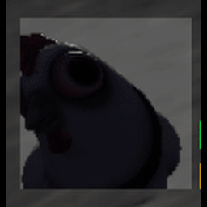
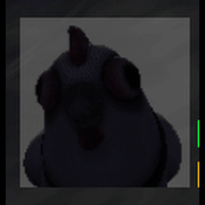

In the [player hud](/fowl-play/gameplay/user-interface/player-hud), shader effects are used to provide immediate feedback when the player is hurt or healed. These effects are applied to a `ColorRect` node overlaying the player icon.

- **Hurt Shader**: Uses chromatic aberration and color blending to create a red-tinted, distorted effect, signaling damage.
- **Heal Shader**: Applies a colored blur and glow, signaling recovery. The shader is based on a Gaussian blur, adapted for performance and visual clarity.

In addition to the shaders, a background color is applied to the background `ColorRect` node, to further emphasize the effect. The color is set to a different color when the player is hurt or healed. All shader and color effects are changable via `@export` variables in the editor.

## Hurt Shader


```gdshader
shader_type canvas_item;

uniform sampler2D screen_texture : hint_screen_texture, filter_linear_mipmap, repeat_enable;
uniform vec3 hurt_color = vec3(0.8, 0.0, 0.0);
uniform float overlay_alpha : hint_range(0.0, 1.0) = 0.5;
uniform float aberration_strength : hint_range(0.0, 1.0) = 0.015;
uniform float displacement_strength : hint_range(0.0, 0.05) = 0.01;
uniform vec2 abberation_offset = vec2(0.5);
uniform float time;

void fragment() {
    vec2 uv = SCREEN_UV;

    // Add a subtle displacement. Higer weight for uv, but make it slightly different
    uv += vec2(
        sin(uv.y * 50.0 + time * 5.0),
        cos(uv.x * 50.0 + time * 5.0)
    ) * displacement_strength;

    // Chromatic aberration offsets
    vec2 offset = (uv - abberation_offset) * aberration_strength;

    // Sample each channel with a slight offset
    float r = texture(screen_texture, uv + offset).r;
    float g = texture(screen_texture, uv).g;
    float b = texture(screen_texture, uv - offset).b;

    vec3 aberrated_color = vec3(r, g, b);

    // Compute difference between channels
    float diff = abs(r - b);
    // Blending the chromattic effect with the hurt color
    float blend_factor = clamp(1.0 - diff * 10.0, 0.0, 1.0);
    vec3 final_color = mix(aberrated_color, hurt_color, blend_factor);

    COLOR = vec4(final_color, overlay_alpha);
}
```

- **Shader Parameters**:

  - `screen_texture`: The screen texture to which the effect is applied.
  - `hurt_color`: The color used for the hurt effect.
  - `overlay_alpha`: The alpha value for the overlay, controlling its transparency.
  - `aberration_strength`: Controls the strength of the chromatic aberration effect.
  - `displacement_strength`: Controls the strength of the displacement effect.
  - `abberation_offset`: The offset for the chromatic aberration effect.
  - `time`: The time value used for animating the displacement effect.

- **Shader Logic**:
  - The shader samples the screen texture and applies chromatic aberration and displacement effects to create a distorted, red-tinted effect.
  - The final color is a blend of the aberrated color and the specified hurt color, providing a clear visual indication of damage.

## Heal Shader


Based on the [gaussian blur shader](https://godotshaders.com/shader/web-safe-darkened-gaussian-blur/) by [`crisp_lad`](https://godotshaders.com/author/crisp_lad/).

```gdshader
shader_type canvas_item;

uniform sampler2D screen_texture : hint_screen_texture, repeat_disable, filter_nearest;
uniform float blur_strength : hint_range(0.1, 5.0) = 2.3;
uniform float glow_intensity : hint_range(0.0, 5.0) = 1.8;
uniform vec3 heal_color : source_color = vec3(0.0, 1.0, 0.4);
uniform float overlay_alpha : hint_range(0.0, 1.0) = 0.5;

// Formula stolen from the internet
float gaussianDistribution(float x, float STD) {
    return exp(-(x*x)/(2.0*STD*STD))/(sqrt(2.0*PI)*STD);
}

vec4 gaussianGlow(sampler2D sampler, vec2 pos, vec2 pixel_size, float sigmaUsed, int radius) {
    vec4 blurredPixel = vec4(0.0);
    float total_weight = 0.0;

    // Increased radius multiplier for more pronounced blur
    int actualRadius = int(round(4.0 * blur_strength));

    for(int i = -actualRadius; i <= actualRadius; i++) {
        for(int j = -actualRadius; j <= actualRadius; j++) {
            vec2 offset = vec2(float(i), float(j)) * pixel_size;
            vec2 samplePos = pos + offset;

            // Calculate 2D Gaussian weight
            float weight = gaussianDistribution(float(i), sigmaUsed) *
                          gaussianDistribution(float(j), sigmaUsed);

            blurredPixel += texture(sampler, samplePos) * weight;
            total_weight += weight;
        }
    }

    blurredPixel /= total_weight;
    return blurredPixel;
}

void fragment() {
    // Get the blurred result
    vec4 blurred = gaussianGlow(screen_texture, SCREEN_UV, SCREEN_PIXEL_SIZE, blur_strength, int(round(4.0 * blur_strength)));

    // Apply glow color and intensity
    vec3 glow = blurred.rgb * heal_color * glow_intensity;

    // Maintain alpha from original blur
    float alpha = max(blurred.a, overlay_alpha);

    COLOR = vec4(glow, alpha);
}
```

- **Shader Parameters**:

  - `screen_texture`: The screen texture to which the effect is applied.
  - `blur_strength`: Controls the strength of the blur effect.
  - `glow_intensity`: Controls the intensity of the glow effect.
  - `heal_color`: The color used for the heal effect.
  - `overlay_alpha`: The alpha value for the overlay, controlling its transparency.

- **Shader Logic**:
  - The shader samples the screen texture and applies a Gaussian blur effect to create a glowing effect.
  - The final color is a blend of the blurred color and the specified heal color, providing a clear visual indication of healing.
