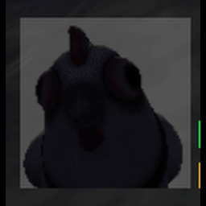

## Used as is

- [Crescent Slash](https://godotshaders.com/shader/procedural-cyclic-slash/)
  
- [Pause Menu Blur](https://godotshaders.com/shader/simple-blur-godot-4-1/)
  

## Modified

- [Earthquake](https://godotshaders.com/shader/distortion-bubble/): Reworked to use a 3D noise texture for both vertex and fragment distortion, added fresnel view effects, and enabled double-sided rendering.
  
- [Fire Ball](https://godotshaders.com/shader/energy-shield-with-impact-effect/): This shader has been modified to allow for gradient colors.
  
- [Enemy Health Bar Icon](https://godotshaders.com/shader/corner-radius/): Simplified the shader to use normalized UV coordinates and a single corner_scale uniform for rounded corners, removing border and color features for a more minimal effect.
  
- [Butter Knife Shine](https://godotshaders.com/shader/3d-item-highlighter-with-angle-adjustment/): Simplified the shine effect to use a time-based, cycling highlight along the Z-axis in view space, removed the enable/progress controls, and adjusted parameters for continuous animation and easier control over shine width and speed.
  
- [Player Hud Heal](https://godotshaders.com/shader/web-safe-darkened-gaussian-blur/): Added a customizable glow color and intensity, added an overlay alpha control, and switched to a more pronounced blur radius for a healing-glow effect instead of a simple darkened blur.
  
- [Training Glass](https://godotshaders.com/shader/frosted-glass-3/): Introduced a `transparency` uniform for explicit alpha control and changed ALBEDO to directly use the blurred screen color, making the shader a standalone frosted glass effect rather than a tint.
  
