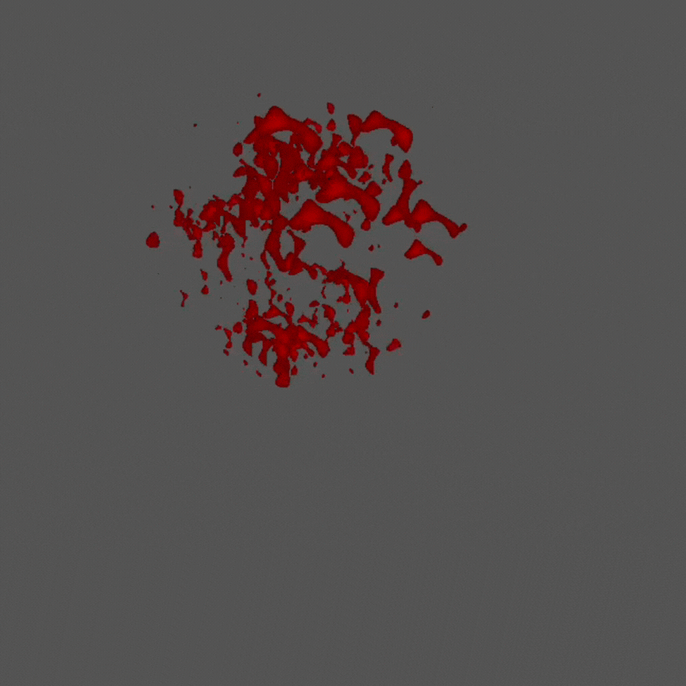

This page covers two Godot spatial shaders that create dynamic splash and splatter effects. The `splash shader` is used for airborne impacts—think blood spurts or liquid bursts—while the `splatter shader` handles stains left behind on surfaces. Both help to enhance visual feedback during gameplay.

## Splash Shader Code
```gdscript
shader_type spatial;
render_mode blend_mix, depth_draw_opaque, cull_back, unshaded;

instance uniform vec4 main_color : source_color = vec4(0.7, 0.02, 0.01, 1.0);
uniform sampler2D noise_texture;
uniform float distortion_amount : hint_range(0.0, 0.5, 0.01) = 0.1;
uniform float noise_power : hint_range(-5.0, 10.0, 0.1) = 5.0;
uniform float base_alpha : hint_range(0.0, 1.0, 0.01) = 0.8;
uniform float angle_influence : hint_range(0.0, 1.0, 0.01) = 0.5;
uniform float gradient_strength : hint_range(0.0, 10.0, 0.1)= 2.0;

void vertex() {
  mat4 billboard_matrix = VIEW_MATRIX;
  billboard_matrix[0] = VIEW_MATRIX * INV_VIEW_MATRIX[0];
  billboard_matrix[1] = VIEW_MATRIX * INV_VIEW_MATRIX[1];
  billboard_matrix[2] = VIEW_MATRIX * INV_VIEW_MATRIX[2];
  billboard_matrix[3] = VIEW_MATRIX * MODEL_MATRIX[3];

  billboard_matrix[0][0] = length(MODEL_MATRIX[0].xyz);
  billboard_matrix[1][1] = length(MODEL_MATRIX[1].xyz);
  billboard_matrix[2][2] = length(MODEL_MATRIX[2].xyz);

  MODELVIEW_MATRIX = billboard_matrix;
  COLOR.r = float(INSTANCE_ID);
  COLOR.g = 0.0;
  COLOR.b = 0.0;
}

void fragment() {
  vec2 center = vec2(0.5);
  vec2 dir = UV - center;
  float radius = length(dir) * gradient_strength;
  float angle = atan(dir.y, dir.x) / (PI * 2.0);
  float gradient = 1.0 - max(radius, angle * angle_influence);

  float distortion_strength = COLOR.r * distortion_amount;
  vec2 distorted_uv = UV + vec2(distortion_strength);
  float texture_value = pow(texture(noise_texture, distorted_uv).r, noise_power);

  vec3 final_color = main_color.rgb * (vec3(gradient) * vec3(texture_value));
  float alpha_threshold = 1.0 - (gradient * texture_value);

  ALBEDO = final_color;
  ALPHA = base_alpha;
  ALPHA_SCISSOR_THRESHOLD = alpha_threshold;
}
```

### What It Does

The `splash shader` combined with `GPUParticles3D` creates a dynamic, camera-facing blood splash effect. It uses a combination of billboarding, noise-based distortion, and gradient masking to simulate airborne splash impacts.

- **Billboarding:** Ensures the splash always faces the camera, regardless of object rotation.
- **Noise Distortion:** Uses a noise texture and per-instance distortion for organic, non-repetitive shapes.
- **Gradient Mask:** Fades the splash from the center outward, with angle-based variation for irregular edges.
- **Alpha Scissor:** Sharp cutouts for realistic, non-uniform transparency.

#### Shader Parameters

- `main_color`: Base color of the splash (can be varied per instance).
- `noise_texture`: Texture for randomizing splash shape.
- `distortion_amount`: How much the splash is warped.
- `noise_power`: Controls the contrast of the noise.
- `base_alpha`: Overall transparency.
- `angle_influence`: How much the splash’s angle affects its fade.
- `gradient_strength`: Controls the radial fade from the center.


## Splatter Shader Code

```gdscript
shader_type spatial;
render_mode blend_mix, depth_draw_opaque, cull_back, diffuse_lambert, specular_schlick_ggx;

instance uniform vec4 main_color : source_color = vec4(0.7, 0.02, 0.01, 1.0);
uniform sampler2D noise_texture;
uniform float splatter_scale = 2.0;
uniform float distortion_amount : hint_range(0.0, 1.0, 0.01) = 0.1;
uniform float edge_variation : hint_range(0.0, 1.0, 0.01) = 1.0;
uniform float noise_power : hint_range(1.0, 10.0, 0.1) = 1.0;

void vertex() {
  COLOR.r = float(INSTANCE_ID);
  COLOR.g = INSTANCE_CUSTOM.y;
  COLOR.b = 0.0;
}

void fragment() {
  vec2 center = vec2(0.5);
  vec2 uv_dir = (UV - center) / splatter_scale;
  float radius = length(uv_dir) * 2.0;
  float gradient = 1.0 - radius;

  float distortion_strength = COLOR.r * distortion_amount;
  vec2 distorted_uv = UV + vec2(distortion_strength) / splatter_scale;
  float texture_value = pow(texture(noise_texture, distorted_uv).r, noise_power);

  float mask = gradient * texture_value;
  float edge_fade = 1.0 - COLOR.g * edge_variation;
  vec3 final_color = main_color.rgb * vec3(mask);

  ALBEDO = final_color;
  ALPHA = edge_fade * mask;
  ALPHA_SCISSOR_THRESHOLD = 1.0 - mask;
}
```

### What It Does

The `splatter shader` simulates blood stains on surfaces, such as floors or walls. It uses lighting models for realistic interaction with the environment and edge fading for natural decay.

- **Diffuse & Specular Lighting:** Reacts to scene lighting for a wet, shiny look.
- **Noise & Distortion:** Adds randomness for organic, non-uniform stains.
- **Edge Variation:** Allows splatters to fade or change over time.
- **Alpha Scissor:** Creates sharp, irregular edges.

#### Shader Parameters

- `main_color`: Base color of the splatter.
- `noise_texture`: Texture for randomizing splatter shape.
- `splatter_scale`: Controls splatter size.
- `distortion_amount`: Amount of UV distortion.
- `edge_variation`: Controls edge fading (can be animated).
- `noise_power`: Adjusts noise contrast.

## Usage in Fowl Play

Both shaders are used to visually reinforce the impact of combat. The `splash shader` is for airborne, momentary effects (like blood spurts), while the `splatter shader` is suited for persistent stains on surfaces. Their parameters allow for variation and tuning to match the dark, gritty tone of the game.

## Technical Notes

- `Billboarding` in the Splash Shader ensures the effect always faces the camera, using the view and model matrices.
- `Instance IDs` are used to randomize distortion and edge effects per particle or decal.
- `Noise Textures` should be seamless and grayscale for best results.
- `Alpha Scissor` is used in both shaders to discard pixels below a threshold, creating sharp, organic edges.
