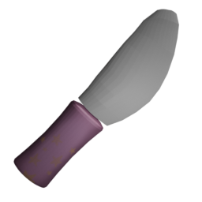

The Butter Knife is a fast, spammable melee weapon. While it deals low damage per hit, its extremely quick attack and cooldown times allow for high damage-per-second (DPS) if used skillfully. Its short range balances its offensive potential.

## Resource Overview

```gdscript
[resource]
script = ExtResource("1_ry0ng")
damage = 8
windup_time = 0.0
attack_duration = 0.2
cooldown_time = 0.1
loop_animation = false
name = "Butter Knife"
purchasable = true
drop_chance = 40
cost = 110
currency_type = 0
description = "Deals %s Base Damage with a quick stab. The attack lasts %s, then enters a cooldown state for %s."
icon = ExtResource("1_m3duu")
model_uid = "uid://db68ojqri7xqs"
```

## Gameplay considerations

- **Strengths**: Extremely fast attack and cooldown, allowing for rapid consecutive hits.
- **Weaknesses**: Low base damage and limited range. The limited range means players must be close to their target to deal damage effectively, which leaves them vulnerable to counterattacks.
- **Best Used**: For players who prefer aggressive, close-quarters combat and can maintain positioning.

## Animations

- **Attack**: The knife pulls back slightly, then thrusts forward in a quick stabbing motion.
- **Cooldown**: A shader glint effect plays, indicating the weapon is recovering.
- **Idle**: The knife is tossed into the air, spinning and flipping with a backward rotation.
