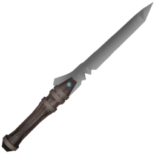

The Dagger is a high-range melee weapon with a slower attack cycle. Its unique feature is the ability to deal damage twice per attack, rewarding precise timing and positioning.

## Resource

```gdscript
[resource]
script = ExtResource("1_43o3y")
damage = 30
windup_time = 0.5
attack_duration = 1.4
cooldown_time = 1.2
loop_animation = false
name = "Dagger"
purchasable = true
drop_chance = 12
cost = 80
currency_type = 0
description = "Deals %s Base Damage with a powerful swing after a windup of %s. The attack lasts %s, then enters a cooldown state for %s.

Allows for [color=orange]2 hits per attack[/color]."
icon = ExtResource("1_8lwf8")
model_uid = "uid://dldj0suybdnhl"
```

## Gameplay Considerations

- **Strengths**: High base damage and long range. Can hit twice per attack cycle.
- **Weaknesses**: Long windup and cooldown, requiring careful timing.
- **Best Used**: For players who can anticipate enemy movement and maximize the double-hit potential.
- **Notable Mechanics**: The dagger's double-hit mechanic allows for two hits per attack, which can be a strategic advantage.

## Animations

- **Attack**: The dagger lunges forward, rotating flat, then spins and moves in an arc.
- **Cooldown**: The weapon is inspected, adding a flourish after the attack.
- **Idle**: The dagger is tossed and spins in the air.
