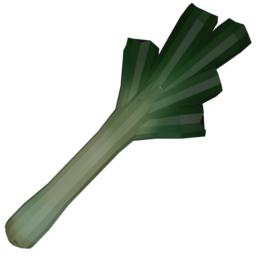

The Leek is a slower melee weapon with decent range and moderate damage. Its unique attack and idle animations give it a playful feel.

## Weapon Resource

```gdscript
[gd_resource type="Resource" script_class="MeleeWeaponResource" load_steps=3 format=3 uid="uid://cybaeim8kc5kk"]

[ext_resource type="Texture2D" uid="uid://ckrv5snsxeiws" path="res://entities/weapons/melee_weapons/melee_weapon_models/leek/art/leek.png" id="1_16jp6"]
[ext_resource type="Script" uid="uid://bflt4m3fx7gmv" path="res://entities/weapons/melee_weapons/melee_weapon_resource.gd" id="1_nt88w"]

[resource]
script = ExtResource("1_nt88w")
damage = 25
windup_time = 0.2
attack_duration = 0.4
cooldown_time = 0.8
stun_time = 0.8
loop_animation = false
name = "Leek"
purchasable = true
is_free = false
drop_chance = 90
cost = 50
currency_type = 0
description = "Deals %s Base Damage with a sharp leek after winding up for %s. The attack lasts %s, then enters a cooldown state for %s, and stuns targets hit for %s."
short_description = "The user swing a [color=yellow]sharp leek[/color], dealing [color=yellow]moderate[/color] damage that applies a [color=yellow]brief[/color] stun effect."
icon = ExtResource("1_16jp6")
model_uid = "uid://bymaeu4dtl7ex"
metadata/_custom_type_script = "uid://bflt4m3fx7gmv"
```

## Weapon Stats

| Stat                | Value                |
|---------------------|---------------------|
| Base Damage         | 25                  |
| Windup Time         | 0.2s                |
| Attack Duration     | 0.4s                |
| Cooldown Time       | 0.8s                |
| Stun Time           | 0.8s                |
| Loop Animation      | No                  |
| Purchasable         | Yes                 |
| Cost                | 50                  |
| Drop Chance         | 90%                 |
| Currency Type       | 0                   |

**Description:**
Deals %s Base Damage with a sharp leek after winding up for %s. The attack lasts %s, then enters a cooldown state for %s, and stuns targets hit for %s.

## Gameplay considerations

- **Strengths**: Good range and moderate damage, decent attack speed. Makes for a good neutral weapon, for all playstyles.
- **Weaknesses**: Slower attack and cooldown compared to faster weapons.
- **Best Used**: For players who want a balance between speed and power.

## Animations

- **Attack**: The leek scales up and rotates backward, then swings forward to attack, quickly returning to its original state.
- **Cooldown**: The leek twirls upward, spinning and scaling up and down for a dynamic effect.
- **Idle**: The leek shrinks, rotates slightly, and bounces back, giving it a lively idle motion.
