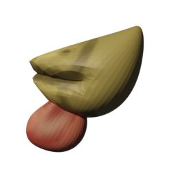

The Peck is inspired by the natural pecking of birds. It is quick and always available to the player unless replaced by another weapon. It serves as the default melee weapon, allowing players to engage in close combat without needing to purchase another weapon.

## Resource Overview

```gdscript
[gd_resource type="Resource" script_class="MeleeWeaponResource" load_steps=3 format=3 uid="uid://c6srj1sb1gdhm"]

[ext_resource type="Texture2D" uid="uid://cwtfhx12oyuy7" path="res://entities/weapons/melee_weapons/melee_weapon_models/peck/art/peck.png" id="1_gp07i"]
[ext_resource type="Script" uid="uid://bflt4m3fx7gmv" path="res://entities/weapons/melee_weapons/melee_weapon_resource.gd" id="1_mvqda"]

[resource]
script = ExtResource("1_mvqda")
damage = 10
windup_time = 0.2
attack_duration = 0.4
cooldown_time = 0.3
stun_time = 0.2
loop_animation = false
name = "Peck"
purchasable = false
is_free = false
drop_chance = 0
cost = 0
currency_type = 0
description = "[color=orange]Default weapon:[/color] The fearsome PECK! 

Your trusty beak unleashes %s Base Damage after a %s windup. The pecking lasts %s, after which your beak needs a breather for %s — Wouldn't want to break it, right? Targets hit are stunned for %s."
short_description = "The user performs a quick [color=yellow]peck attack[/color] that deals [color=yellow]minor[/color] damage and stunning targets [color=yellow]slightly[/color].
"
icon = ExtResource("1_gp07i")
model_uid = "uid://cyabnta5e4ldb"
metadata/_custom_type_script = "uid://bflt4m3fx7gmv"c
```

## Weapon Stats

| Stat                | Value                |
|---------------------|---------------------|
| Base Damage         | 10                  |
| Windup Time         | 0.2s                |
| Attack Duration     | 0.4s                |
| Cooldown Time       | 0.3s                |
| Stun Time           | 0.2s                |
| Loop Animation      | No                  |
| Purchasable         | No                  |
| Cost                | 0                   |
| Drop Chance         | 0%                  |
| Currency Type       | 0                   |

**Description:**
[color=orange]Default weapon:[/color] The fearsome PECK! 

Your trusty beak unleashes %s Base Damage after a %s windup. The pecking lasts %s, after which your beak needs a breather for %s — Wouldn't want to break it, right? Targets hit are stunned for %s.

## Gameplay considerations

- **Strengths**: Always available, quick to use, and ideal for learning combat mechanics.
- **Weaknesses**: Lower damage and range compared to other weapons.
- **Best Used**: As a fallback weapon or for new players.
- **Note**: Once another melee weapon is purchased, the peck will be replaced and unavailable until the player dies. The peck is not purchasable.

## Animations

- **Attack**: The player character jumps slightly and pecks with its beak while airborne. Uses a custom script to trigger the animation on the player or compatible enemy:

```gdscript
class_name Peck
extends MeleeWeapon


func play_attack_animation() -> void:
	var animation_tree: AnimationTree

	if entity_stats.is_player:
		if GameManager.chicken_player and GameManager.chicken_player.animation_tree:
			animation_tree = GameManager.chicken_player.animation_tree
	else:
		if GameManager.current_enemy and GameManager.current_enemy.animation_tree:
			animation_tree = GameManager.current_enemy.animation_tree

	if animation_tree:
		# Fire the OneShot request
		animation_tree.set("parameters/MeleeOneShot/request", AnimationNodeOneShot.ONE_SHOT_REQUEST_FIRE)
```
