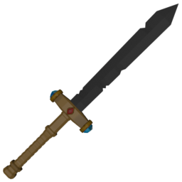

The Sword is a powerful melee weapon with high base damage and an attack arc. It is designed for players who want to deal significant damage in a single swing.

## Resource

```gdscript
[resource]
script = ExtResource("1_tqsw4")
damage = 40
windup_time = 0.0
attack_duration = 0.6
cooldown_time = 0.5
loop_animation = false
name = "Sword"
purchasable = true
drop_chance = 50
cost = 150
currency_type = 0
description = "Deals %s Base Damage with a slash. The attack lasts %s, then enters a cooldown state for %s."
icon = ExtResource("1_djghw")
model_uid = "uid://co3ix5krmh3qr"
```

## Gameplay Considerations

- **Strengths**: High damage output and wide attack arc, making it still hit when the player is not directly in front of the player.
- **Weaknesses**: Slightly slower than the fastest weapons, requiring good timing.
- **Best Used**: For players who want to maximize damage per hit and control space in melee combat.

## Animations

- **Attack**: The sword moves forward and rotates in an arc, simulating a slash.
- **Cooldown**: The sword spins back to its original position, readying for the next attack.
- **Idle**: The sword wiggles and rotates slightly, notifying the player that it is ready.
