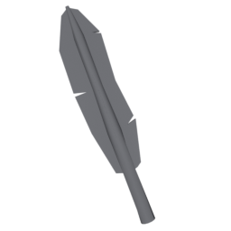

The **feather** is a precision hitscan weapon that fires a single, high-speed projectile. Its unique property is that it deals **true damage**, completely ignoring the target’s defense stat.

---

## Weapon Resource

```gdscript
[gd_resource type="Resource" script_class="RangedWeaponResource" load_steps=3 format=3 uid="uid://xugbt3rir6fn"]

[ext_resource type="Script" uid="uid://dm0sr7j8y5j30" path="res://entities/weapons/ranged_weapons/ranged_weapon_resource.gd" id="1_ddm8g"]
[ext_resource type="Texture2D" uid="uid://bogv88bhar46o" path="res://entities/weapons/ranged_weapons/ranged_weapon_models/feather/art/feather.png" id="1_j6iuc"]

[resource]
script = ExtResource("1_ddm8g")
damage = 20
windup_time = 0.0
attack_duration = 0.5
cooldown_time = 0.5
allow_continuous_fire = false
allow_early_release = false
fire_rate_per_second = 0.0
max_range = 200.0
handle_attack_end_by_state = false
loop_animation = false
name = "Feather"
purchasable = true
is_free = false
drop_chance = 70
cost = 50
currency_type = 0
description = "A stolen feather, still burning with its owner's wrath, its color now faded by sorrow. 

This weapon has %s Base Damage. The attack starts instantly, and takes %s, with a max range of %s, then enters a cooldown state for %s.

This weapon deals [color=orange]True Damage, ignoring targets Defense[/color].

This weapon %s and %s."
short_description = "The user throws its feather with [color=yellow]high velocity[/color], striking from [color=yellow]Long Range[/color] and dealing [color=orange]True Damage[/color]."
icon = ExtResource("1_j6iuc")
model_uid = "uid://qj6ygx6ak84a"
metadata/_custom_type_script = "uid://dm0sr7j8y5j30"

```

## Attack State Mechanics

The feather’s attack state is designed for instant, accurate shots with strong visual feedback. It uses a hitscan approach, meaning the projectile travels instantly to its target, and the result of the attack is determined immediately.

### Hitscan Firing

- Fires a single, straight-line shot from the attack origin
- Uses a RayCast3D to instantly detect what is hit
- No projectile physics or travel time—damage is applied immediately

### True Damage

- The feather’s attack always deals **true damage**
- Ignores all defense stats on the target
- Guarantees consistent damage output regardless of enemy resistances

### Visual Effects

- The feather model is animated from the origin to the hit point for visual feedback
- Wind and launch particle effects are triggered on fire
- Wind effect lags slightly behind the feather for a dynamic look

### Processing Separation

- **Visual Phase:** Animates the feather and wind effects for the duration of the attack
- **Physics Phase:** Raycast is processed in the physics step for accurate collision detection

### Automatic Timing Control

- Uses a timer to control the duration of the visual effect and transition to cooldown
- Ensures the weapon cannot be fired again until the animation and cooldown are complete

---

## Attack State Code

```gdscript
extends BaseRangedCombatState

@export var attack_origin: Node3D
@export_group("Wind Effect")
@export var wind_lag_time: float = 0.15
@export var _wind_attack_elapsed: float = 0.0

var _pending_raycast: RayCast3D = null
var _visualization_timer: Timer = null
var _feather_start_pos: Vector3
var _feather_end_pos: Vector3
var _attack_elapsed: float = 0.0

@onready var feather_model : Node3D = $"../../feather"
@onready var wind_effect : GPUParticles3D = $"../../WindEffect"
@onready var launch_effect : GPUParticles3D = $"../../LaunchEffect"

func enter(_previous_state, _info: Dictionary = {}) -> void:
	if weapon.entity_stats.is_player:
		SignalManager.cooldown_item_slot.emit(
			weapon.current_weapon,
			weapon.current_weapon.attack_duration,
			false
		)
	_pending_raycast = null
	_fire_single_shot()
	wind_effect.emitting = true
	feather_model.visible = true
	_attack_elapsed = 0.0
	_wind_attack_elapsed = 0.0
	launch_effect.emitting = true

func physics_process(delta: float) -> void:
	if is_instance_valid(_pending_raycast):
		if _pending_raycast.is_colliding():
			process_raycast_hit(_pending_raycast, DamageEnums.DamageTypes.TRUE)
			_pending_raycast = null
			_start_visualization_timer()
	if feather_model.visible:
		_attack_elapsed += delta
		var t = clamp(_attack_elapsed / weapon.current_weapon.attack_duration, 0.0, 1.0)
		feather_model.global_position = _feather_start_pos.lerp(_feather_end_pos, t)
		_wind_attack_elapsed += delta
		var wind_t = clamp((_wind_attack_elapsed - wind_lag_time) / weapon.current_weapon.attack_duration, 0.0, 1.0)
		wind_effect.global_position = _feather_start_pos.lerp(_feather_end_pos, wind_t)

func exit() -> void:
	_pending_raycast = null
	if _visualization_timer:
		_visualization_timer.queue_free()
		_visualization_timer = null
	wind_effect.emitting = false
	feather_model.visible = false
	feather_model.position = Vector3.ZERO
	wind_effect.position = Vector3(0, 0, -0.6)

func _fire_single_shot() -> void:
	var fire_direction: Vector3 = -attack_origin.global_basis.z.normalized()
	var max_range: float = weapon.current_weapon.max_range
	_feather_start_pos = attack_origin.global_position
	_feather_end_pos = _feather_start_pos + fire_direction * max_range
	_pending_raycast = _create_raycast(_feather_start_pos, fire_direction, max_range)

func _create_raycast(
	origin: Vector3,
	direction: Vector3,
	max_range: float
) -> RayCast3D:
	var raycast := RayCast3D.new()
	raycast.enabled = true
	raycast.target_position = direction * max_range
	raycast.collision_mask = 0b0111
	get_tree().root.add_child(raycast)
	raycast.global_position = origin
	var timer := Timer.new()
	raycast.add_child(timer)
	timer.wait_time = 0.1
	timer.one_shot = true
	timer.timeout.connect(
		func():
			if is_instance_valid(raycast) and raycast.is_inside_tree():
				raycast.queue_free()
	)
	timer.start()
	return raycast

func _start_visualization_timer():
	if _visualization_timer:
		_visualization_timer.queue_free()
	_visualization_timer = Timer.new()
	_visualization_timer.wait_time = weapon.current_weapon.attack_duration
	_visualization_timer.one_shot = true
	add_child(_visualization_timer)
	_visualization_timer.timeout.connect(_on_visualization_timer_timeout)
	_visualization_timer.start()

func _on_visualization_timer_timeout():
	transition_signal.emit(WeaponEnums.WeaponState.COOLDOWN, {})
	if _visualization_timer:
		_visualization_timer.queue_free()
		_visualization_timer = null
```

---

## Code Features

### State Management

- Inherits from a base ranged combat class for shared weapon logic
- Uses timers to control attack duration and cooldown
- Handles state transitions and effect cleanup

### Performance Optimization

- Raycast is created and destroyed automatically for each shot
- Visual effects are only active during the attack animation
- All temporary nodes are cleaned up after use

### Mathematics

- Uses linear interpolation (`lerp`) to animate the feather and wind effects from start to end
- Wind effect lags behind the feather for a dynamic trailing effect

### Godot Engine Features

- Uses RayCast3D for instant hitscan detection
- Uses Godot’s particle and node system for visual feedback
- Employs signals and timers for state and effect management

---

## Summary

- **Hitscan:** The feather instantly hits its target using a raycast.
- **True Damage:** Ignores all defense, always deals full damage.
- **Visual Feedback:** Feather and wind effects animate along the shot path.
- **Cooldown:** Attack cannot be repeated until the animation and cooldown complete.

The feather is a powerful, skill-based weapon for players who value precision and reliability in combat.
