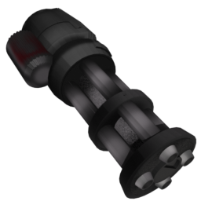

The minigun is a powerful ranged weapon that fires a high volume of bullets in quick succession. Each bullet deals minimal damage, but the rapid fire rate makes it very effective against enemies. The weapon has a long cooldown time to balance its power.

---

## Weapon Resource

```gdscript
[gd_resource type="Resource" script_class="RangedWeaponResource" load_steps=3 format=3 uid="uid://csmfpbrekf78u"]

[ext_resource type="Script" uid="uid://dm0sr7j8y5j30" path="res://entities/weapons/ranged_weapons/ranged_weapon_resource.gd" id="1_dlpss"]
[ext_resource type="Texture2D" uid="uid://mc0qe47pebkh" path="res://entities/weapons/ranged_weapons/ranged_weapon_models/minigun/art/minigun.png" id="1_f0db6"]

[resource]
script = ExtResource("1_dlpss")
damage = 5
windup_time = 1.0
attack_duration = 5.0
cooldown_time = 2.5
allow_continuous_fire = true
allow_early_release = true
fire_rate_per_second = 0.2
max_range = 45.0
handle_attack_end_by_state = false
loop_animation = true
name = "Minigun"
purchasable = true
is_free = false
drop_chance = 25
cost = 150
currency_type = 0
description = "Deals %s Base Damage per bullet, with a fire rate of %s after a windup of %s. The attack lasts %s, with a max range of %s, then enters a cooldown state for %s.

This weapon %s and %s."
short_description = "The user fires bursts of bullets rapidly, hitting targets continuously and dealing [color=yellow]minor[/color] damage over a [color=yellow]great distance[/color]."
icon = ExtResource("1_f0db6")
model_uid = "uid://8owdwg4pu4ht"
metadata/_custom_type_script = "uid://dm0sr7j8y5j30"

```

## Attack State Mechanics

The attack state manages both visual representation and damage functionality. When activated, it rapidly fires projectiles in a controlled spiral pattern, simulating the "spray" of a multi-barreled machine gun.

### Spiral Firing Pattern

The minigun fires bullets in a spiral pattern that:

- Creates an unpredictable firing pattern
- Balances high fire rate with controlled spread
- Visually communicates the weapon's power

The pattern uses a rotating offset around a central point (`barrel_radius`), simulating the multiple rotating barrels.

### Bullet Visualization

The weapon creates tracer effects using:

- `ImmediateMesh` for efficient rendering
- Cylindrical geometry for bullet trajectories
- Timed self-destruction to prevent memory leaks
- Raycasts with collision masks for hit detection

### Processing Separation

The minigun separates:

1. **Visual Phase**: Creates immediate feedback when firing
2. **Physics Phase**: Handles collision detection at fixed intervals. In order for raycasts to accurately detect collisions, they need to be updated in the physics process

This ensures responsive visuals without sacrificing physics accuracy.

### Automatic Timing Control

The minigun uses timers to enforce attack duration limits and transitions to a cooldown state when expired. This cooldown balances the weapon's power.

## Attack State Code

```gdscript
extends BaseRangedCombatState

@export var attack_origin: Node3D
@export var barrel_radius: float = 0.2  # Radius of minigun barrel arrangement
@export var spiral_spread: float = 25.0  # Degrees between each bullet's angle
@export var max_spread_angle: float = 45.0  # Max spray angle

var _fire_timer: float = 0.0
var _current_angle: float = 0.0
var _angle_direction: int = 1
var _ray_queue: Array[RayRequest] = []

@onready var attack_duration_timer : Timer = $AttackDurationTimer


func enter(_previous_state, _info: Dictionary = {}) -> void:
	if weapon.entity_stats.is_player:
		SignalManager.cooldown_item_slot.emit(weapon.current_weapon, weapon.current_weapon.attack_duration, false)
	_fire_timer = 0.0
	_current_angle = 0.0
	_angle_direction = 1
	attack_duration_timer.start(weapon.current_weapon.attack_duration)


func process(delta: float) -> void:
	_fire_timer += delta

	var fire_interval: float = weapon.current_weapon.fire_rate_per_second

	while _fire_timer >= fire_interval:
		_fire_timer -= fire_interval
		_fire_bullet()


func physics_process(_delta: float) -> void:
	# loop through raycast queue, create raycasts and check for collisions
	for ray_param in _ray_queue:
		var origin: Vector3 = ray_param.origin
		var direction: Vector3 = ray_param.direction
		var max_range: float = ray_param.max_range

		var raycast: RayCast3D = _create_raycast(origin, direction, max_range)
		raycast.force_raycast_update()
		process_raycast_hit(raycast)
	_ray_queue.clear()


func exit() -> void:
	# Reset the angle to the initial position
	_current_angle = 0.0
	_angle_direction = 1

	attack_duration_timer.stop()

	# Clear ray cast queue, allows existing raycasts to still be processed
	_ray_queue.clear()


# The visualization should start immediatly for game feel, but Raycasts need to be processed in physics_process to work
func _fire_bullet() -> void:
	# Calculate spawn position with rotating offset
	var angle_rad : float = deg_to_rad(_current_angle)
	var offset := Vector3(
		cos(angle_rad) * barrel_radius,
		sin(angle_rad) * barrel_radius,
		0
	)

	var fire_direction: Vector3 = attack_origin.global_basis.z.normalized()
	var max_range: float = weapon.current_weapon.max_range
	var origin: Vector3 = attack_origin.global_position + attack_origin.global_transform.basis * offset

	# Store raycast parameters for physics processing
	_ray_queue.append(RayRequest.new(origin, fire_direction, max_range))

	# Visualize the trajectory
	_create_trajectory_visualization(origin, fire_direction, max_range)
	_update_spiral_angle()


func _create_raycast(origin: Vector3, direction: Vector3, max_range: float) -> RayCast3D:
	var raycast := RayCast3D.new()
	raycast.enabled = true
	raycast.target_position = direction * max_range
	raycast.collision_mask = 0b0111 # check for collisions on layer 1 (world), layer 2 (player) and layer 3 (enemy)

	# Add to physics space first
	get_tree().root.add_child(raycast)
	raycast.global_position = origin

	# Creating a timer to automatically remove the raycast
	var timer := Timer.new()
	raycast.add_child(timer)
	timer.wait_time = 0.1
	timer.one_shot = true
	timer.timeout.connect(func():
		if is_instance_valid(raycast) and raycast.is_inside_tree():
			raycast.queue_free()
	)
	timer.start()

	return raycast


func _create_trajectory_visualization(origin: Vector3, direction: Vector3, max_range: float) -> void:
	var trajectory_mesh := ImmediateMesh.new()
	var mesh_instance := MeshInstance3D.new()
	mesh_instance.mesh = trajectory_mesh
	mesh_instance.cast_shadow = GeometryInstance3D.SHADOW_CASTING_SETTING_OFF

	# Add to scene root but position in world space
	get_tree().current_scene.add_child(mesh_instance)
	mesh_instance.global_position = origin

	trajectory_mesh.surface_begin(Mesh.PRIMITIVE_TRIANGLES)
	trajectory_mesh.surface_set_color(Color(1.0, 0.5, 0.0, 0.3))  # Tracers

	var radius := 0.1  # Tracer thickness
	var segments := 6
	var start_verts: Array[Vector3] = []
	var end_verts: Array[Vector3] = []
	var ortho := _find_orthogonal_vector(direction)

	for i in segments:
		var angle := float(i) / segments * TAU
		var circle_vec := ortho.rotated(direction, angle) * radius
		start_verts.append(circle_vec)
		end_verts.append(direction * max_range + circle_vec)

	_generate_cylinder_geometry(trajectory_mesh, start_verts, end_verts, segments)
	trajectory_mesh.surface_end()

	# Creating a timer to automatically remove the mesh
	var timer := Timer.new()
	mesh_instance.add_child(timer)
	timer.wait_time = 0.15
	timer.one_shot = true
	timer.timeout.connect(func():
		mesh_instance.queue_free()
		timer.queue_free()
	)
	timer.start()


func _find_orthogonal_vector(direction: Vector3) -> Vector3:
	return (
		Vector3.RIGHT
		if abs(direction.dot(Vector3.UP)) < 0.9
		else Vector3.FORWARD
	).cross(direction).normalized()


func _generate_cylinder_geometry(
	mesh: ImmediateMesh,
	start_verts: Array[Vector3],
	end_verts: Array[Vector3],
	segments: int
) -> void:
	for i in segments:
		var next_i := (i + 1) % segments

		# Side triangles
		mesh.surface_add_vertex(start_verts[i])
		mesh.surface_add_vertex(end_verts[i])
		mesh.surface_add_vertex(start_verts[next_i])

		mesh.surface_add_vertex(start_verts[next_i])
		mesh.surface_add_vertex(end_verts[i])
		mesh.surface_add_vertex(end_verts[next_i])


func _update_spiral_angle() -> void:
	_current_angle += spiral_spread * _angle_direction
	_current_angle = clamp(_current_angle, -max_spread_angle, max_spread_angle)
	_angle_direction *= -1 if abs(_current_angle) >= max_spread_angle else 1


func _on_attack_duration_timer_timeout() -> void:
	transition_signal.emit(WeaponEnums.WeaponState.COOLDOWN, {})
```

---

### Code Features

#### State Management

- Built on a base ranged combat class for reusing common weapon features
- Uses timers to control attack duration
- Handles state transitions

#### Performance Optimization

- Separates visual effects from hit detection
- Auto-removes visual effects when not needed
- Generates geometry on demand

#### Mathematics

- Creates spiral patterns with circular calculations
- Uses angle limits to create spray pattern

#### Godot Engine Features

- Uses Godot's built-in collision system with RayCast3D
- Filters which objects can be hit using collision masks
- Creates and removes objects in the game world as needed
- Uses Godot's timer system for both gameplay and cleanup tasks
