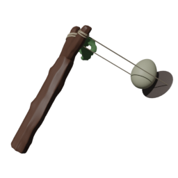

The **slingshot** is a versatile ranged weapon that launches a single, high-impact projectile. Unlike rapid-fire weapons, the slingshot focuses on precision and area denial: its projectile explodes on impact, spawning a lingering temporary fire hazard that damages over time.

---

## Weapon Resource

```gdscript
[gd_resource type="Resource" script_class="RangedWeaponResource" load_steps=3 format=3 uid="uid://e28hxersxled"]

[ext_resource type="Texture2D" uid="uid://66h4iajbhhw1" path="res://entities/weapons/ranged_weapons/ranged_weapon_models/slingshot/art/slingshot.png" id="1_26unw"]
[ext_resource type="Script" uid="uid://dm0sr7j8y5j30" path="res://entities/weapons/ranged_weapons/ranged_weapon_resource.gd" id="1_g1vt4"]

[resource]
script = ExtResource("1_g1vt4")
damage = 40
windup_time = 0.5
attack_duration = 0.0
cooldown_time = 2.5
allow_continuous_fire = true
allow_early_release = true
fire_rate_per_second = 0.0
max_range = 0.0
handle_attack_end_by_state = false
loop_animation = false
name = "Slingshot"
purchasable = true
is_free = false
drop_chance = 15
cost = 100
currency_type = 0
description = "Hold the attack button to line up the perfect shot. Take as much time as you need!

Release to launch a powerful explosive egg that deals %s [color=yellow]Base Damage[/color] on impact after a brief windup of %s.

Upon exploding, the egg leaves behind a [color=orange]temporary fire pool[/color]. Watch out, as it [color=orange]hurts both you and enemies[/color]!  

After firing, the slingshot requires %s to recover before it can be used again.  

This weapon %s and %s."
short_description = "The user aims and launches an explosive egg that deals [color=yellow]moderate[/color] damage on impact and creates a [color=yellow]Fire Pool[/color] damaging all nearby targets."
icon = ExtResource("1_26unw")
model_uid = "uid://dp3a4dva535bj"
metadata/_custom_type_script = "uid://dm0sr7j8y5j30"

```

## Attack State Mechanics

The slingshot’s attack state manages both aiming and firing mechanics. When activated, it visualizes the projectile's projectory. When the player releases the attack button, the slingshot fires a projectile in that trajectory.

### Firing Pattern

- Fires a single, high-damage projectile per attack
- No spread or spiral; the projectile travels straight from the attack origin in an arch
- Emphasizes accuracy and timing over volume of fire

### Projectile Visualization

- The projectile is a visible, physical object (a RigidBody3D)
- Includes visual effects: debris, fire, and smoke particles
- Plays sound effects on impact and explosion

### Processing Separation

The slingshot separates:

1. **Visual Phase**: Spawns a visual effects for immediate feedback
2. **Physics Phase**: Handles projectile movement, collision, and hazard spawning in `_physics_process`

This ensures responsive visuals and accurate physics.

### Automatic Timing Control

- Uses a timer to control attack duration and transition to cooldown
- Projectile has its own timeout, after which it explodes even if it doesn’t hit anything

## Attack State Code

```gdscript
extends BaseRangedCombatState

@export var attack_origin: Node3D

var _fire_timer: float = 0.0
var _ray_queue: Array[RayRequest] = []

@onready var attack_duration_timer : Timer = $AttackDurationTimer

func enter(_previous_state, _info: Dictionary = {}) -> void:
	if weapon.entity_stats.is_player:
		SignalManager.cooldown_item_slot.emit(weapon.current_weapon, weapon.current_weapon.attack_duration, false)
	_fire_timer = 0.0
	attack_duration_timer.start(weapon.current_weapon.attack_duration)

func process(delta: float) -> void:
	_fire_timer += delta
	var fire_interval: float = weapon.current_weapon.fire_rate_per_second
	while _fire_timer >= fire_interval:
		_fire_timer -= fire_interval
		_fire_bullet()

func physics_process(_delta: float) -> void:
	for ray_param in _ray_queue:
		var origin: Vector3 = ray_param.origin
		var direction: Vector3 = ray_param.direction
		var max_range: float = ray_param.max_range
		var raycast: RayCast3D = _create_raycast(origin, direction, max_range)
		raycast.force_raycast_update()
		process_raycast_hit(raycast)
	_ray_queue.clear()

func exit() -> void:
	attack_duration_timer.stop()
	_ray_queue.clear()

func _fire_bullet() -> void:
	var fire_direction: Vector3 = attack_origin.global_basis.z.normalized()
	var origin: Vector3 = attack_origin.global_position
	_spawn_projectile(origin, fire_direction)

func _spawn_projectile(origin: Vector3, direction: Vector3) -> void:
	var projectile_scene: PackedScene = preload("res://path/to/slingshot_projectile.tscn")
	var projectile: RigidBody3D = projectile_scene.instantiate()
	get_tree().current_scene.add_child(projectile)
	projectile.global_position = origin
	projectile.linear_velocity = direction * weapon.current_weapon.projectile_speed
	projectile.setup_projectile(weapon.entity_stats, weapon.current_weapon.damage)

func _on_attack_duration_timer_timeout() -> void:
	transition_signal.emit(WeaponEnums.WeaponState.COOLDOWN, {})
```

---

## Projectile Mechanics

The slingshot projectile is a physics-based object that:

- Flies forward with initial velocity
- Has a brief invincibility window to avoid immediate self-collision
- Explodes on impact or after a timeout
- Spawns a temporary fire hazard at the impact location

### Projectile Code

```gdscript
extends RigidBody3D

@export var time_out: float = 2.0
@export var invincibility_time: float = 0.1
@export_range(0.01, 2.0, 0.01) var fire_pool_damage_modifier := 0.2
@export var hazard: PackedScene = preload("uid://cw81sd3kyuelj")

var base_damage: int = 0
var _timer: float = 0.0
var _has_spawned_hazard: bool = false
var _invincibility_timer: float = 0.0
var _original_collision_mask: int = 0

@onready var debris_effect : GPUParticles3D = $Debris
@onready var fire_effect : GPUParticles3D = $Fire
@onready var smoke_effect : GPUParticles3D = $Smoke
@onready var egg_model : Node3D = $slingshot_projectile
@onready var cracking_sound : RandomSFXPlayer = $CrackingSound
@onready var exposion_sound : RandomSFXPlayer = $ExplosionSound

func setup_projectile(p_firer_stats: LivingEntityStats, p_damage: int) -> void:
	base_damage = p_damage
	if p_firer_stats.is_player:
		_original_collision_mask = (1 << 0) | (1 << 2)
	else:
		_original_collision_mask = (1 << 0) | (1 << 1)
	collision_mask = 0
	_invincibility_timer = 0.0

func _physics_process(delta: float) -> void:
	if _has_spawned_hazard:
		return
	if collision_mask == 0:
		_invincibility_timer += delta
		if _invincibility_timer >= invincibility_time:
			collision_mask = _original_collision_mask
	_timer += delta
	if _timer >= time_out and is_inside_tree():
		_spawn_hazard()

func _on_body_entered(body: Node) -> void:
	if _invincibility_timer < invincibility_time:
		return
	cracking_sound.play_random()
	if _has_spawned_hazard:
		return
	if not (body is Enemy or body is ChickenPlayer):
		return
	if not is_inside_tree():
		return
	SignalManager.weapon_hit_target.emit(body, base_damage, DamageEnums.DamageTypes.NORMAL)
	_spawn_hazard()

func _explode() -> void:
	collision_layer = 0
	collision_mask = 0
	linear_velocity = Vector3.ZERO
	angular_velocity = Vector3.ZERO
	call_deferred("set_contact_monitor", false)
	set_freeze_enabled(FREEZE_MODE_STATIC)
	egg_model.hide()
	exposion_sound.play_random()
	debris_effect.emitting = true
	fire_effect.emitting = true
	smoke_effect.emitting = true

func _spawn_hazard() -> void:
	if _has_spawned_hazard:
		return
	_has_spawned_hazard = true
	_explode()
	if not is_inside_tree():
		_queue_free_when_particles_done()
		return
	if not is_instance_valid(hazard):
		push_error("Hazard PackedScene is not set for the projectile!")
		_queue_free_when_particles_done()
		return
	var hazard_instance: BaseHazard = hazard.instantiate()
	var parent_node: Node = get_parent()
	var scene_tree: SceneTree = get_tree()
	if is_instance_valid(parent_node):
		parent_node.add_child(hazard_instance)
	else:
		scene_tree.current_scene.add_child(hazard_instance)
	hazard_instance.global_position = global_position
	hazard_instance.damage = base_damage * fire_pool_damage_modifier
	_queue_free_when_particles_done()

func _queue_free_when_particles_done() -> void:
	await _all_particles_finished()
	if is_inside_tree():
		queue_free()

func _all_particles_finished() -> void:
	var effects: Array[Variant] = [debris_effect, fire_effect, smoke_effect]
	for effect in effects:
		if effect.emitting:
			await effect.finished
```

---

## Code Features

### State Management

- Built on a base ranged combat class for reusing common weapon features
- Uses timers to control attack duration and projectile lifetime
- Handles state transitions and cooldowns

### Performance Optimization

- Visual and physics processing are separated for responsiveness and accuracy
- Projectiles and hazards are auto-removed after their effects finish

### Mathematics

- Uses vector math for projectile trajectory and collision detection
- Calculates projectile velocity based on attack origin and direction
- No spread or spiral, emphasizing skill shots

### Godot Engine Features

- Uses RigidBody3D for realistic projectile physics
- Uses collision masks to control what the projectile can hit
- Spawns hazards using PackedScene instancing
- Uses Godot’s timer and signal system for cleanup and effects

## Hazard Effect

When the projectile explodes (on impact or timeout), it spawns a [**fire pool**](/fowl-play/gameplay/combat/hazards/fire-pool) at the impact location.  
The fire hazard deals damage over time to any entity that enters its area of effect, creating a zone of denial and area control.

<!-- Explosion effect : https://www.youtube.com/watch?v=RtJJVjjM_-Q -->
