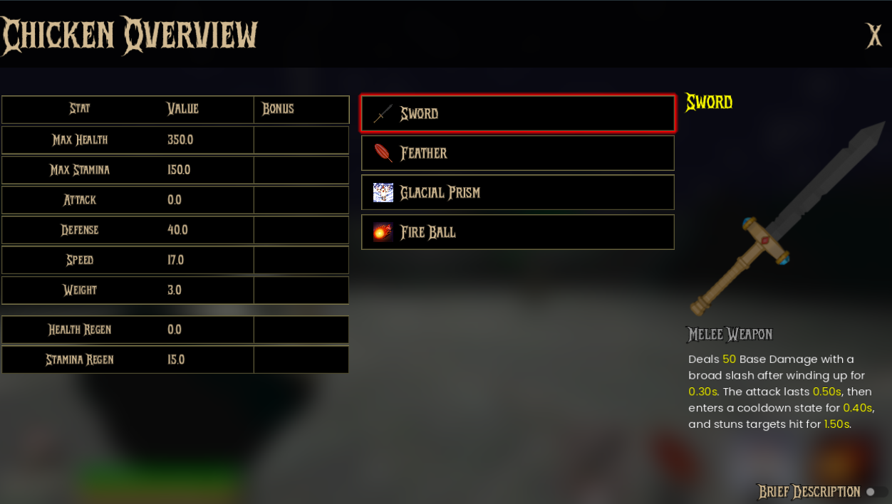

The Chicken Stats Overview shows your chicken's current stats and equipped items while in the arena. It is accessible via the Overview button in the [pause menu](/fowl-play/gameplay/user-interface/pause-menu).

The overview is divided into the following:

- **Stats Table:** Displays all primary stats (such as Health, Stamina, Attack, etc.) and any bonuses.
- **Equipment Panel:** Shows currently equipped items and their details.
- **Item Preview:** Shows a detailed preview of the selected item, including its effects and description.

## Stats Table

This section displays your chicken's base stats and any temporary upgrades acquired during the run. It uses the same stat preview system as the [rebirth shop](/fowl-play/gameplay/user-interface/shops/rebirth-shop#purchase-preview).

### Stats Container

This script defines the `ChickenStatsContainer`, which manages and displays all the chicken's stats in the UI. It handles previewing stat changes, clearing previews, and updating stat values based on upgrades or player actions.

```gdscript
class_name ChickenStatsContainer
extends VBoxContainer

# Dictionary to track which stats are currently being previewed
var _preview_values: Dictionary = {}

@onready var stat_containers: Array[StatContainer]


func _ready() -> void:
	stat_containers = []
	for child in get_children():
		if child is StatContainer:
			stat_containers.append(child)


## Preview a stat change for a specific upgrade type
func preview_stat_change(upgrade_type: StatsEnums.UpgradeTypes, bonus_value: float) -> void:
	var target_stat: StatsEnums.Stats = _upgrade_type_to_stat(upgrade_type)
	if target_stat == null:
		return

	# Store the preview value
	_preview_values[target_stat] = bonus_value

	# Find the corresponding stat container and update it
	for container in stat_containers:
		if container.stat == target_stat:
			container.show_preview_bonus(bonus_value)
			break


## Clear preview for a specific upgrade type
func clear_stat_preview(upgrade_type: StatsEnums.UpgradeTypes) -> void:
	var target_stat: StatsEnums.Stats = _upgrade_type_to_stat(upgrade_type)
	if target_stat == null:
		return

	# Remove from preview values
	_preview_values.erase(target_stat)

	# Find the corresponding stat container and clear preview
	for container in stat_containers:
		if container.stat == target_stat:
			container.clear_preview_bonus()
			break


## Clear all stat previews
func clear_all_previews() -> void:
	_preview_values.clear()
	for container in stat_containers:
		container.clear_preview_bonus()


## Update the base value for all stat containers
func update_base_values() -> void:
	for stat_container in stat_containers:
		var stat_name: String = StatsEnums.stat_to_string(stat_container.stat)
		stat_container.setup(SaveManager.get_loaded_player_stats().get(stat_name))


## Map upgrade types to stats
func _upgrade_type_to_stat(upgrade_type: StatsEnums.UpgradeTypes) -> StatsEnums.Stats:
	match upgrade_type:
		StatsEnums.UpgradeTypes.HEALTH:
			return StatsEnums.Stats.MAX_HEALTH
		StatsEnums.UpgradeTypes.STAMINA:
			return StatsEnums.Stats.MAX_STAMINA
		StatsEnums.UpgradeTypes.ATTACK:
			return StatsEnums.Stats.ATTACK
		StatsEnums.UpgradeTypes.DEFENSE:
			return StatsEnums.Stats.DEFENSE
		StatsEnums.UpgradeTypes.SPEED:
			return StatsEnums.Stats.SPEED
		StatsEnums.UpgradeTypes.WEIGHT:
			return StatsEnums.Stats.WEIGHT
		_:
			return StatsEnums.Stats.NONE
```

### Single Stat

This script defines the `StatContainer`, which displays a single stat (like Health or Attack) in the UI. It shows the base value, any changes (such as from upgrades), and can preview potential changes before they are applied.

```gdscript
## This container displays a single stat, including its base value and any changes.
class_name StatContainer
extends HBoxContainer

@export var stat: StatsEnums.Stats

var _base_value: float = 0.0
var _preview_bonus: float = 0.0

@onready var stat_label: Label = $StatLabel
@onready var base_stat_value_label: Label = $BaseStatValueLabel
@onready var change_stat_value_label: RichTextLabel = $ChangeStatValueLabel


func _ready() -> void:
	if not _is_stat_valid():
		return

	var stat_name: String = StatsEnums.stat_to_string(stat)
	setup(SaveManager.get_loaded_player_stats().get(stat_name))
	stat_label.text = stat_name.capitalize()


## Initializes the container with the stat's base value.
func setup(base_value: float) -> void:
	if not _is_stat_valid():
		return

	_base_value = base_value
	base_stat_value_label.text = str(_base_value)
	change_stat_value_label.text = ""


## Updates the display using stats from a LivingEntityStats object.
func update_from_stats(stats: LivingEntityStats) -> void:
	if not _is_stat_valid():
		return

	var stat_name: String = StatsEnums.stat_to_string(stat)
	var stat_value: float = stats.get(stat_name)
	update_change_value(stat_value)


## Updates the display to show the difference from the base value.
func update_change_value(current_value: float) -> void:
	if not _is_stat_valid():
		return

	var change: float = current_value - _base_value + _preview_bonus
	_update_display(change)


## Show a preview bonus (highlighting potential upgrade)
func show_preview_bonus(bonus: float) -> void:
	if not _is_stat_valid():
		return

	_preview_bonus = bonus
	var change: float = _preview_bonus
	_update_display(change, true)


## Clear the preview bonus
func clear_preview_bonus() -> void:
	if not _is_stat_valid():
		return

	_preview_bonus = 0.0
	_update_display(0.0)


func _update_display(change: float, is_preview: bool = false) -> void:
	if change == 0:
		change_stat_value_label.text = ""
		return

	var text: String = "%s %.1f" % ["-" if (change < 0) else "+", abs(change)]
	if is_preview:
		# Add visual indication that this is a preview
		change_stat_value_label.text = "[color=orange]%s[/color]" % text
	else:
		change_stat_value_label.text = text


func _is_stat_valid() -> bool:
	if stat == null:
		push_error("No stat type set for StatContainer: %s" % name)
		hide()
		return false
	return true
```

## Equipment Panel

This section shows the currently equipped items for your chicken.

This script defines the `ChickenEquipmentPanel`, which visually represents an equipment slot for the chicken. It shows the currently equipped item and highlights the panel when active or focused.

```gdscript
class_name ChickenEquipmentPanel
extends Panel

var equipped_item: BaseResource

var active: bool = false:
	set(value):
		active = value
		if value:
			add_theme_stylebox_override("panel", active_stylebox_dark)
		else:
			add_theme_stylebox_override("panel", inactive_stylebox_dark)

@onready var img: TextureRect = $%TextureRect
@onready var label: Label = %Label

@onready var active_stylebox_dark: StyleBoxFlat = preload("uid://cetchnns5h8tx")
@onready var inactive_stylebox_dark: StyleBoxFlat = preload("uid://cng68uuqfw6hb")


func _ready() -> void:
	mouse_entered.connect(
		func():
			focus_entered.emit()
	)
	mouse_exited.connect(
		func():
			focus_exited.emit()
	)
```

### Item Preview

When hovering/moving over an equipment slot, it highlights the panel and shows the item details. This section provides a detailed preview of the selected item, including its effects, stats, and description. It reuses the Item Preview Container from the [Base Shop](/fowl-play/gameplay/game-progression/shop).
