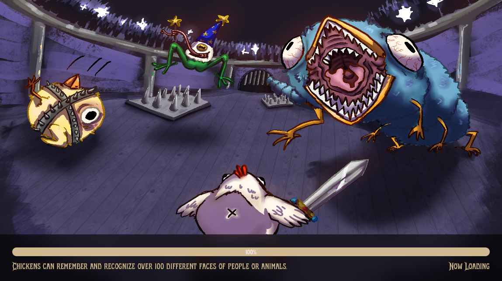

We observed a noticeable freeze when entering the arena. This occurred because the game was loading a large scene all at once, without any indication to the player that something was happening. The result was a jarring pause that gave the impression the game was unresponsive.

To resolve this and improve the user experience, we introduced a loading screen. This screen masks the loading time and adds personality by displaying concept art, a progress-bar, and random chicken facts to keep the player engaged.

## Reasoning

Before implementing the loading screen, clicking on the arena would immediately initiate the scene load. Since this is a resource-heavy operation, it caused the game to hang briefly without feedback. This felt like a crash to players.

The loading screen solves this by:

* Hiding the freeze with visual feedback
* Providing a clear indication that loading is in progress
* Giving us an opportunity to showcase artwork and in-game characters
* Making the transition into gameplay feel smoother and more intentional

## Loading screen 

Below is a preview of the loading screen shown while the arena is being prepared. It features dynamic progress feedback, our games concept art, and a fun chicken facts to keep players entertained during the transition.




## Scene Loading Code

This function handles the asynchronous loading of a game scene while displaying the loading screen.

```gdscript
## Loads a game scene with a loading screen, then switches to HUD and target game scene
##
## @param: game_scene_path - The resource path or UID to the game scene
## @param: hud_ui - Optional: Which HUD UI to show after loading (default: PLAYER_HUD)
func load_game_with_loading_screen(game_scene_path: String, hud_ui: UIEnums.UI = UIEnums.UI.PLAYER_HUD) -> void:
	SignalManager.switch_ui_scene.emit(UIEnums.UI.LOADING_SCREEN)
	SignalManager.loading_screen_started.emit()
	await get_tree().process_frame

	ResourceLoader.load_threaded_request(game_scene_path)
	var progress: Array = []

	while ResourceLoader.load_threaded_get_status(game_scene_path, progress) == ResourceLoader.THREAD_LOAD_IN_PROGRESS:
		SignalManager.loading_progress_updated.emit(progress[0] if progress.size() > 0 else 0.0)
		await get_tree().process_frame

	SignalManager.loading_screen_finished.emit()
	var loaded_resource: Resource = ResourceLoader.load_threaded_get(game_scene_path)
	loaded_resource = null

	SignalManager.emit_throttled("switch_game_scene", [game_scene_path])
	SignalManager.emit_throttled("switch_ui_scene", [hud_ui])
```
