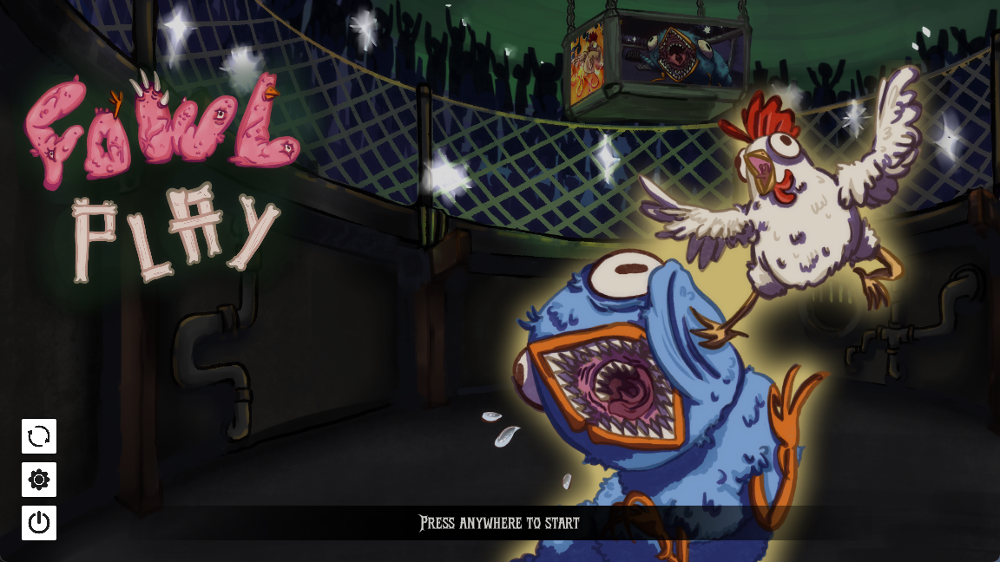
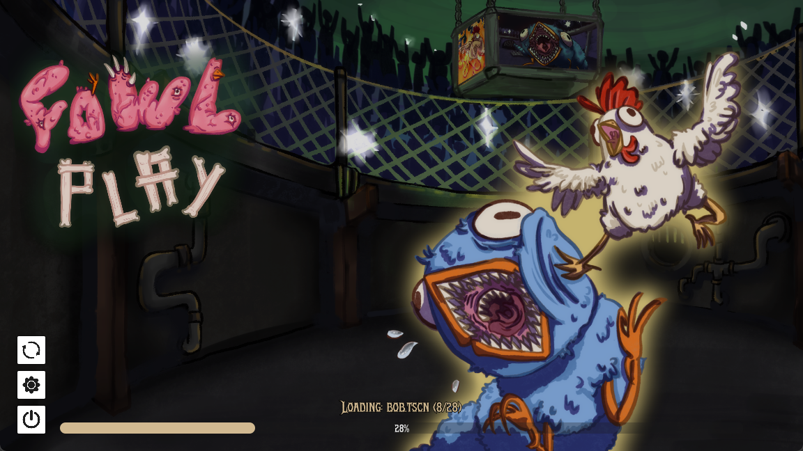

The Main Menu is the first screen players see when launching Fowl Play. It serves as the central hub for starting the game, accessing settings, and viewing key art that establishes the game's visual identity.

## In Short

The menu features several key interactive elements:

- **Start Game:** Begins a new game or continues a saved one.
- **Settings:** Opens the settings panel to adjust audio, video, and controls.
- **Reset Save:** A button to completely reset the save file, allowing the player to start from scratch.
- **Exit Game:** Closes the game.

On the Main Menu, the [Main Menu Theme](/fowl-play/art/music/main-menu) plays, which is an upbeat and catchy tune that sets a lighthearted and adventurous tone for the game.

## Parallax Effect

To add a fun element to the main menu, the background incorporates a parallax effect. Different layers of the background artwork move at different speeds in response to the player's mouse movement.


## Shader Preloading

During playtesting, we noticed visual stutters when effects and shaders were first loaded in and encountered. These stutters went away on subsequent encounters, but reappear after the game closes.
To ensure a smooth gameplay experience without visual stuttering, Fowl Play preloads all necessary shaders and materials while the player is on the main menu. This process, often called "shader compilation," can cause a brief hitch the first time a material or effect is rendered. By performing this step during the initial loading screen, these hitches are eliminated during actual gameplay.
This is sadly a process which seems to be needed on every startup, but an option has been made available in the settings menu under `Graphics` to disable preloading entirely.



The preloading system is composed of three main scripts that work together: the `SceneScanner`, the `ShaderPreloader`, and the `ShaderPreloadManager`.

### Manager

The `ShaderPreloadManager` is a high-level controller that orchestrates the entire process. It initializes the `ShaderPreloader`, connects to its signals to listen for progress updates, and provides a simple interface to start the preloading. This script acts as the bridge between the preloading system and the main menu's UI, allowing it to display progress to the player.

```gdscript
class_name ShaderPreloadManager
extends Node

@onready var preloader: ShaderPreloader

var _total_scenes_to_preload: int = 0

func _ready() -> void:
	preloader = ShaderPreloader.new()
	add_child(preloader)

	# Connect signals
	preloader.preloading_started.connect(_on_preloading_started)
	preloader.preloading_progress.connect(_on_preloading_progress)
	preloader.preloading_completed.connect(_on_preloading_completed)
	preloader.preloading_failed.connect(_on_preloading_failed)

func start_shader_preloading() -> void:
	print("Starting shader preloading...")
	preloader.start_preloading()

func _on_preloading_started(total_scenes: int) -> void:
	_total_scenes_to_preload = total_scenes
	print("Starting to preload ", total_scenes, " scenes")

func _on_preloading_progress(
	current_scene_index: int,
	scene_path: String
) -> void:
	if _total_scenes_to_preload > 0:
		# current_scene_index starts at 0, so add 1 for progress display
		var progress: int = round(
			((current_scene_index + 1) * 100.0) / _total_scenes_to_preload
		)
		print("Progress: ", progress, "% - Loading: ", scene_path.get_file())
	else:
		print(
			"Loading: ",
			scene_path.get_file(),
			" (Total scenes not determined yet)"
		)

func _on_preloading_completed() -> void:
	print("All shaders and materials preloaded successfully!")

func _on_preloading_failed(error: String) -> void:
	print("Preloading failed: ", error)

# This function is called to initiate the shader preloading process
func preload_all_shaders() -> void:
	start_shader_preloading()

	# Wait for completion
	await preloader.preloading_completed
```

The Main Menu script calls `preload_all_shaders()` to start the preloading process when the menu is ready. It adds the preload manager as a child node, so the scenes and its materials and shaders can actually enter the tree.

```gdscript
func _setup_shader_preloading() -> void:
	preload_manager = ShaderPreloadManager.new()
	add_child(preload_manager)

	# Connect signals
	if preload_manager.preloader:
		preload_manager.preloader.preloading_started.connect(_on_preloading_started)
		preload_manager.preloader.preloading_progress.connect(_on_preloading_progress)
		preload_manager.preloader.preloading_completed.connect(_on_preloading_completed)
		preload_manager.preloader.preloading_failed.connect(_on_preloading_failed)
	else:
		printerr("MainMenu: Preloader not ready in ShaderPreloadManager during _setup_shader_preloading.")

	# Start preloading
	preload_manager.preload_all_shaders()
```

### Scene Scanning

The `SceneScanner` is a utility script responsible for finding all relevant game scenes that need to be preloaded. To avoid scanning the entire project every time the game launches, it runs once and caches the results in a configuration file. This file is automatically regenerated whenever the game's version number changes, ensuring the list of scenes is always up-to-date with the latest build. This is important, since looping over all folders and files, even with optimizations, is slow and a process we would like to avoid as much as possible.

The scanner is optimized to:

- **Exclude Unnecessary Directories:** It skips directories like `addons`, `ui`, and `art` that don't contain gameplay scenes with complex shaders.
- **Exclude Specific Scenes:** It ignores certain base or utility scenes that are never instanced directly.
- **Identify Top-Level Scenes:** It intelligently detects scenes that are instanced within other scenes. Only "top-level" scenes are added to the preload list, as their sub-scenes will be processed automatically when the parent is loaded. This prevents redundant work and speeds up the process.

```gdscript
class_name SceneScanner
extends RefCounted

# Location to store the scene paths to preload
const CONFIG_FILE_PATH: String = "user://shader_preload_config.json"
# Directories to exclude from scanning
const EXCLUDED_DIRECTORIES: Array[String] = [
	"addons",
	".godot",
	".import",
	"export", # Exported game assets, doesn't contain anything actually used in the game
	"ui", # UI Scenes, minimal shader and material use
	"utilities",
	"resources",
	"art", # Art assets
]
# Scenes to exclude from preloading (filenames)
const EXCLUDED_SCENES: Array[String] = [
	"main.tscn",
	"ability.tscn",
	"enemy.tscn",
	"enemy_melee_handler.tscn",
	"base_melee_weapon_model.tscn",
	"base_ranged_weapon_model.tscn",
]

# Helper to collect all .tscn files using ResourceLoader.list_directory
static func _collect_all_tscn_files_rl(
	current_dir_path: String,
	scene_paths_array: Array[String]
) -> void:
	# Ensure current_dir_path ends with a slash for consistency with list_directory
	var normalized_dir_path: String = current_dir_path
	if not normalized_dir_path.ends_with("/"):
		normalized_dir_path += "/"

	var entries: PackedStringArray = ResourceLoader.list_directory(
		normalized_dir_path
	)

	# list_directory returns an empty array if path doesn't exist or can't be read
	if entries.is_empty():
		# Optional: Check if the directory itself exists if needed for more detailed logging
		# if not ResourceLoader.has(normalized_dir_path): # This might not work for dirs
		# printerr("SceneScanner: Directory not found or inaccessible: ", normalized_dir_path)
		return # Nothing to process in this directory

	for entry_name in entries:
		# Skip hidden files/directories (e.g., .gdignore, .DS_Store)
		if entry_name.begins_with("."):
			continue

		var full_item_path: String = normalized_dir_path.path_join(entry_name)

		if entry_name.ends_with("/"): # It's a directory
			var dir_name_only: String = entry_name.trim_suffix("/")
			if dir_name_only in EXCLUDED_DIRECTORIES:
				continue # Skip this excluded directory
			# Recurse into subdirectories
			_collect_all_tscn_files_rl(full_item_path, scene_paths_array)
		elif entry_name.ends_with(".tscn"): # It's a file, check if it's a .tscn
			if not (entry_name in EXCLUDED_SCENES):
				scene_paths_array.append(full_item_path)

static func scan_project_scenes() -> Array[String]:
	var context_msg: String = "(Editor)" if Engine.is_editor_hint() else "(Exported Game)"
	print(
		"SceneScanner: ",
		context_msg,
		" Starting scene scan using ResourceLoader.list_directory..."
	)

	var all_candidate_scenes: Array[String] = []
	_collect_all_tscn_files_rl("res://", all_candidate_scenes)

	if all_candidate_scenes.is_empty():
		print(
			"SceneScanner: ",
			context_msg,
			" No .tscn files found after scan and filtering. This could mean:\n",
			"  - No scenes exist in the project that meet the criteria.\n",
			"  - All scenes were filtered out by EXCLUDED_DIRECTORIES or EXCLUDED_SCENES.\n",
			"  - ResourceLoader.list_directory could not access 'res://' or subdirectories (check export settings if in exported game)."
		)

	var instanced_scenes_by_others: Dictionary = {}

	for scene_path in all_candidate_scenes:
		var packed_scene: PackedScene = ResourceLoader.load(
			scene_path,
			"PackedScene",
			ResourceLoader.CACHE_MODE_IGNORE # Avoid issues with cached versions
		)
		if packed_scene:
			var temp_instance: Node = packed_scene.instantiate(
				PackedScene.GEN_EDIT_STATE_DISABLED
			)
			if temp_instance:
				_recursively_find_instanced_sub_scenes(
					temp_instance,
					instanced_scenes_by_others,
					scene_path
				)
				temp_instance.queue_free()
			else:
				printerr(
					"SceneScanner: Failed to instantiate (disabled) ",
					scene_path
				)
		else:
			printerr("SceneScanner: Failed to load PackedScene for ", scene_path)

	var scenes_to_preload: Array[String] = []
	for scene_path in all_candidate_scenes:
		if not instanced_scenes_by_others.has(scene_path):
			scenes_to_preload.append(scene_path)

	print(
		"SceneScanner: Found ",
		all_candidate_scenes.size(),
		" total candidate scenes after filtering."
	)
	print(
		"SceneScanner: Identified ",
		instanced_scenes_by_others.size(),
		" scenes that are instanced by others."
	)
	print(
		"SceneScanner: Will preload ",
		scenes_to_preload.size(),
		" top-level scenes."
	)
	return scenes_to_preload

static func _recursively_find_instanced_sub_scenes(
	node: Node,
	instanced_scenes_set: Dictionary,
	current_parsing_scene_path: String
) -> void:
	if (
		node.scene_file_path != ""
		and node.scene_file_path != current_parsing_scene_path
	):
		instanced_scenes_set[node.scene_file_path] = true

	for child_node in node.get_children():
		_recursively_find_instanced_sub_scenes(
			child_node,
			instanced_scenes_set,
			current_parsing_scene_path
		)

static func save_scene_config(scene_paths: Array[String]) -> void:
	var config_data: Dictionary = {
		"version": ProjectSettings.get_setting(
			"application/config/version",
			"unknown"
		),
		"generated_at": Time.get_datetime_string_from_system(),
		"scene_count": scene_paths.size(),
		"scenes": scene_paths,
	}

	var file: FileAccess = FileAccess.open(CONFIG_FILE_PATH, FileAccess.WRITE)
	if file:
		file.store_string(JSON.stringify(config_data, "\t"))
		file.close()
		print(
			"SceneScanner: Scene config saved with ",
			scene_paths.size(),
			" scenes to ",
			CONFIG_FILE_PATH
		)
	else:
		printerr(
			"SceneScanner: Failed to save scene config to ", CONFIG_FILE_PATH
		)

static func load_scene_config() -> Array[String]:
	var scene_paths: Array[String] = []
	var current_project_version: String = ProjectSettings.get_setting(
		"application/config/version",
		"unknown"
	)
	var needs_regeneration: bool = false

	if not FileAccess.file_exists(CONFIG_FILE_PATH):
		print(
			"SceneScanner: Config file not found: ",
			CONFIG_FILE_PATH,
			". Flagging for regeneration."
		)
		needs_regeneration = true
	else:
		var file: FileAccess = FileAccess.open(CONFIG_FILE_PATH, FileAccess.READ)
		if file:
			var json_string: String = file.get_as_text()
			file.close()

			var json = JSON.new()
			var parse_result = json.parse(json_string)

			if parse_result == OK:
				var config_data = json.data
				if not config_data is Dictionary:
					printerr(
						"SceneScanner: Invalid config file format (root is not a Dictionary). Flagging for regeneration."
					)
					needs_regeneration = true
				else:
					var config_version: String = ""
					if config_data.has("version"):
						config_version = config_data.version

					if config_version != current_project_version:
						print(
							"SceneScanner: Config version mismatch (config: '",
							config_version,
							"', project: '",
							current_project_version,
							"'). Flagging for regeneration."
						)
						needs_regeneration = true
					else:
						if config_data.has("scenes") and config_data.scenes is Array:
							for scene_path_variant in config_data.scenes:
								if scene_path_variant is String:
									if ResourceLoader.exists(
										scene_path_variant,
										"PackedScene"
									):
										scene_paths.append(scene_path_variant)
									else:
										print(
											"SceneScanner: Scene from config not found or not a PackedScene: ",
											scene_path_variant
										)
							print(
								"SceneScanner: Loaded ",
								scene_paths.size(),
								" scenes from config."
							)
						else:
							printerr(
								"SceneScanner: Invalid config file format (missing 'scenes' array or wrong type). Flagging for regeneration."
							)
							needs_regeneration = true
			else:
				printerr(
					"SceneScanner: Failed to parse config file JSON: ",
					json.get_error_message(),
					" at line ",
					json.get_error_line(),
					". Flagging for regeneration."
				)
				needs_regeneration = true
		else:
			printerr(
				"SceneScanner: Failed to open config file for reading: ",
				CONFIG_FILE_PATH,
				". Flagging for regeneration."
			)
			needs_regeneration = true

	if needs_regeneration:
		print("SceneScanner: Attempting to regenerate scene config...")
		generate_and_save_config() # This calls scan_project_scenes

		scene_paths.clear() # Clear any paths loaded from an old/invalid config
		var new_file: FileAccess = FileAccess.open(
			CONFIG_FILE_PATH,
			FileAccess.READ
		)
		if new_file:
			var new_json_string: String = new_file.get_as_text()
			new_file.close()
			var new_json = JSON.new()
			var new_parse_result = new_json.parse(new_json_string)
			if new_parse_result == OK:
				var new_config_data = new_json.data
				if new_config_data is Dictionary and new_config_data.has("scenes") and new_config_data.scenes is Array:
					for scene_path_variant in new_config_data.scenes:
						if scene_path_variant is String:
							if ResourceLoader.exists(
								scene_path_variant,
								"PackedScene"
							):
								scene_paths.append(scene_path_variant)
							else:
								print(
									"SceneScanner: Scene from newly generated config not found/invalid: ",
									scene_path_variant
								)
					print(
						"SceneScanner: Loaded ",
						scene_paths.size(),
						" scenes from newly generated config."
					)
				else:
					printerr(
						"SceneScanner: Newly generated config is invalid (e.g., missing 'scenes' array or not a Dictionary)."
					)
			else:
				printerr(
					"SceneScanner: Failed to parse newly generated config JSON: ",
					new_json.get_error_message(),
					" at line ",
					new_json.get_error_line()
				)
		else:
			printerr(
				"SceneScanner: Failed to open newly generated config for reading: ",
				CONFIG_FILE_PATH
			)
			# If reading new config fails, scene_paths will be empty, which is the correct fallback.

	return scene_paths

static func generate_and_save_config() -> void:
	var context_msg: String = "(Editor)" if OS.has_feature("debug") else "(Exported Game)"
	print(
		"SceneScanner: ", context_msg, " Starting project scan to generate config..."
	)

	var scene_paths_to_save: Array[String] = scan_project_scenes()
	save_scene_config(scene_paths_to_save)
```

### Scene Preloading

The `ShaderPreloader` script does the heavy lifting. It takes the list of scenes from the config file and processes them one by one.

Its core responsibilities are:

- **Asynchronous Operation:** It uses Godot's threaded loading to fetch scene data without freezing the main thread, allowing the UI to remain responsive.
- **Forcing Shader Compilation:** For each scene, it recursively finds all unique materials. To force the GPU to compile the associated shader, it creates a tiny, temporary `MeshInstance3D`, applies the material to it, and adds it to the scene tree for a few frames.
- **Handling Particle Systems:** It specifically finds and starts particle systems (`GPUParticles3D` and `CPUParticles3D`) to ensure their shaders are also compiled.
- **Progress Reporting:** It emits signals to report its progress, which the `ShaderPreloadManager` uses to update the loading screen UI.

```gdscript
class_name ShaderPreloader
extends Node

signal preloading_started(total_scenes: int)
signal preloading_progress(current_scene: int, scene_path: String)
signal preloading_completed()
signal preloading_failed(error: String)

var _is_preloading: bool = false
var _preload_scene: Node3D # Node to temporarily host instanced scenes/meshes
var _processed_materials: Dictionary = {} # To track unique materials globally

const FRAMES_FOR_MATERIAL_BATCH_PROCESSING: int = 4
const FRAMES_FOR_PARTICLE_PROCESSING: int = 5

func _ready() -> void:
	_preload_scene = Node3D.new()
	_preload_scene.name = "ShaderPreloadScene_Temporary" # Give it a unique name
	_preload_scene.visible = false # Keep it invisible
	add_child(_preload_scene)

func start_preloading() -> void:
	if _is_preloading:
		printerr("ShaderPreloader: Preloading already in progress.")
		return

	var scene_paths: Array[String] = SceneScanner.load_scene_config()
	if scene_paths.is_empty():
		var msg: String = "ShaderPreloader: No scenes found in config to preload."
		print(msg)
		emit_signal("preloading_failed", msg)
		return

	_is_preloading = true
	_processed_materials.clear()
	emit_signal("preloading_started", scene_paths.size())
	print("ShaderPreloader: Starting preloading of ", scene_paths.size(), " scenes.")

	call_deferred("_start_async_preloading", scene_paths)

func _start_async_preloading(scene_paths: Array[String]) -> void:
	await _preload_scenes_async(scene_paths)

func _preload_scenes_async(scene_paths: Array[String]) -> void:
	for i in range(scene_paths.size()):
		var scene_path: String = scene_paths[i]
		emit_signal("preloading_progress", i + 1, scene_path)
		print(
			"ShaderPreloader: Preloading scene ",
			(i + 1),
			"/",
			scene_paths.size(),
			": ",
			scene_path
		)

		ResourceLoader.load_threaded_request(scene_path)
		var resource_status: ResourceLoader.ThreadLoadStatus = ResourceLoader.THREAD_LOAD_IN_PROGRESS

		while resource_status == ResourceLoader.THREAD_LOAD_IN_PROGRESS:
			resource_status = ResourceLoader.load_threaded_get_status(scene_path)
			await get_tree().process_frame

		if resource_status == ResourceLoader.THREAD_LOAD_LOADED:
			var packed_scene: PackedScene = ResourceLoader.load_threaded_get(
				scene_path
			)
			if packed_scene:
				await _process_scene_resources_for_preloading(packed_scene)
			else:
				printerr(
					"ShaderPreloader: Failed to get PackedScene after loading: ",
					scene_path
				)
		else:
			printerr(
				"ShaderPreloader: Failed to load scene (status: ",
				resource_status,
				"): ",
				scene_path
			)

		await get_tree().process_frame # Small delay between scenes

	_is_preloading = false
	print(
		"ShaderPreloader: Preloading completed. Processed ",
		_processed_materials.size(),
		" unique materials."
	)
	emit_signal("preloading_completed")

func _disable_processing_recursive(node: Node) -> void:
	node.set_process_mode(Node.PROCESS_MODE_DISABLED)
	for child in node.get_children():
		_disable_processing_recursive(child)

func _process_scene_resources_for_preloading(packed_scene: PackedScene) -> void:
	var instance: Node = packed_scene.instantiate(
		PackedScene.GEN_EDIT_STATE_DISABLED
	)
	if not instance:
		printerr(
			"ShaderPreloader: Failed to instantiate scene: ",
			packed_scene.resource_path
		)
		return

	# Explicitly disable processing for all nodes in the instanced scene
	_disable_processing_recursive(instance)
	_preload_scene.add_child(instance) # Add main instance to our temp scene

	# Collect all unique, new materials from the instantiated scene
	var materials_to_batch_process: Array[Material] = []
	_recursive_collect_materials(instance, materials_to_batch_process)

	# Batch process collected materials by creating temporary meshes
	if not materials_to_batch_process.is_empty():
		var temp_mesh_instances_batch: Array[MeshInstance3D] = []
		var temp_mesh_res := BoxMesh.new() # Create one mesh resource to reuse
		temp_mesh_res.size = Vector3(0.01, 0.01, 0.01) # Make it very small

		for material_to_process in materials_to_batch_process:
			var temp_mesh_instance := MeshInstance3D.new()
			temp_mesh_instance.mesh = temp_mesh_res
			temp_mesh_instance.set_surface_override_material(0, material_to_process)

			_preload_scene.add_child(temp_mesh_instance) # Add temp mesh to the same scene as the main instance
			temp_mesh_instances_batch.append(temp_mesh_instance)

			_processed_materials[material_to_process.get_instance_id()] = true # Mark as globally processed
			#print("ShaderPreloader: Queued material for batch: ", material_to_process.resource_path if material_to_process.resource_path else "built-in/unique")

		print(
			"ShaderPreloader: Processing batch of ",
			temp_mesh_instances_batch.size(),
			" materials for scene: ",
			packed_scene.resource_path
		)
		for _i in range(FRAMES_FOR_MATERIAL_BATCH_PROCESSING):
			await get_tree().process_frame

		for temp_mi in temp_mesh_instances_batch:
			temp_mi.queue_free()

		if not temp_mesh_instances_batch.is_empty():
			await get_tree().process_frame # Allow a frame for temp meshes cleanup

	# Process particle systems
	await _process_particle_systems_in_node_recursive(instance)

	# Clean up the main instanced scene
	instance.queue_free()
	await get_tree().process_frame # Allow a frame for main instance cleanup

func _recursive_collect_materials(
	node: Node,
	collected_materials_list: Array[Material]
) -> void:
	if node is MeshInstance3D:
		var mi := node as MeshInstance3D
		for i in range(mi.get_surface_override_material_count()):
			var mat: Material = mi.get_surface_override_material(i)
			if mat and not (mat.get_instance_id() in _processed_materials) and not collected_materials_list.has(mat):
				collected_materials_list.append(mat)
		if mi.mesh:
			for i in range(mi.mesh.get_surface_count()):
				var mat: Material = mi.mesh.surface_get_material(i)
				if mat and not (mat.get_instance_id() in _processed_materials) and not collected_materials_list.has(mat):
					collected_materials_list.append(mat)

	elif node is GPUParticles3D:
		var gpu_particles := node as GPUParticles3D
		if gpu_particles.process_material:
			var mat: Material = gpu_particles.process_material
			if mat and not (mat.get_instance_id() in _processed_materials) and not collected_materials_list.has(mat):
				collected_materials_list.append(mat)

		var draw_pass_meshes: Array[Mesh] = []
		if gpu_particles.draw_passes >= 1 and gpu_particles.draw_pass_1:
			draw_pass_meshes.append(gpu_particles.draw_pass_1)
		if gpu_particles.draw_passes >= 2 and gpu_particles.draw_pass_2:
			draw_pass_meshes.append(gpu_particles.draw_pass_2)
		if gpu_particles.draw_passes >= 3 and gpu_particles.draw_pass_3:
			draw_pass_meshes.append(gpu_particles.draw_pass_3)
		if gpu_particles.draw_passes >= 4 and gpu_particles.draw_pass_4:
			draw_pass_meshes.append(gpu_particles.draw_pass_4)

		for mesh_in_pass in draw_pass_meshes:
			if mesh_in_pass:
				for i in range(mesh_in_pass.get_surface_count()):
					var mat_surf: Material = mesh_in_pass.surface_get_material(i)
					if mat_surf and not (mat_surf.get_instance_id() in _processed_materials) and not collected_materials_list.has(mat_surf):
						collected_materials_list.append(mat_surf)

	elif node is CPUParticles3D:
		var cpu_particles := node as CPUParticles3D
		var material_to_check: Material = cpu_particles.material_override
		if material_to_check and not (material_to_check.get_instance_id() in _processed_materials) and not collected_materials_list.has(material_to_check):
			collected_materials_list.append(material_to_check)

		if cpu_particles.mesh: # Also check mesh materials if no override or if override is different
			for i in range(cpu_particles.mesh.get_surface_count()):
				var mat_surf: Material = cpu_particles.mesh.surface_get_material(i)
				if mat_surf and not (mat_surf.get_instance_id() in _processed_materials) and not collected_materials_list.has(mat_surf):
					collected_materials_list.append(mat_surf)

	if node.has_method("get_material_override"): # General material override
		var mat_override = node.get_material_override()
		if mat_override and not (mat_override.get_instance_id() in _processed_materials) and not collected_materials_list.has(mat_override):
			collected_materials_list.append(mat_override)

	for child in node.get_children():
		_recursive_collect_materials(child, collected_materials_list)

func _process_particle_systems_in_node_recursive(node: Node) -> void:
	if node is GPUParticles3D or node is CPUParticles3D:
		var particles: Node = node
		if particles.amount > 0:
			var original_emitting_state: bool = particles.emitting
			particles.emitting = true
			particles.restart()
			for _i in range(FRAMES_FOR_PARTICLE_PROCESSING):
				await get_tree().process_frame
			particles.emitting = original_emitting_state
			if not original_emitting_state:
				particles.restart() # Ensure particles are cleared if they weren't meant to be emitting

	for child in node.get_children():
		await _process_particle_systems_in_node_recursive(child)
```

## References

This technique is based on the recommendations in the [Godot Shader Documentation](https://docs.godotengine.org/en/stable/tutorials/performance/pipeline_compilations.html). See those docs for a more in depth explanation and potential future changes in newer Godot versions.
