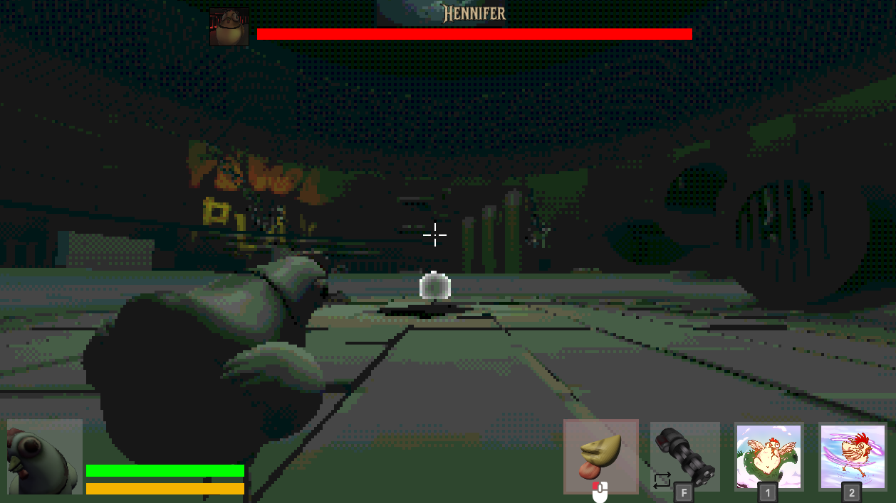

The Player HUD (Heads-Up Display) provides essential information and feedback to the player during gameplay. It is composed of several UI elements that display the player's health, stamina, inventory items and visual feedback for events such as taking damage or healing.



## Components

- **Health and Stamina Bar**: Shows the player's current health and stamina values, updating in real-time as the player's stats change.
- **Player Icon**: A visual representation of the player, rendered using a subviewport. It provides feedback with shader effects when the player is hurt or healed. Since it uses a subviewport, chicken player animations are also displayed here.
- **Item Slots**: Displays the player's inventory items, highlighting the currently active item(s).

## Health and Stamina Bar

The health and stamina bars provide immediate feedback on the player's survivability and ability to perform actions. The code uses Godot's signal system to ensure the UI stays in sync with the player's stats, but is still seperate. This means the chicken player is not dependent on the UI, and the UI can be reused in other contexts.

- **Signal Connections**: The HUD listens for `init_health`, `init_stamina`, and `player_stats_changed` signals. This decouples the UI from the game logic, making it easier to maintain and extend.
- **Input Handling**: The mouse mode is set to `MOUSE_MODE_CAPTURED` to ensure the player remains focused on gameplay.
- **Stat Updates**: When stats change, the HUD updates the max values and triggers visual feedback (hurt/heal shaders) if health changes, providing immediate feedback to the player. This is done for the `in-run-upgrade` system, where the player can upgrade their (maximum) health and stamina.

```gdscript
extends VBoxContainer

@onready var health_bar: HealthBar = %HealthBar
@onready var stamina_bar: StaminaBar = %StaminaBar


func _ready() -> void:
	Input.mouse_mode = Input.MOUSE_MODE_CAPTURED

	# Initializing the health and stamina bars
	SignalManager.init_health.connect(health_bar.init_health)
	SignalManager.init_stamina.connect(stamina_bar.init)

	SignalManager.player_stats_changed.connect(_on_stats_changed)


func _on_stats_changed(stats: LivingEntityStats) -> void:
	# updating the max values
	health_bar.max_value = stats.max_health
	stamina_bar.max_value = stats.max_stamina

	# trigger hurt and health shaders
	if(stats.current_health < health_bar.health):
		SignalManager.player_hurt.emit()
	elif (stats.current_health > health_bar.health):
		SignalManager.player_heal.emit()

	health_bar.health = stats.current_health
	stamina_bar.stamina = stats.current_stamina

```

## Player Icon

The player icon is rendered using a subviewport, which allows for isolated rendering of the player model and its animations. This approach ensures that the icon can display real-time animations and effects without interfering with the main game view.

- **Subviewport Usage**: By rendering the player icon in a subviewport, the HUD can show the player's current state, including animations, independently of the main camera. - The subviewport is set to only render objects on visual layer 2. Use the [`Mask Culling`](/fowl-play/gameplay/important-code/mask-culling) script to set the visual layer to show up in the subviewport. - _Note:_ Because the subviewport is facing the player, the player hud shows a different angle of the player and their animations. This means that all models and animations need to work correctly and be visually pleasing from the back and the front.
- **Shader Feedback**: When the player takes damage or heals, the icon displays a shader effect. This is achieved by connecting to `player_hurt` and `player_heal` signals and applying the corresponding shader material.

```gdscript
extends CenterContainer

@export_group("Shaders")
@export var hurt_time : float = 0.15
@export var heal_time : float = 0.25
@export var hurt_shader : ShaderMaterial
@export var heal_shader : ShaderMaterial

@export_group("Fov")
@export var normal_fov : float = 65.0
@export var effect_fov : float = 75.0
@export var fov_tween_duration : float = 0.1 ## How fast the FOV changes

@export_group("Border")
@export var border_starting_colour : Color
@export var border_heal_colour : Color
@export var border_hurt_colour : Color


@onready var duration_timer : Timer = $DurationTimer
@onready var overlay_shader : ColorRect = $OverlayShader
@onready var border : ColorRect = $Border
@onready var camera : Camera3D = %ViewportCamera

var fov_tween : Tween ## Keeping track of the FOV tween


func _ready() -> void:
	# Hide by default
	overlay_shader.hide()

	# set border colour
	border.color = border_starting_colour

	if camera:
		camera.fov = normal_fov
	else:
		printerr("ViewportCamera node not found!")

	# Connect signals
	SignalManager.player_hurt.connect(
		func():
			print("hurt shader")
			_on_player_health(hurt_time, hurt_shader, border_hurt_colour)
	)
	SignalManager.player_heal.connect(
		func():
			print("heal shader")
			_on_player_health(heal_time, heal_shader, border_heal_colour)
	)


func _on_player_health(time : float, shader_material : ShaderMaterial, colour: Color) -> void:
	if not camera:
		printerr("Cannot apply effect: ViewportCamera not found!")
		return

	# Setting the border colour
	border.color = colour

	# Kill previous FOV tween if it's still running
	if fov_tween and fov_tween.is_valid():
		fov_tween.kill()

	# Create a new tween owned by this node
	fov_tween = create_tween()
	# Animate the camera's fov property to the effect_fov
	fov_tween.tween_property(
			camera, "fov", effect_fov, fov_tween_duration
		).set_trans(Tween.TRANS_SINE).set_ease(Tween.EASE_OUT)

	# Apply the appropriate shader
	overlay_shader.material = shader_material

	# Reset shader visibility timer if already playing
	if overlay_shader.visible:
		duration_timer.stop()

	overlay_shader.show()
	duration_timer.start(time) # Start timer for shader visibility


func _on_duration_timer_timeout():
	if not camera:
		return

	# resetting border colour
	border.color = border_starting_colour

	# Kill previous FOV tween if it's still running (unlikely here, but safe)
	if fov_tween and fov_tween.is_valid():
		fov_tween.kill()

	# Create a new tween to return FOV to normal
	fov_tween = create_tween()
	# Animate the camera's fov property back to the normal_fov
	fov_tween.tween_property(
			camera, "fov", normal_fov, fov_tween_duration
		).set_trans(Tween.TRANS_SINE).set_ease(Tween.EASE_IN)

	# Hide the shader effect
	overlay_shader.hide()
```

- **Camera Control**: The subviewport camera is set up to only render objects on visual layer 2. It follows the player and looks at a point in front of the player. Instead of using a standard `look_at`, which would rotate the camera vertically, the code adjusts the target's y-coordinate to keep the camera at a fixed height. This ensures a stable and predictable view of the player icon.

```gdscript
extends SubViewport

@export var offset : Vector3 = Vector3(0.0, 1.5, -1.8)
@onready var camera : Camera3D = %ViewportCamera


func _process(_delta: float) -> void:
	if GameManager.chicken_player:
		var player = GameManager.chicken_player

		# Position camera behind the player
		var rotated_offset = player.transform.basis * offset
		camera.global_position = player.global_position + rotated_offset

		# Calculate a target point in front of the player
		var target_position = player.global_position + player.transform.basis.z * 5.0
		target_position.y = camera.global_position.y  # Match camera's height

		# Look at the forward point
		camera.look_at(target_position)
```

### Shaders

On top of the player icon, [shader effects](/fowl-play/effects-shaders/shaders/player-hud-shaders) are applied to provide visual feedback when the player is hurt or healed. These shaders create a dynamic and engaging user experience, enhancing the player's immersion in the game.

## Item Slots

The item slots display the player's inventory and highlight the currently active item(s). This is crucial for gameplay, as it allows the player to quickly assess and switch between items.

- **Dynamic Slot Creation**: The container dynamically creates item slots based on the player's inventory.
- **Active State Feedback**: When an item slot is activated or deactivated (via signals), its appearance changes, providing feedback about which item(s) is/are currently active.
- **Type Safety**: The code checks that each item is a `BaseResource` before creating a slot, preventing runtime errors and ensuring only valid items are displayed.

### Item Slot

Each item slot is a custom control that updates its appearance and icon based on the assigned item and its active state.

```gdscript
class_name UiItemSlot extends CenterContainer

@export var item : BaseResource :
	set = _on_update_item

@export_group("Color")
@export var active_indicator_colour : Color
@export var item_background_colour : Color

var active : bool = false:
	set(value) :
		active = value
		active_indicator.visible = value

@onready var active_indicator : ColorRect = $ActiveIndicator
@onready var item_image : TextureRect = $ItemImage
@onready var item_background : ColorRect = $ItemBackground

func _ready():
	if active_indicator_colour:
		active_indicator.color = active_indicator_colour
	if item_background_colour:
		item_background.color = item_background_colour
	_on_update_item(item)

func _on_update_item(_item : BaseResource):
	item = _item
	if item_image && _item:
		item_image.texture = _item.icon
```

### Item Slot Container

The container manages the collection of item slots, handling activation and deactivation through signals.

```gdscript
extends HBoxContainer

const ITEM_SLOT: PackedScene = preload("uid://ckypq3131wkcv")


func _ready() -> void:
	SignalManager.activate_item_slot.connect(
		func(index: int ):
			print("Activating item slot at index: ", index)
			# Check if the item slot is valid
			if index < 0 or index >= get_child_count():
				push_warning("Invalid item slot index: ", index)
				return
			# Activate the item slot
			var item_slot: UiItemSlot = get_child(index) as UiItemSlot
			if item_slot:
				item_slot.active = true
				print("Activated item slot: ", item_slot)
			else:
				# Added closing parenthesis for push_warning
				push_warning("No item slot found at index: ", index)
	)

	SignalManager.deactivate_item_slot.connect(
		func(index: int):
			print("Deactivating item slot at index: ", index)
			# Check if the item slot is valid
			if index < 0 or index >= get_child_count():
				push_warning("Invalid item slot index: ", index)
				return
			# Deactivate the item slot
			var item_slot: UiItemSlot = get_child(index) as UiItemSlot
			if item_slot:
				item_slot.active = false
				print("Deactivated item slot: ", item_slot)
			else:
				# Added closing parenthesis for push_warning
				push_warning("No item slot found at index: ", index)
	)
	_init_item_slots(Inventory.inventory_data.get_items_sorted_flattened())

func _init_item_slots(items: Array) -> void:
	print("Initializing item slots with items: ", items)
	# Clear the container
	for child in get_children():
		child.queue_free()

	# Create item slots
	for i in range(items.size()):
		var item = items[i]
		if not item is BaseResource:
			if item != null: # Only warn if it's not null but wrong type
				push_warning("Item at index ", i, " is not a BaseResource.")
			continue # Skip null or wrong type items

		var item_slot: UiItemSlot = ITEM_SLOT.instantiate() as UiItemSlot
		if item_slot:
			add_child(item_slot)
			item_slot.item = item
		else:
			push_error("Failed to instantiate or cast ITEM_SLOT scene.")
			continue # Skip if instantiation fails
```
