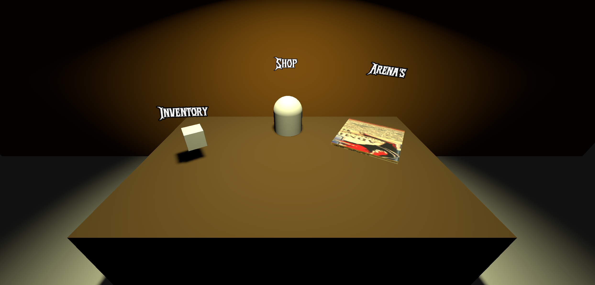
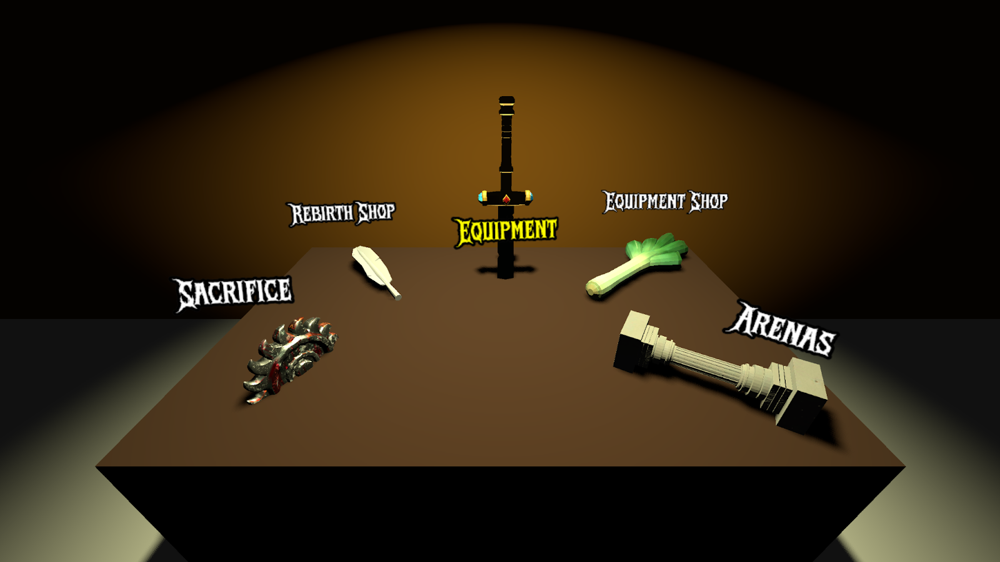
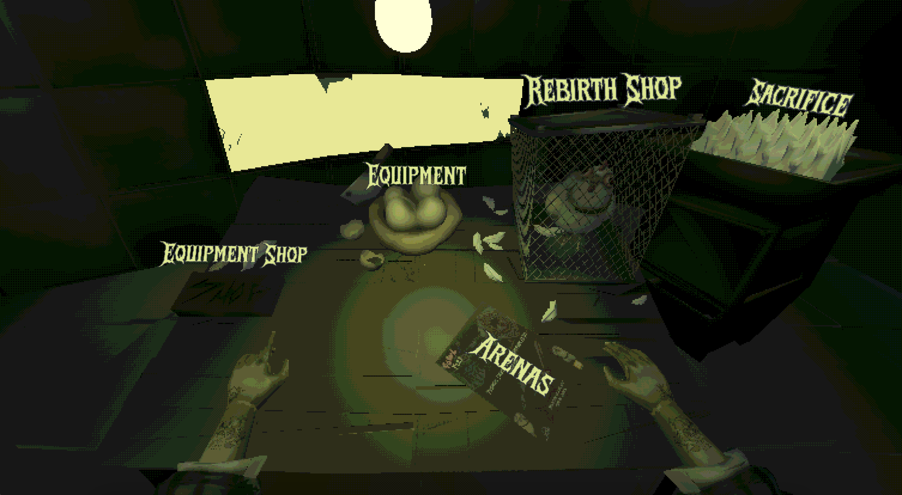

The Poultry Man menu serves as an in-game interface where players can interact with various functionalities. It essentially serves as a hub for players to access different game features, such as upgrading their character, buying weapons and abilities and choosing an arena to fight in.

## Version One


The older version of the Poultry Man menu was set in a world-like scene with an open sky, which felt out of place for the dark and unsettling theme we wanted to achieve. Instead of creating an immersive and fitting environment, it felt too bright and unstructured, failing to capture the eerie, scientific horror aesthetic. The lighting was flat, and the setting did not contribute to the intended vibe.

## Version Two



To improve the menu and align it with the game's dark and gritty theme, several enhancements were made:

- **Darkened the World**: Instead of an open-sky background, the environment is now much darker, reinforcing the eerie and unsettling atmosphere.
- **Added a Wall**: A wall was introduced to enclose the menu area, making it feel more like a confined, eerie laboratory where unethical experiments take place.
- **Dynamic Lighting**: A flashing light effect was added to create a more unsettling atmosphere, making the environment feel more alive and foreboding.
- **Added Labels**: Labels were introduced to indicate what each item does, providing players with clear information about where each item leads.
- **Hover Effects**: When players hover over an item, the label changes color and the node increases in size, making it more visually distinct and responsive.
- **Keyboard & Controller Navigation**: Players can now navigate the menu using both a keyboard and a controller, improving accessibility and ease of use.

## Version Three



In this version, the Poultry Man menu underwent significant visual and audio improvements:

- **New 3D Models**: The menu now features custom, thematic 3D models for each menu option, replacing the basic shapes from previous versions. These models better represent the game's items and options, enhancing immersion.
- **Expanded Menu Options**: Additional interactive options were added, including the rebirth shop and a way to sacrifice the chicken.
- **Ambient Music & Sound Effects**: [Atmospheric background music](/fowl-play/art/music/poultry-man-menu) and [sound effects](/fowl-play/art/sound/poultry-man-menu) were introduced, deepening the eerie and unsettling mood of the menu.
- **Improved Lighting**: The lighting was further refined to highlight the new models and create a more dramatic, focused environment, with a light flickering effect that adds to the unsettling atmosphere.
- **Refined UI Labels**: Labels were updated to match the new models and layout, maintaining clarity and style.

These changes made the menu more engaging, visually appealing, and consistent with the game's dark, experimental theme.

## Version Four (Finalized)



For the final delivery, the Poultry Man menu received a complete overhaul:

- **Fully Stylized Visuals**: The menu art style was finalized to match the game's unique aesthetic, with custom fonts, color grading, and visual effects including the addition of Poultry Man's arms, all of which reinforce the unsettling laboratory vibe.
- **Detailed Environment**: The background and props were redesigned to create a more immersive, story-driven setting, including thematic objects and environmental storytelling elements.
- **Polished Animations**: Menu transitions, hover effects, and model animations were refined.

### Submenu Preloading

This new version of the Poultry Man Menu also preloads all submenus during the initial load, which is covered by the loading screen between the main menu and the poultry man menu. This ensures all submenus are immediately available once the player can click on them, improving the user experience.
Before this change, we noticed that, especially the shop, would hang for a couple of seconds when the player first clicked on it, which was not ideal.

```gdscript
var menu_actions: Dictionary[StringName, UIEnums.UI] = {
	&"Arenas": UIEnums.UI.ARENAS,
	&"EquipmentShop": UIEnums.UI.POULTRYMAN_SHOP,
	&"Equipment": UIEnums.UI.CHICKEN_INVENTORY,
	&"Sacrifice": UIEnums.UI.CHICKEN_SACRIFICE,
	&"RebirthShop": UIEnums.UI.REBIRTH_SHOP
}

func _ready() -> void:
	UIManager.remove_ui_by_enum(UIEnums.UI.PLAYER_HUD)
	_initialize_focusable_items()
	_connect_input_signals()
	_set_initial_focus() # Handles initial highlight and focus
	_preload_items()

func _preload_items() -> void:
	print("Adding UI menu items in poultry man menu...")
	# For all menu_actions, call SignalManager.add_ui_scene
	for scene_enum_value in menu_actions.values():
		if scene_enum_value == UIEnums.UI.CHICKEN_SACRIFICE: continue # TODO: Crack
		SignalManager.add_ui_scene.emit(scene_enum_value, {}, false)
	print("UI loaded for poultry man menu")
```

The loading is very simple, not using any fancy multithreading as the amount of data to load is relatively small in the current state of Fowl Play. Multithreading is something to keep in mind if Fowl Play were to ever expand significantly, but for now, this simple approach works well.
