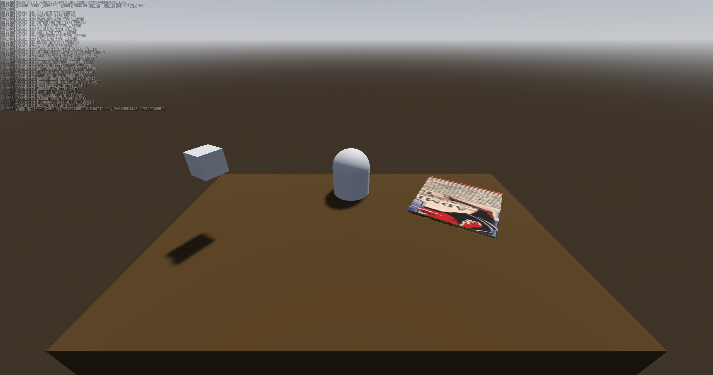
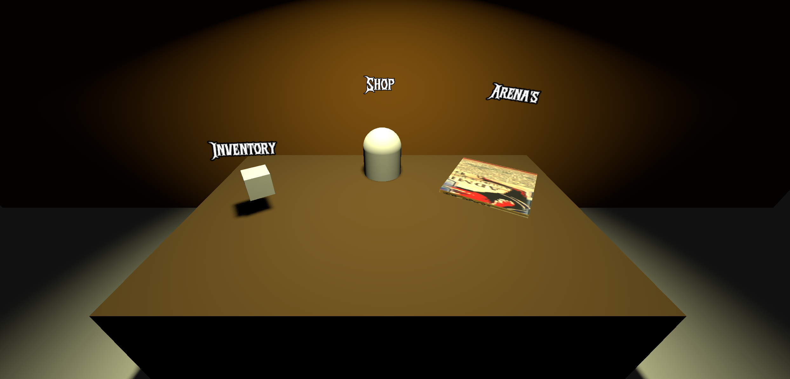

## Poultry Man Menu

The Poultry Man menu serves as an in-game interface where players can interact with various functionalities. Initially, the menu design did not match the intended atmosphere of the game. The latest update enhances the visual and interactive aspects of the menu to better fit the eerie, griddy theme of a scientist mutating and sacrificing chickens.

### Old Version

The older version of the Poultry Man menu was set in a world-like scene with an open sky, which felt out of place for the dark and unsettling theme we wanted to achieve. Instead of creating an immersive and fitting environment, it felt too bright and unstructured, failing to capture the eerie, scientific horror aesthetic. The lighting was flat, and the setting did not contribute to the intended vibe.

### New Version & Changes

To improve the menu and align it with the game's dark and griddy theme, several enhancements were made:

- **Darkened the World**: Instead of an open-sky background, the environment is now much darker, reinforcing the eerie and unsettling atmosphere.
- **Added a Wall**: A wall was introduced to enclose the menu area, making it feel more like a confined, eerie laboratory where unethical experiments take place.
- **Dynamic Lighting**: A flashing light effect was added to create a more unsettling atmosphere, making the environment feel more alive and foreboding.
- **Added Labels**: Labels were introduced to indicate what each item does, providing players with clear information about where each item leads.
- **Hover Effects**: When players hover over an item, the label changes color and the node increases in size, making it more visually distinct and responsive.
- **Keyboard & Controller Navigation**: Players can now navigate the menu using both a keyboard and a controller, improving accessibility and ease of use.

### Future Improvements

While the current changes bring the menu closer to the desired aesthetic, there are additional improvements we would like to implement to further enhance the atmosphere:

- **Background Music**: Adding eerie background music to intensify the dark atmosphere.
- **Theme-Appropriate Models**: Introducing new models that better fit the horror-scientific theme, such as mutated chickens, grimy equipment, or eerie lab machinery.
- **Environmental Details**: Placing additional elements around the table and on the walls, such as scattered notes, blood splatters, broken tools, or warning signs to enhance immersion.

These future additions will help refine the Poultry Man menu, making it even more immersive and fitting for the game's unsettling tone.
