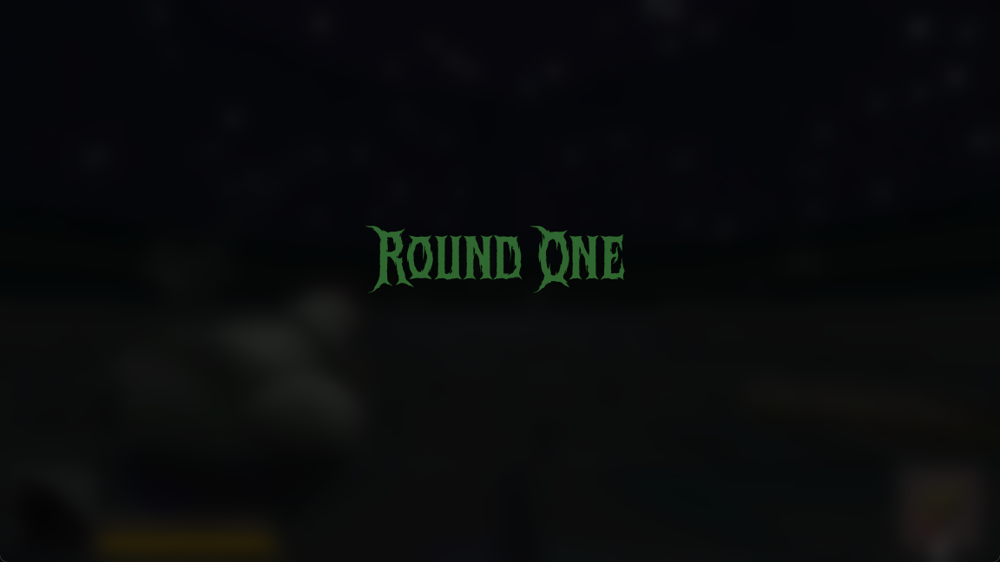
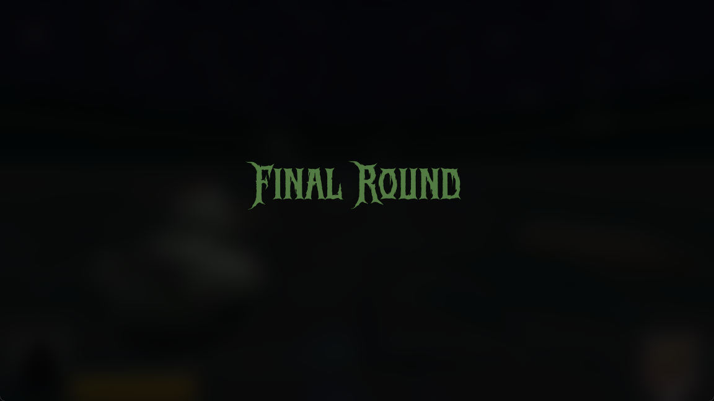
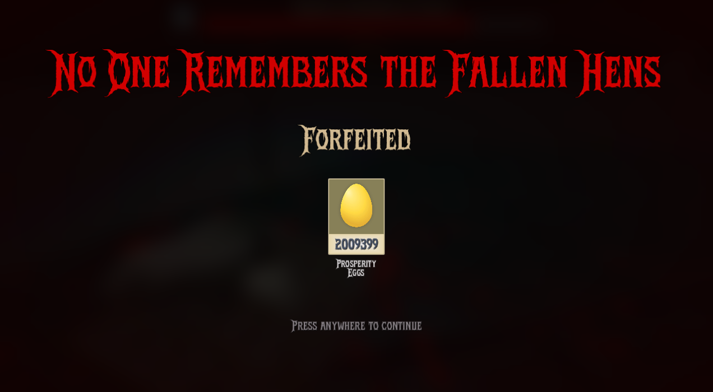
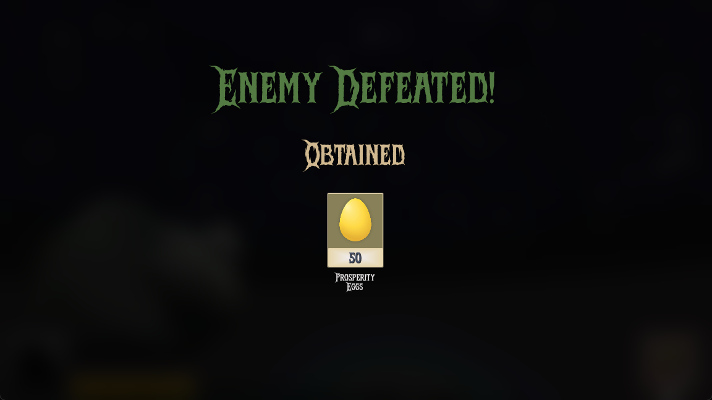
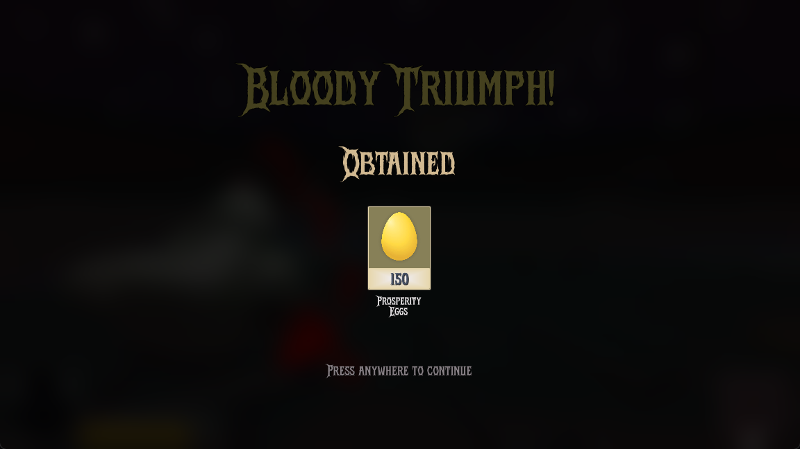
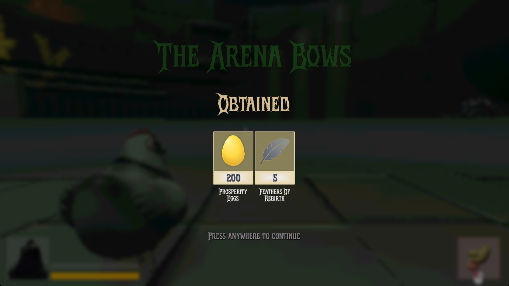

Between rounds, various screens are displayed to provide players with information, such as the current round, and the rewards won/lost during the round.

## Round Screen

The round screen is displayed at the start of each round, showing the current round number.


### Final Round

When entering the final round, instead of showing a number, the screen displays "Final Round" to indicate that this is the last round of the game.


## Death Screen

When the player dies, a death screen is displayed. It shows how many `Prosperity Eggs` the player has lost by dying.
During this screen, the [Game Over Theme](/fowl-play/art/music/game-over) plays.


The title text at the top of the death screen is randomized from a list of death lines, which are displayed in a large font.

```gdscript
@export var death_lines: Array[String] = [
	"Your Feathers Line the Arena Floor",
	"The Pecking Order Claims Another",
	"Plucked. Beheaded. Devoured.",
	"Clucked Your Last Cluck",
	"Your Egg Was Doomed From the Start",
	"No One Remembers the Fallen Hens",
	"You Died",
	"Mortuus Es Ut Scortum",
	"Your Mother Must Be Proud",
	"You Died Like a █████",
]
```

## Round Won

When the player wins a round, a screen is displayed showing the number of `Prosperity Eggs` won during the round.


### Victory Screen

The victory screen is displayed when the player wins a round, showing the number of `Prosperity Eggs` won.
During this screen, the [Victory Theme](/fowl-play/art/music/victory-theme) plays.

Additionally, if the player has defeated a boss in the round, the victory screen will also show the amount of `Feathers of Rebirth` earned.


The title text at the top of the victory screen is randomized from a list of victory lines, which are displayed in a large font.

```gdscript
@export var victory_lines: Array[String] = [
	"The Weak Perish, You Endure.",
	"The Arena Bows",
	"Bloody Triumph!",
	"Coop de Grâce!",
]
```
