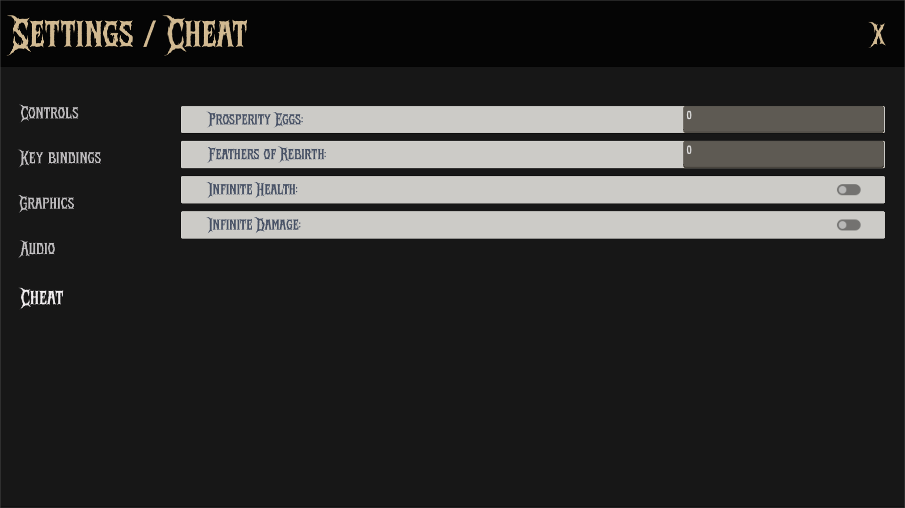

The `CheatSettingsPanel` is a Control node that provides an interface for enabling or disabling cheats in the game. It allows users to toggle various cheat options.



## Properties
### Enums
`ToggleCheats` is an enum that defines the available cheat options.

```gdscript
enum ToggleCheats {
	INFINITE_HEALTH,
	INFINITE_DAMAGE
}
```

### Node References

| Type	Name	Description
|-------|-------|-------------|
| PackedScene	| input_field_scene | Preloaded input field component |
| PackedScene	| check_button_scene | Preloaded checkbox component |
| VBoxContainer	| content_container | Container for cheat UI elements |

## Implementation

`ready()` initializes the cheat settings panel by clearing any existing cheat UI elements and creating new input fields and checkboxes for the available cheats. It connects the signals for value changes and toggles.
```gdscript
func _ready() -> void:
	for child in content_container.get_children():
		child.queue_free()

	# Create Input Fields
	_create_cheat_field(
		"prosperity_eggs",
		"Prosperity Eggs:",
		InputValidator.InputType.INTEGER
	)
	_create_cheat_field(
		"feathers_of_rebirth",
		"Feathers of Rebirth:",
		InputValidator.InputType.INTEGER
	)

	# Create Checkboxes
	_create_cheat_toggle(ToggleCheats.INFINITE_HEALTH,  GameManager.infinite_health)
	_create_cheat_toggle(ToggleCheats.INFINITE_DAMAGE, GameManager.infinite_damage)
```

`_create_cheat_field()` creates an input field for a specific cheat variable. It checks if the variable exists in `GameManager`, instantiates the input field scene, sets its value, and connects the signal for value changes.
```gdscript
func _create_cheat_field(
	variable_name: String,
	label_text: String,
	validation_type: InputValidator.InputType
) -> void:
	if not variable_name in GameManager:
		push_error("Missing GameManager property: %s" % variable_name)
		return
	
	var validator: InputValidator = input_field_scene.instantiate()

	if not validator:
		push_error("Could not instantiate or find nodes in input_field_scene.")
		return

	validator.validation_type = validation_type
		

	content_container.add_child(validator)
	validator.set_value(GameManager.get(variable_name))

	validator.set_label_text(label_text)
	# Connect signal after adding to scene tree
	validator.value_committed.connect(
		_on_value_committed.bind(variable_name, validation_type)
	)

```

`_create_cheat_toggle()` creates a checkbox for a specific cheat option. It converts the enum to a string for the label, sets the initial state, and connects the signal for toggling.
```gdscript
func _create_cheat_toggle(
	cheat: ToggleCheats, initial_state: bool
) -> void:
	var instance: SettingsCheckButton = check_button_scene.instantiate()

	if not instance:
		push_error("Could not instantiate check_button_scene.")
		return

	content_container.add_child(instance)

	# converting the enum to string
	var label_text: String = "%s:" % ToggleCheats.keys()[cheat].capitalize()

	instance.set_text(label_text)
	# Set initial state without triggering the signal
	instance.set_pressed_no_signal(initial_state)
	
	# Connect signal after adding to scene tree
	instance.toggled.connect(_on_cheat_toggled.bind(cheat))
```

`_on_value_committed()` is called when the value of an input field is committed. It updates the corresponding variable in `GameManager` and prints a message indicating the change.
```gdscript
func _on_value_committed(new_value: Variant, variable_name: String, _type: InputValidator.InputType) -> void:
	GameManager.set(variable_name, new_value)
	print("Updated %s to %s" % [variable_name, new_value])
```

`_on_cheat_toggled()` is called when a checkbox is toggled. It updates the corresponding cheat variable in `GameManager` and prints a message indicating the change.
```gdscript
func _on_cheat_toggled(is_pressed: bool, cheat: ToggleCheats) -> void:
	print("Cheat '%d' toggled: %s" % [cheat, is_pressed])

	match cheat:
		ToggleCheats.INFINITE_HEALTH:
			GameManager.infinite_health = is_pressed
		ToggleCheats.INFINITE_DAMAGE:
			GameManager.infinite_damage = is_pressed
		_:
			push_warning("Unhandled cheat toggle: %d" % cheat)
```

## Technical Details

### Dynamic UI Generation
- creates input fields for numeric game variables.
- Generates toggle buttons for boolean cheats.
- Uses validation for numeric inputs.
- Automatically labels controls based on enum/property names.

## Dependencies
- `GameManager`: The script relies on the `GameManager` singleton to manage game state and cheat properties.
- `InputValidator`: The script uses the `InputValidator` component for input validation and type checking.
- `SettingsCheckButton`: The script uses the `SettingsCheckButton` component for creating toggle buttons in the UI.
- `SettingsInputField`: The script uses the `SettingsInputField` component for creating input fields in the UI.

## Usage

To use the CheatSettingsPanel, you need to add it to the settings menu as PackedScene (see `SettingsMenu`). The panel will allow users to adjust the cheat settings using the input fields and toggles.