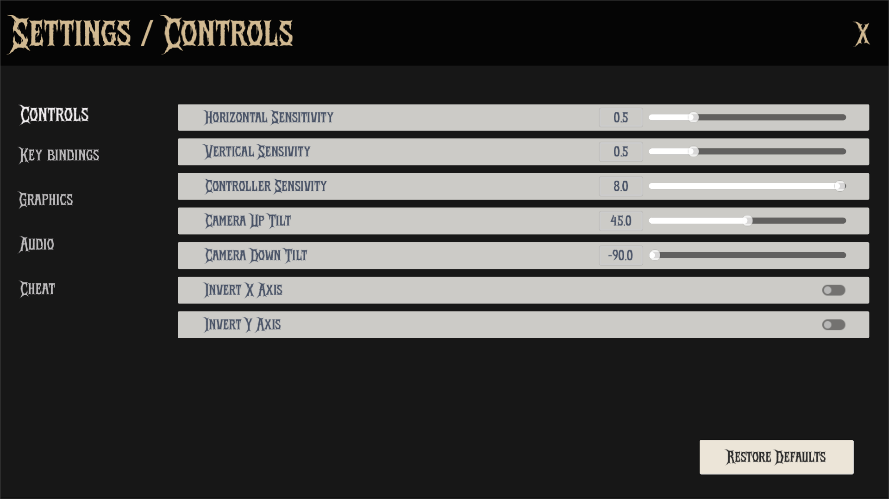

The `ControlsSettingsPanel` is a Control node that provides an interface for adjusting control settings in the game.

It allows users to modify various control settings, such as sensitivity, camera inversion and tilting, and provides a button to reset all control settings to their default values. The settings are saved and loaded using the `SettingsManager`, ensuring that the user's preferences persist between game sessions.



## Properties
### Configuration

| Type	| Name	| Description |
|-------|-------|-------------|
| String	| config_path |	Path to the configuration file ("user://settings.cfg") |
| String	| config_name |	Section name for controls settings ("controls") |
| Array[Dictionary]	| controls_settings |	Stores current control settings |

### Node References

| Type	| Name	| Description |
|-------|-------|-------------|
| VBoxContainer	| content_container |	Container for housing all control setting elements |
| PackedScene	| slider_resource | Preloaded slider control scene |
| PackedScene	| check_button_resource | Preloaded checkbox control scene |
| ControlsSetting	| controls_settings_resource | Resource containing default settings |

## Implementation

`ready()` initializes the controls settings panel by calling the `_load_controls_settings()` function, which loads the control settings from the configuration file. It also sets up the default settings if no configuration file exists.
```gdscript
func _ready() -> void:
	_load_controls_settings()
```

`_load_controls_settings()` loads the control settings from the configuration file using the `SettingsManager`. It retrieves the current control settings and updates the UI elements accordingly. If no configuration file exists, it initializes with default settings.
```gdscript
func _load_controls_settings() -> void:
	var config = ConfigFile.new()

	# Initialize with default settings
	controls_settings = controls_settings_resource.default_settings.duplicate(true)

	# Try to load config file
	if config.load(config_path) == OK and config.has_section(config_name):
		controls_settings.clear()
		# Override defaults with saved settings
		for controls_setting in config.get_section_keys(config_name):
			controls_settings.append({
				controls_setting: config.get_value(config_name, controls_setting)
				})

	_load_controls_items()
```

`_save_controls_settings()` saves the current control settings to the configuration file. It iterates through the `controls_settings` array and updates the settings in the configuration file.
```gdscript
func _save_controls_settings() -> void:
	var config = ConfigFile.new()
	config.load(config_path) # Load existing settings

	for controls_setting: Dictionary in controls_settings:
		config.set_value(config_name, controls_setting.keys()[0], controls_setting.values()[0])

	config.save(config_path)
	SignalManager.controls_settings_changed.emit()
```

`_load_controls_items()` is responsible for creating and displaying the UI elements for each control setting in the `content_container`. It removes any existing UI elements and instantiates new ones based on the current control settings. Each slider or checkbox is connected to the `_value_changed()` function, which updates the corresponding setting in the `controls_settings` array.
```gdscript
func _load_controls_items() -> void:
	for child in content_container.get_children():
		content_container.remove_child(child)
		child.queue_free()

	for item: Dictionary in controls_settings:
		var item_name: String = item.keys()[0]
		var item_values: Dictionary = item.values()[0]

		match item_values["type"]:
			"slider":
				var slider: SettingsSlider = slider_resource.instantiate()
				content_container.add_child(slider)
				slider.label.text = item_name.capitalize()
				slider.slider.min_value = item_values["min"]
				slider.slider.max_value = item_values["max"]
				slider.slider.step = item_values["step"]
				slider.slider.value = item_values["value"]
				slider.slider.value_changed.connect(_value_changed.bind(item))
			"check_button":
				var check_button: SettingsCheckButton = check_button_resource.instantiate()
				content_container.add_child(check_button)
				check_button.set_pressed_no_signal(item_values["value"])
				check_button.label.text = item_name.capitalize()
				check_button.toggled.connect(_value_changed.bind(item))
```
`_value_changed()` is called when the value of a slider or checkbox changes. It updates the corresponding setting in the `controls_settings` array and saves the settings to the configuration file.
```gdscript
func _value_changed(value: float, item: Dictionary) -> void:
	controls_settings[controls_settings.find(item)].values()[0]["value"] = value

	_save_controls_settings()

```

`_on_restore_defaults_button_up()` is called when the "Restore Defaults" button is pressed. It removes the configuration file if it exists and resets the control settings to their default values. It then reloads the control items and saves the settings.
```gdscript
func _on_restore_defaults_button_up() -> void:
	if FileAccess.file_exists(config_path):
		DirAccess.remove_absolute(config_path)

	controls_settings.clear()
	controls_settings = controls_settings_resource.default_settings.duplicate(true)

	_load_controls_items()
	_save_controls_settings()
```

## Technical Details

### Dynamic UI Generation
- Creates UI elements based on settings configuration
- Uses preloaded scenes for sliders and check buttons
- Automatically adjusts layout and properties based on settings
- Supports dynamic addition and removal of UI elements

### Settings Structure
Each control setting contains:
- for sliders:
	- min: Minimum value
	- max: Maximum value
	- step: Increment step
	- value: Current value
- for check buttons:
	- value: Boolean state

### Signal Handling
- Emits `controls_settings_changed` signal via `SignalManager` when settings are modified.
- Connects UI element signals to appropriate handlers.

### Configuration Persistence
Settings are stored in a configuration file (`user://settings.cfg`) using the `ConfigFile` class.
The stored values are:
- **Section**: "controls"
- **Keys**: Control setting names (e.g., "sensitivity", "invert_y", "tilt")
- **Values**: Corresponding configuration values for each setting
This allows the game to remember user preferences across sessions.

## Dependencies
- `SettingsManager`: Manages loading and saving settings.
- `SettingsSlider`: Custom slider control for adjusting values.
- `SettingsCheckButton`: Custom checkbox control for toggling options.
- `SignalManager`: Manages signals for settings changes.

## Usage

To use the ControlsSettingsPanel, you need to add it to the settings menu as PackedScene (see `SettingsMenu`). The panel will automatically load the current control settings and allow users to adjust them using the sliders. When the user changes a setting, the new setting is saved to the configuration file.
