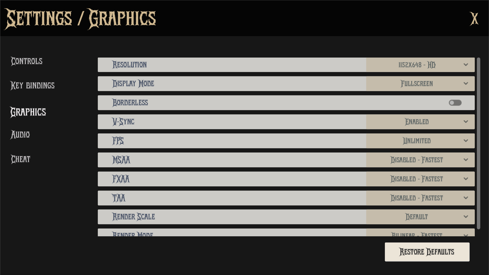

The `GraphicsSettingsPanel` is a Control node that provides an interface for adjusting graphics settings in the game.

It allows users to modify various graphics options such as resolution, display mode, V-Sync, anti-aliasing methods, and render scale. The settings are saved and loaded using the `SettingsManager`, ensuring that the user's preferences persist between game sessions.



## Properties
### Constants
| Name | Type | Description |
|------|------|-------------|
| RESOLUTIONS | Dictionary[String, Vector2i] | Available screen resolutions with labels |
| DISPLAY_MODES | Dictionary[String, WindowMode] | Window display modes (Windowed, Fullscreen, etc.) |
| V_SYNC | Dictionary[String, VSyncMode] | Vertical synchronization options |
| FPS | Dictionary[String, int] | Framerate limit options |
| MSAA | Dictionary[String, MSAA] | Multisample anti-aliasing quality levels |
| FXAA | Dictionary[String, ScreenSpaceAA] | Fast approximate anti-aliasing options |
| TAA | Dictionary[String, bool] | Temporal anti-aliasing toggle |
| RENDER_SCALE | Dictionary[String, float] | 3D rendering resolution scaling factors |
| RENDER_MODE | Dictionary[String, Scaling3DMode] | 3D scaling modes (FSR, Bilinear) |

### Configuration
| Type | Name | Description |
|------|------|-------------|
| String | config_path | Path to configuration file ("user://settings.cfg") |
| String | config_name | Section name for graphics settings ("graphics") |
| Dictionary | graphics_settings | Stores current graphics settings |

### Node References
| Type | Name | Description |
|------|------|-------------|
| ContentItemDropdown | resolution | Resolution selection dropdown |
| ContentItemDropdown | display_mode | Window mode dropdown |
| SettingsCheckButton | borderless | Borderless window toggle |
| ContentItemDropdown | v_sync | VSync mode dropdown |
| ContentItemDropdown | fps | FPS limit dropdown |
| ContentItemDropdown | msaa | MSAA quality dropdown |
| ContentItemDropdown | fxaa | FXAA toggle dropdown |
| ContentItemDropdown | taa | TAA toggle |
| ContentItemDropdown | render_scale | Render scale quality dropdown |
| ContentItemDropdown | render_mode | 3D scaling mode dropdown |


## Implementation

The `_ready()` function initializes the graphics settings panel by calling `_load_graphics_items()` to populate the dropdowns and checkboxes with available options. It also sets the initial values for the graphics settings based on the current configuration.
```gdscript
func _ready() -> void:
	_load_graphics_items()
```

The `_load_graphics_settings()` function loads the graphics settings from the configuration file using the `SettingsManager`. It retrieves the current graphics settings and updates the dropdowns and checkboxes accordingly.
```gdscript
func _load_graphics_settings() -> void:
	SettingsManager.load_settings(get_viewport(),get_window(),config_name)

	_set_graphics_values()
```

The `_save_graphics_settings()` function saves the current graphics settings to the configuration file. It iterates through the `graphics_settings` dictionary and updates the values in the configuration file.
```gdscript
func _save_graphics_settings() -> void:
	var config = ConfigFile.new()
	config.load(config_path) # Load existing settings

	for graphics_setting: String in graphics_settings:
		config.set_value(config_name, graphics_setting, graphics_settings[graphics_setting])

	config.save(config_path)
```

The following functions are connected to the respective signals from the UI elements. They handle the changes made by the user and update the graphics settings accordingly.
```gdscript
func _set_resolution(index: int) -> void:
	var value: Vector2i = RESOLUTIONS.values()[index]
	DisplayServer.window_set_size(value)
	DisplayUtils.center_window(get_window())

	resolution.options.selected = index
	graphics_settings["resolution"] = value

	_save_graphics_settings()
```

```gdscript
func _set_display_mode(index: int) -> void:
	var value: DisplayServer.WindowMode = DISPLAY_MODES.values()[index]
	DisplayServer.window_set_mode(value)

	display_mode.options.selected = index
	graphics_settings["display_mode"] = value

	_save_graphics_settings()
```

```gdscript
func _set_borderless(value: bool) -> void:
	DisplayServer.window_set_flag(DisplayServer.WINDOW_FLAG_BORDERLESS, value)
	DisplayServer.window_set_size(graphics_settings["resolution"])
	DisplayUtils.center_window(get_window())

	graphics_settings["borderless"] = value

	_save_graphics_settings()
```

```gdscript
## Vsync is enabled by default.
## Vertical synchronization locks framerate and makes screen tearing not visible
## at the cost of higher input latency and stuttering when the framerate target
## is not met.Adaptive V-Sync automatically disables V-Sync when the framerate 
## target is not met, and enables V-Sync otherwise. This prevents suttering and 
## reduces input latency when the framerate target is not met, at the cost of 
## visible tearing.
func _set_vsync(index: int) -> void:
	var value: DisplayServer.VSyncMode = V_SYNC.values()[index]
	DisplayServer.window_set_vsync_mode(value)

	v_sync.options.selected = index
	graphics_settings["v_sync"] = value

	_save_graphics_settings()
```

```gdscript
## The rendering FPS affects the appearance of TAA, as higher framerates allow 
## it to converge faster. On high refresh rate monitors, TAA ghosting issues 
## may appear less noticeable as a result (if the GPU can keep up).
func _set_fps(index: int) -> void:
	var value: int = FPS.values()[index]
	Engine.set_max_fps(value)

	fps.options.selected = index
	graphics_settings["fps"] = value

	_save_graphics_settings()
```

```gdscript
## Multi-sample anti-aliasing. High quality, but slow. It also does not smooth 
## out the edges of transparent (alpha scissor) textures.
func _set_msaa(index: int) -> void:
	var value: int = MSAA.values()[index]
	get_viewport().msaa_3d = value

	msaa.options.selected = index
	graphics_settings["msaa"] = value

	_save_graphics_settings()
```

```gdscript
## Fast approximate anti-aliasing. Much faster than MSAA (and works on alpha 
## scissor edges), but blurs the whole scene rendering slightly.
func _set_fxaa(index: int) -> void:
	var value: int = FXAA.values()[index]
	get_viewport().screen_space_aa = value

	fxaa.options.selected = index
	graphics_settings["fxaa"] = value

	_save_graphics_settings()
```

```gdscript
## Temporal antialiasing. Smooths out everything including specular aliasing, 
## but can introduce ghosting artifacts and blurring in motion. 
## Moderate performance cost.
func _set_taa(index: int) -> void:
	var value: int = TAA.values()[index]
	get_viewport().use_taa = value

	taa.options.selected = index
	graphics_settings["taa"] = value

	_save_graphics_settings()
```

```gdscript
func _set_render_scale(index: int) -> void:
	var value: float = RENDER_SCALE.values()[index]
	get_viewport().scaling_3d_scale = value

	render_scale.options.selected = index
	graphics_settings["render_scale"] = value

	_save_graphics_settings()
```

```gdscript
func _set_render_mode(index: int) -> void:
	var value: int = RENDER_MODE.values()[index]
	get_viewport().scaling_3d_mode = value

	render_mode.options.selected = index
	graphics_settings["render_mode"] = value

	_save_graphics_settings()
```

`load_graphics_items()` is responsible for populating the dropdowns and checkboxes with available options. It clears the existing options and adds new ones based on the defined constants.
```gdscript
func _load_graphics_items() -> void:
	resolution.options.clear()
	for res_text in RESOLUTIONS:
		resolution.options.add_item(res_text)

	display_mode.options.clear()
	for dis_text in DISPLAY_MODES:
		display_mode.options.add_item(dis_text)

	v_sync.options.clear()
	for v_text in V_SYNC:
		v_sync.options.add_item(v_text)

	fps.options.clear()
	for fps_text in FPS:
		fps.options.add_item(fps_text)

	msaa.options.clear()
	for msaa_text in MSAA:
		msaa.options.add_item(msaa_text)

	fxaa.options.clear()
	for fxaa_text in FXAA:
		fxaa.options.add_item(fxaa_text)

	taa.options.clear()
	for taa_text in TAA:
		taa.options.add_item(taa_text)

	render_scale.options.clear()
	for scale_text in RENDER_SCALE:
		render_scale.options.add_item(scale_text)

	render_mode.options.clear()
	for scale_text in RENDER_MODE:
		render_mode.options.add_item(scale_text)

	_load_graphics_settings()
```

`set_graphics_values()` sets the initial values for the graphics settings based on the current configuration. It selects the appropriate options in the dropdowns and checkboxes according to the loaded settings.
```gdscript
func _set_graphics_values() -> void:
	resolution.options.select(max(RESOLUTIONS.values().find(DisplayServer.window_get_size()), 0))
	display_mode.options.select(DISPLAY_MODES.values().find(DisplayServer.window_get_mode()))
	borderless.set_pressed_no_signal(DisplayServer.window_get_flag(DisplayServer.WINDOW_FLAG_BORDERLESS))
	v_sync.options.select(V_SYNC.values().find(DisplayServer.window_get_vsync_mode()))
	fps.options.select(FPS.values().find(Engine.max_fps))
	msaa.options.select(MSAA.values().find(get_viewport().msaa_3d))
	fxaa.options.select(FXAA.values().find(get_viewport().screen_space_aa))
	taa.options.select(TAA.values().find(get_viewport().use_taa))
	render_scale.options.select(RENDER_SCALE.values().find(max(snappedf(get_viewport().scaling_3d_scale, 0.01), 0.5)))
	render_mode.options.select(RENDER_MODE.values().find(get_viewport().scaling_3d_mode))

```

`restore_defaults()` is called when the "Restore Defaults" button is pressed. It removes the configuration file if it exists and reloads the graphics items to reset the settings to their default values.
```gdscript
func _on_restore_defaults_button_up() -> void:
	if FileAccess.file_exists(config_path):
		DirAccess.remove_absolute(config_path)

	_load_graphics_items()
```

## Technical Details

### Graphics Pipeline Control
- Manages both window-level (resolution, mode) and rendering-level (AA, scaling) settings.
- Uses Godot's DisplayServer for window configuration,
- Modifies Viewport settings for rendering quality,
- Controls Engine parameters for performance tuning,

### Anti-Aliasing Options
- **MSAA**: Multisample anti-aliasing, high quality but performance intensive.
- **FXAA**: Fast approximate anti-aliasing, blurs entire image.
- **TAA**: Temporal anti-aliasing, smooths out everything but can introduce ghosting artifacts and blurring in motion.

### Performance Scaling
- Includes FSR (FidelityFX Super Resolution) options for upscaling.
- Provides multiple render scale presets for performance tuning.
- Allows framerate limiting to control performance and power consumption.

### Configuration Persistence

Settings are stored in a configuration file (`user://settings.cfg`) using the `ConfigFile` class. The stored values are:
- **Section**: "graphics"
- **Keys**: Graphics setting names (e.g., "resolution", "display_mode", "v_sync", "render_scale")
- **Values**: Corresponding configuration values for each setting
This allows the game to remember user preferences across sessions.

## Dependencies
- `SettingsManager`: For loading and saving settings.
- `DisplayUtils`: For centering the window.
- `ContentItemDropdown`: Custom dropdown UI element.
- `SettingsCheckButton`: Custom checkbox UI element.

## Usage

To use the `GraphicsSettingsPanel`, you need to add it to the settings menu as a PackedScene (see `SettingsMenu`). The panel will automatically load the current graphics settings and allow users to adjust them using the dropdowns and checkboxes. When the user changes a setting, the new value is saved to the configuration file.