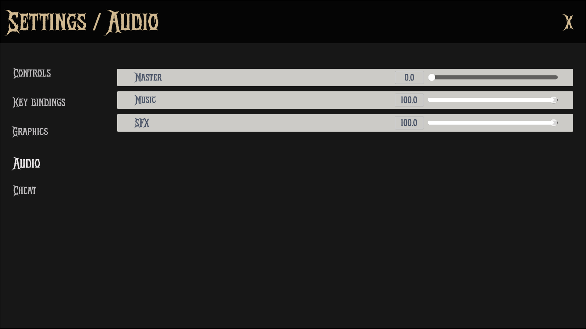

The `AudioSettingsPanel` is a Control node that provides an interface for adjusting audio settings in the game. It allows users to modify the volume levels for different audio categories (Master, Music, SFX).

<!-- and provides a button to reset all audio settings to their default values. -->

It includes sliders for each audio bus, allowing players to adjust the volume levels according to their preferences. The settings are saved and loaded using the `SettingsManager`, ensuring that the user's preferences persist between game sessions.



## Properties

### Configuration

| Type                      | Name         | Description                                            |
| ------------------------- | ------------ | ------------------------------------------------------ |
| String                    | config_path  | Path to the configuration file ("user://settings.cfg") |
| String                    | config_name  | Section name for audio settings in config ("audio")    |
| Dictionary[String, float] | audio_busses | Stores volume levels for each audio bus (0-100 range)  |

### Node References

| Type          | Name              | Description                                    |
| ------------- | ----------------- | ---------------------------------------------- |
| PackedScene   | audio_slider      | Preloaded slider control for volume adjustment |
| VBoxContainer | content_container | Container for housing all audio sliders        |

## Implementation

`ready()` initializes the audio settings panel by loading the audio bus names and their corresponding volume levels from the AudioServer. It creates a slider for each audio bus and sets its value based on the loaded settings.

```gdscript
func _ready() -> void:
	for index in range(AudioServer.get_bus_count()):
		var bus_name: String = AudioServer.get_bus_name(index)
		audio_busses[bus_name] = AudioServer.get_bus_volume_linear(index) * 100

	_load_audio_settings()
```

`_load_audio_settings()` loads the audio settings from the configuration file using the `SettingsManager`. It retrieves the volume levels for each audio bus and updates the sliders accordingly.

```gdscript
func _load_audio_settings() -> void:
	SettingsManager.load_settings(get_viewport(),get_window(),config_name)

	_load_audio_busses()
```

`save_audio_settings()` saves the current audio settings to the configuration file. It iterates through the `audio_busses` dictionary and updates the volume levels for each audio bus in the configuration file.

```gdscript
func _save_audio_settings() -> void:
	var config = ConfigFile.new()
	config.load(config_path) # Load existing settings

	for audio_bus_name: String in audio_busses:
		config.set_value(config_name, audio_bus_name, audio_busses[audio_bus_name])

	config.save(config_path)
```

`load_audio_busses()` is responsible for creating and displaying the sliders for each audio bus in the `content_container`. It removes any existing sliders and instantiates new ones based on the current audio bus settings. Each slider is connected to the `_volume_changed()` function, which updates the corresponding volume level in the `audio_busses` dictionary.

```gdscript
func _load_audio_busses() -> void:
	for child in content_container.get_children():
		content_container.remove_child(child)
		child.queue_free()

	for audio_bus in audio_busses:
		var instance: SettingsSlider = audio_slider.instantiate()
		content_container.add_child(instance)

		instance.set_text(audio_bus)
		instance.set_value(audio_busses[audio_bus])
		instance.slider.value_changed.connect(_volume_changed.bind(audio_bus))
```

```_volume_changed()` is called when the value of a slider changes. It calls `_set_volume()` and `_save_audio_settings()` to update the volume level and save the settings.

```gdscript
func _volume_changed(value: float, bus_name: String) -> void:
	_set_volume(bus_name, value)
	_save_audio_settings()
```

`set_volume()` sets the volume for a specific audio bus. It converts the percentage value to decibels and updates the volume level in the `audio_busses` dictionary. The volume is clamped between 0 and 100 to ensure valid values.

```gdscript
## Set volume for a specific bus (using percentage)
func _set_volume(bus_name: String, volume: float) -> void:
	var bus_idx: int = AudioServer.get_bus_index(bus_name)
	if bus_idx == -1:
		return

	# Convert from percentage to dB
	# Note: 0.0 percent = -80 dB (silent), 1.0 percent = 0 dB (max)
	audio_busses[bus_name] = volume
	volume = linear_to_db(clampf(volume, 0.0, 100.0) / 100)
	AudioServer.set_bus_volume_db(bus_idx, volume)
```

## Technical Details

### Volume Conversion

The script handles volume conversion between different scales:

- **UI Percentage (0-100)**: The value shown to players in the UI.
- **Linear Scale (0.0-1.0)**: Used for calculations and internal representation.
- **Decibel Scale (-80dB to 0dB)**: Used by the AudioServer for actual audio processing.

### Configuration Persistence

Settigngs are stored in a configuration file (`user://settings.cfg`) using the `ConfigFile` class. The stored values are:

- **Section**: "audio"
- **Keys**: Audio bus names (e.g., "Master", "Music", "SFX")
- **Values**: Volume percentages (0-100)
  This allows the game to remember user preferences across sessions.

## Dependencies

- `AudioServer`: Used for managing audio buses and volume levels.
- `SettingsManager`: Handles loading and saving settings to the configuration file.
- `SettingsSlider`: A custom slider control for adjusting volume levels.

## Usage

To use the AudioSettingsPanel, you need to add it to the settings menu as PackedScene (see `SettingsMenu`). The panel will automatically load the current audio settings and allow users to adjust them using the sliders. When the user changes a slider value, the new volume level is saved to the configuration file.
