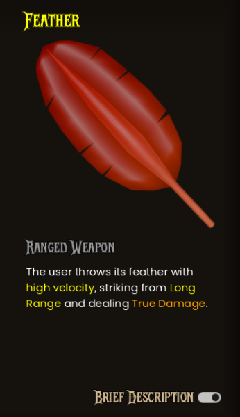

## Features

- Purchase weapons and abilities using `Prosperity Eggs`.
- Shop always offers 6 items: 1 melee weapon, 1 ranged weapon, 1 ability, and 3 additional random items.
- Weapons and abilities are reset on chicken/player death.
- Item swap confirmation dialog prevents accidental replacement.
- Item preview panel shows both short and long descriptions.

## Item Types

| Type          | Example                      | Description                                     |
| ------------- | ---------------------------- | ----------------------------------------------- |
| Melee Weapon  | Sword, Leek                  | Close-range attacks, often with special effects |
| Ranged Weapon | Feather, Slingshot           | Long-range attacks, may ignore defense          |
| Ability       | Glacial Prism, Seas of Flame | Grants special powers or effects                |

## Swap Confirmation

When purchasing an item for which you already have a different item equipped, a confirmation dialog appears, showing the item being replaced and the new item being purchased. Players must confirm their purchase before the new item is equipped.

## Item Preview

- The preview panel displays a short description by default. Toggle to view the long description for detailed stats and effects.

### Short description

Provides a quick overview of the item's primary function and most important stats.

### Long description

Provides detailed information about the item's stats, effects, and any special properties it may have.

