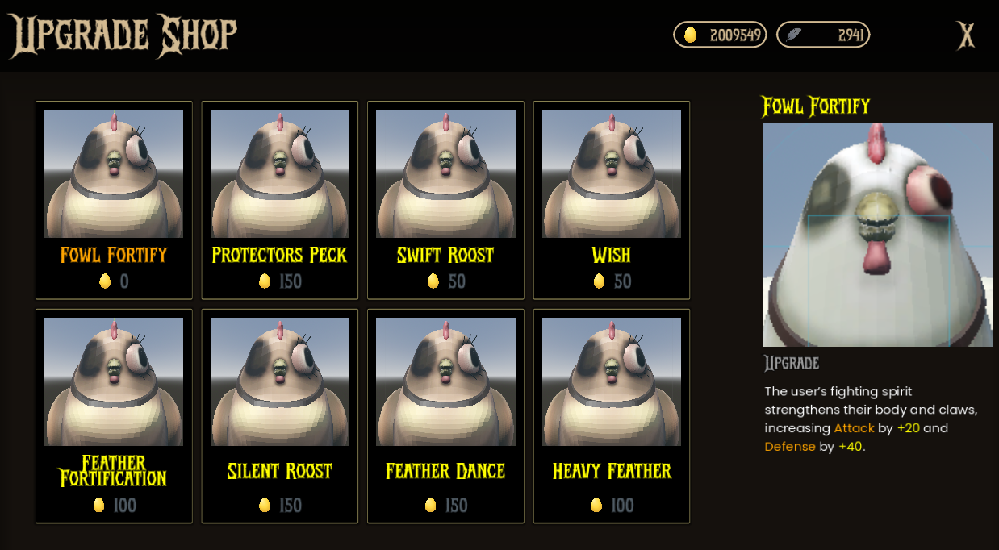
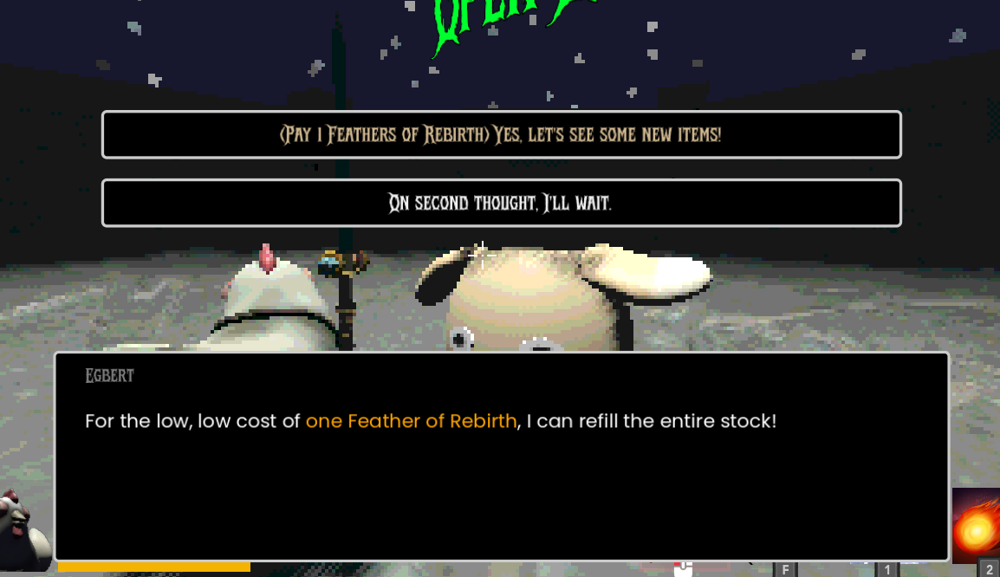
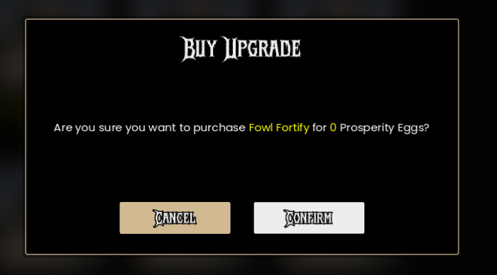

## Features

- Purchase temporary upgrades during an arena run using `Prosperity Eggs`.
- Upgrades enhance stats, but for the current run only.
  - Upgrades reset after leaving the arena.
- Shop can be refreshed for a cost (`Feathers Of Rebirth`), offering new upgrade choices.
- Always contains 8 random upgrades, of which 1 is randomly made free.

## Resetting the Shop

- Talk to the shopkeeper and pay 1 Feather of Rebirth to refresh the shop's stock.
- This will display new upgrade options for purchase.

## Confirmation

When purchasing an upgrade, a confirmation dialog appears, showing the cost of the upgrade and its effects. Players must confirm their purchase before the upgrade is applied.
