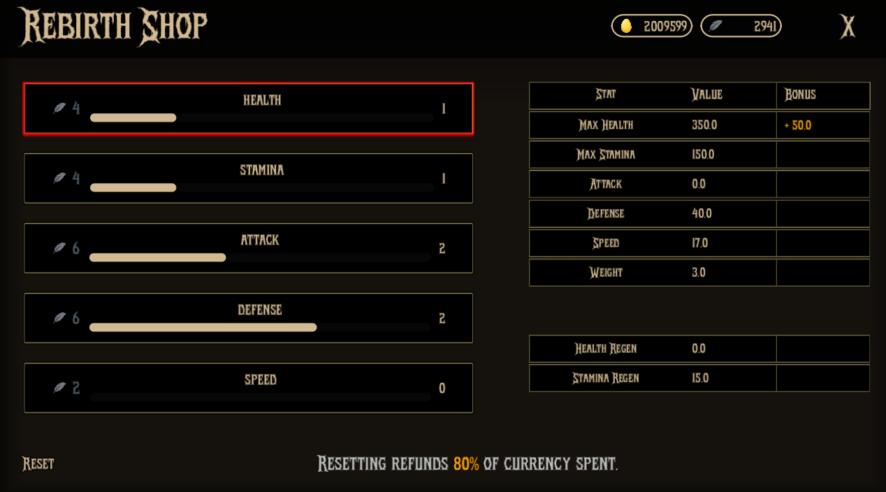
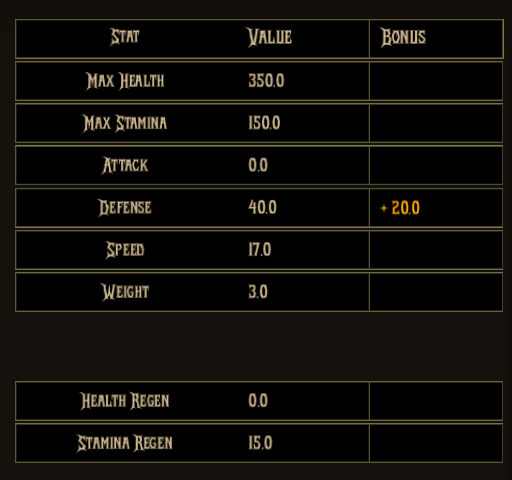
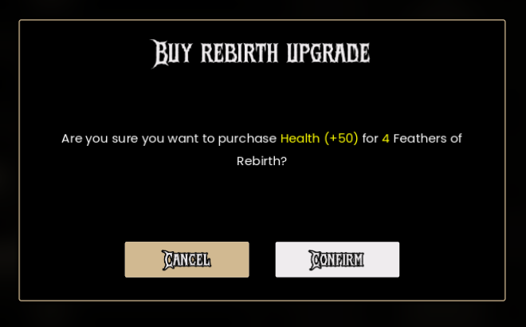
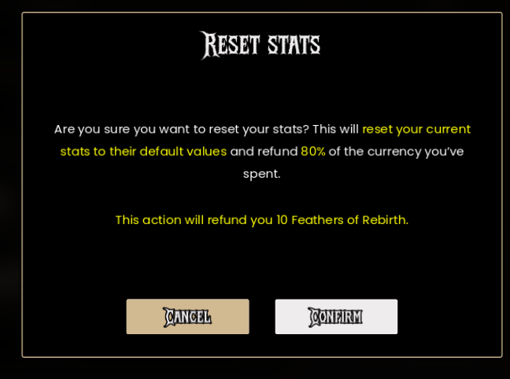

## Features

- Spend `Feathers Of Rebirth` to purchase permanent stat upgrades.
- Upgrades persist between runs and chickens.
- Confirmation dialogs for purchases and resets to prevent accidental purchases.
- Reset all upgrades to refund 80% of spent `Feathers Of Rebirth` and reallocate points.

## Purchase Preview

When hovering over an upgrade, a preview of the upgrade's effects is displayed on the right side of the shop interface. This allows players to see the benefits of an upgrade before committing to a purchase.

## Purchase Confirmation

When a player attempts to purchase an upgrade, a confirmation dialog appears, showing the cost of the upgrade and its effects. Players must confirm their purchase before the upgrade is applied.

## Reset

The player can reset their purchased upgrades, refunding 80% of the spent `Feathers Of Rebirth`. This allows players to reallocate their upgrades if they wish to change their build or strategy.

When the player chooses to reset their upgrades, a confirmation dialog appears, showing the total amount of `Feathers Of Rebirth` that will be refunded. Players must confirm the reset before it is applied.

## Resetting Upgrades

- Click the **Reset** button at the bottom of the shop interface.
- A confirmation dialog will show the total refund amount (80% of spent Feathers Of Rebirth).
- Confirm to reset all upgrades and receive the refund.
