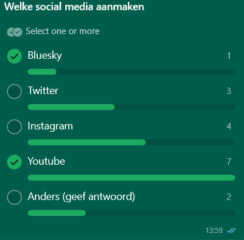

## Social Media Accounts

In order to promote and give insights into our game, social media profiles were created. These accounts have the following purposes:

- **Gather valuable feedback:** By putting our game out there publicly will hopefully lead to valuable input from others.
- **Building community:** Engaging with an audience helps create a sense of connection and interest around our project.
- **Develop professional skills:** Managing social media accounts and interacting with followers gives us hands-on experience in digital marketing and communication. Interaction with fellow game developers can give valuable insights and improvements to our workflow.
- **Enhance visibility:** Regular updates and interactions help keep our content relevant, making it more likely to catch the attention of potential players or even future employers.

While building a fully engaged community is near impossible due to the limited time frame and the fact that this is a school project, these efforts still provide us with valuable experience and exposure. It will at least look good on our resumes 😉.

### Chosen Platforms

- [**YouTube**](https://www.youtube.com/@studiofishbones)
- [**TikTok**](https://www.tiktok.com/@studiofishbones)
- [**Instagram**](https://www.instagram.com/studiofishbones)
- [**X/Twitter**](https://x.com/StudioFishbones)
- [**Bluesky**](https://bsky.app/profile/studiofishbones.com)

For easy linking, we created a [**Linktree**](https://linktr.ee/studiofishbones).

#### Poll

The choice for the social media platforms was decided within the group, using a poll.


### Video-Centric Platforms

#### YouTube

- **Purpose:** Host trailers and gameplay video's. Potential deep dives into our game.
- **Advantage:** Long-term content discoverability and ideal for longer form content.

#### TikTok

- **Purpose:** Share trailer snippets and quick progress updates.
- **Advantage:** Huge user base, ideal for short form content.

### Image-Centric Platforms

#### Instagram

- **Purpose:** Posting screenshots of the game.
- **Advantage:** Long-term content discoverability and ideal for picture content.

### Developer Communities

#### X/Twitter

- **Purpose:** Quick development updates, participating within development communities.
- **Advantage:**
  - Connect with other (game) developers.
  - Participate in game development Twitter threads.
  - Getting feedback.

#### Bluesky

- **Purpose:** Quick development updates, participating within development communities.
- **Advantage:**
  - Connect with other (game) developers.
  - Getting feedback.
  - Growing alternative to X/Twitter with tech-savvy user base.
    - Godot community.

### First Bio

On most platforms, bio's are character limited. This gives us little space to get our information across. The initial bio's for these platforms display the following information, varying by platform limitations.

```
Studio Fishbones is a "fictional" game development studio startup.
Created as part of the game development minor at The Hague University of Applied Science.
```
