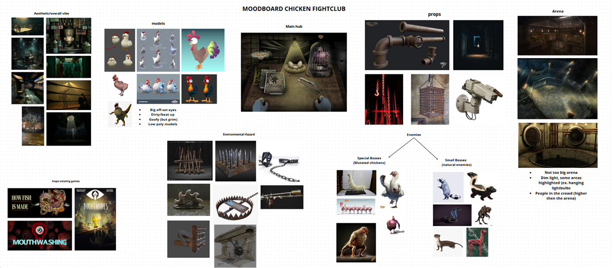
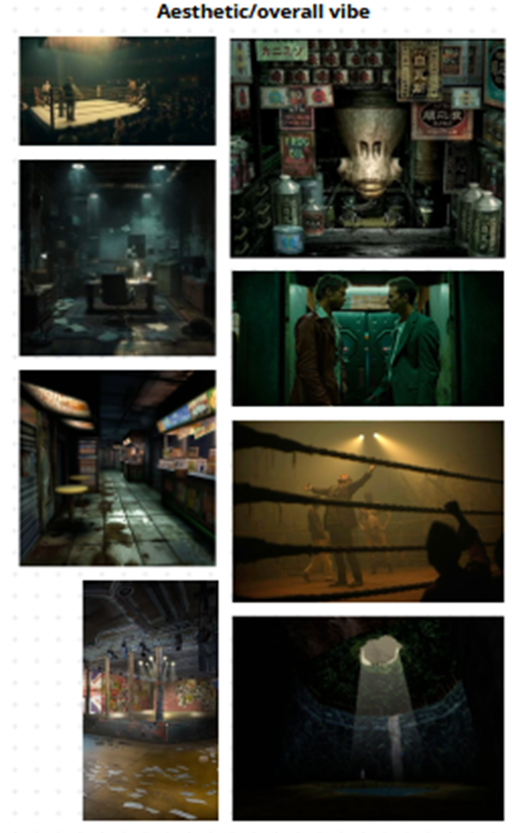
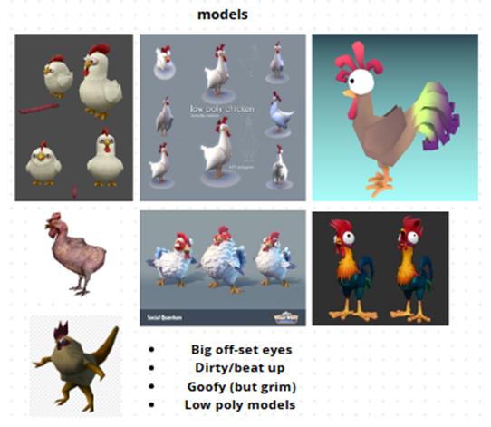

## Logline

Fowl Play is a _3D Roguelike Arena Fighter_ game about hatching and mutating chickens to dominate the Arena. You enhance and upgrade your chicken with _Biological and Mechanical Mutations_ to overpower enemies, defeat bosses and become the ultimate chicken.

## Our reason for making this game

From the beginning, we wanted to do a 3D game. This would give us more freedom in creating the overall layout and fit better without ideas. While creating a 3D game is more challenging, it does allow for some creative ideas we as a group wanted to try out.

During the brainstorm session, most of our ideas gravitated towards psychological horror, action games and roguelike elements. Fowl Play incorporates all these elements to create a unique and thrilling experience:

- **Psychological Horror** - The world of Fowl Play has a dark atmosphere, filled with gruesome environments and unsettling chicken mutations.
- **Action** - The combat in Fowl Play features 3D Free Movement, allowing players to engage in fast-paced combat using primary and secondary attacks, along with various abilities to add depth and strategy. Inside the Arena, the main goal is to continuously duel against increasingly powerful enemies as you take control of your chicken.
- **Roguelike Elements** - The runs inside the Arena are unpredictable, featuring a diverse array of enemy encounters to fight against, evolving chicken mutations and a wide range of purchasable items, ensuring each run is different.

## Gameplay

Fowl Play is a single-player game, where the player will be playing as both the Poultry Man and as the chicken itself. As the Poultry Man, you will be able to access menus where you can upgrade your chicken and select the Arena for your chicken to fight in. Upgrades will not only make your chicken stronger, but will also give your chicken different abilities to use in the Arena.

In the Arena, you will control your chicken. You will fight against numerous enemies, and it’s your goal to win. By completing an Arena, points will be earned, which can make that Arena more difficult the following run or unlocking various special endings. The more difficult an Arena is, the richer the rewards are upon completion.

### Currency

In our game, there are two types of currencies: **Prosperity Eggs** and **Feathers of Rebirth**:

- **Prosperity Eggs**: The trade currency used to purchase new eggs, buy armor and weapons, mutate or evolve your current chicken, and trigger various events inside the Arena.
  - _How to obtain_: Players can gain Prosperity Eggs by _defeating enemy(s)_ inside the Arena. The harder the level is, the more you will gain upon completion. Additionally, Prosperity Eggs can also be acquired through special events, such as the Wealth event encounter.
- **Feathers of Rebirth**: Investment currency used to buy permanent stat upgrades that will be persistent across runs and different chickens.
  - _How to obtain_: Players can gain Feathers of Rebirth after their chicken has died or has been sacrificed. The amount earned scales with the difficulty and the number of rounds traversed by the chicken, rewarding riskier and longer runs. Sacrificing your chicken gives more Feathers of Rebirth compared to dying in the Arena by an enemy.
    - Because this currency can only be gained by the chicken dying, we ensure that players don't rely too heavily on a single overpowered "god roll" chicken, keeping the game dynamic and exciting.

### Poultry Man

The Poultry Man gameplay will take place primarily through menus, overseeing your chicken and preparing it for battle in the Arena. You will be responsible for managing your chicken’s stats, purchasing upgrades, equipping armor and weapons, and selecting the optimal Arena for combat. You will be able to select the arena from a set of flyers in the menu. On these flyers you will be able to see the rewards for being the last one standing in the arena, but keep in consideration that the higher the reward, the harder the fight!

###

### Combat

The game features 3D Free Movement with a third-person camera, offering dynamic and fast-paced action. The player controls a chicken that can perform the following actions inside combat:

- **Melee Attack** - Close combat strikes
- **Ranged Attack** - Attack from a distance
- **Dash/Dodge** - Quickly evade or reposition
- **Sprinting** - Move faster for a short time
- **Jumping** - Leap into the air
  - **Double Jumping** - Jump again while in midair
  - **Gliding** - Slowly descend and stay airborne longer
- **Abilities** - Depending on the equipment and its mutation, special attacks or defensive moves can be used

These core mechanics are the same for every chicken, ensuring a consistent combat system, while upgrades, evolutions, mutations, and equipment allow for more fun during a run in the Arena.

#### Stats & Enhancements

Each chicken has a set of stats that determine its combat prowess, movement capabilities, and overall survivability in the Arena. These stats can be enhanced through upgrades, evolutions, mutations, and equipment, allowing players to create a more powerful chicken during their run. The stats of a chicken are as followed:

1. **HP** - Defines the chicken’s maximum health
2. **Attack** - Affects melee and ranged damage output
3. **Defense** - Influences amount of health lost when hit
4. **Speed** - Determines movement speed, including walking, sprinting, and gliding
5. **Weight** - Impacts speed, jump height, and fall speed

In addition to stats, each chicken can equip armor and weapons to further increase their stats. For example, equipping an item that increases the speed stat of your chicken by 20%. In some cases, items can also have drawbacks, such as increasing certain stats, while also decreasing another stat.

However, players can use these drawbacks to strategically win against enemies. For example, a greater weight stat can lead to less knock back, whereas a lesser weight stat can lead to your chicken jumping too high.

Some evolutions and mutations provide passive bonuses that are active inside the Arena, which makes your chicken stronger and sometimes even able to attract powerful enemies.

###

### Battle Arena Elements

- **Round-based** - Each arena consists of 5 rounds
- **Boss Fights** - The final battle features a powerful boss enemy
- **Forfeit Option**- The player can choose to forfeit after each round
- **Tournament Style Progression**- Fight your way to the top against progressively stronger enemies
- **Interactive Arena** - Features environmental hazards
- **Fixed Arena** - The arena is predesigned and remains the same each run. There is no procedural generation system for the arena
- **Different Rounds**- Enemies and hazards may change each round

#### Rounds

Most rounds consist of 1v1 combat, where you have to defeat your opponent to win. To spice things up, combat rounds occasionally contain multiple enemies or other twists.

At the end of each round, the player is presented with a Forfeit Option. This allows you to cut your losses and end the Arena run prematurely. While forfeiting means missing out on potential rewards from further rounds, it can be a strategic decision if your chicken is in poor condition. Choosing to forfeit will not award any Feathers of Rebirth. This option adds an element of player choice and risk management to the round structure.

#### Special Events

Between each round, special events can occur, such as:

- **Shop**- A place where it’s possible to _exchange Prosperity Eggs_ for armor, weapons, and other valuable items.
- **Respite**- A rejuvenating health pool where players can _recover some HP_.
- **Wealth**- A hidden chest sealed behind a puzzle, _rewarding players with Prosperity Eggs or rare items_ upon solving it.
- **Lost Fragments**- A _special story event_ offering a glimpse into the lives of other Poultry Men and the world beyond the arena.

#### Enemies

In the arena, the player will fight against various enemies, categorized in types:

- **Wild Beasts** - Includes other chickens and rats.
- **Predators** - Natural predators of a chicken, that include turkeys, ostriches, and more.
- **Mutations** - These are usually mutations of chickens, serving as an end boss of the Arena.

### Roguelike Elements

- **Permadeath** - If your chicken dies in the arena, you must start over with a new one
- **Meta-progression** - Unlock permanent upgrades through Feathers of Rebirth
- **Temporary power-ups** - Gain buffs during a run by collecting Prosperity Eggs
- **Unique runs** - Every run features different mutations, chickens, and strategies
- **Progressive Difficulty** - Difficulty increases after each round

## Visuals

### Core art direction: Low-Poly

We're going with a low-poly style for Fowl Play, mostly because it's easier for our small team to handle, but also because it captures that unsettling vibe we're after. We want the contrast of janky, cartoony chicken models set against a surprisingly grim backdrop.

The underground chicken fighting ring will get weird and dark with the environments. Important here is the contrast. The contrast works best when it's subtle enough to be creepy rather than just gross and jarring.

#### Inspirations

- **“Mouthwashing” and "How Fish is Made":** Examples of the sort of low poly gruesome environments perfect for the arena’s.
- **Little Nightmares:** Blending cartoon characters with a messed up world.

### Enemy Design

Enemies in Fowl Play are divided into three classes, each with a distinct visual style and increasing levels of threat:

- **Common Enemies (Other Chickens):** Chickens from the other Poultry Men. Basic mutations.
- **Elite Enemies (Natural Predators):** These enemies are more of a challenge, based on natural predators of chickens, such as foxes, skunks, and snakes. Their design emphasizes predatory characteristics.
- **Special Bosses (Fully Mutated Chickens):** These are the most visually striking and formidable enemies in the game. Special Bosses are designed as **fully mutated chickens**, showcasing extreme biological and mechanical augmentations. For example, a "centipede chicken". Each special boss will incorporate unique abilities that reflect their specific mutations.

### Arena Environment: Underground Fight Ring

The Arena itself is an **underground fight ring** with a **grim, sewer-like aesthetic**. This environment reinforces the dark and unsettling nature of the chicken fights. Key visual elements of the Arena include:

- **Environmental Hazards:** The Arena will be filled with various environmental hazards, to increase the strategic depth of combat encounters. These hazards include:
  - Bear traps
  - Ground saws
  - Trap spikes
  - Flame throwers
- **Crowd Spectators:** Low-poly crowd elements surrounding the arena that reinforce the underground fighting context and emphasize the spectacle nature of the competitions.

### Hub Area: Chicken Upgrade Station

The main hub area, where the Poultry Man manages the chicken, is designed as a dirty make-shift laboratory. Key visual elements of the hub include:

- **Flyers for Matches:** Flyers will be present in the hub, serving as the interface for selecting Arena matches and conveying information about rewards and difficulty.
- **Upgrade Visualization:** The hub will visually display unlocked vials and weapons, allowing players to equip their chickens and prepare for combat. This area will serve as a visual representation of the player's progression and customization options.

### Mood board

#### Aesthetic

For the aesthetic, we want to create a dirty looking, underground hub where the fights will be hosted. The reason we chose this style is that it fits in with the narrative we're going with. The floors will have dried up blood stains and dirt scattered around, to amplify the vibe of this establishment hosting illegal fight clubs. In the pictures, there are images of fight rings with elastic bands from boxing arenas, but we will most likely change this to chain fences.

#### The Chicken

\
The entire game will be made using low poly models. Since the concept of the game is grim, we want to make it a bit more lighthearted by designing the chickens as goofy looking with big offset eyes. The texturing of the chickens itself will be cartoonish, mainly because of the low poly style we’re going with, but we also want to add stains/blood to help with visual storytelling.

#### The Arena

We want the fight area to be lower than the audience, to enhance the feeling of the wealthy elite hovering over the player, pressuring them to do well. To get this effect, we will have two floors for the audience to stand on. One on ground level with the fight arena itself, and one on a balcony looking over the arena.

Around the fight area, there will be chain fences to amplify the feeling of being trapped in the arena and having to fight till the death. Behind these fences, we want to place more dark faceless audience members to make the arena come over as a crowded and bustling place. For the accessories we’ll be adding metal sewer pipes, hanging light bulbs that flicker and sewer gates.

#### Main Hub

For the main hub we really want a simple grim, easy to interact with design. To envision this concept, we made quick concept art using PhotoShop and existing images.

The Poultry Man will stay as a mysterious figure, only showing their arms and hands in the menu. We try to keep the menu simple, yet effective, and keep it within the whole aesthetic of the game.

#### Props

For the props, we plan on staying basic and following the underground fighting aesthetic. This means: metal pipes, wood boxes, flickering light bulbs, bricks, stones, some vegetation, scattered eggs and feathers of previous fights.

##

## Story

The primary focus of our game is not the story, so it will not be the main goal. However, we will integrate minor story elements throughout the gameplay to add depth and immersion. The story will mainly serve to explain and enhance the setting. We will explicitly only ever show the arena and the room where the Poultry Man manages the chicken. The outside world will remain a mystery, with occasional small glimpses through short dialogues.

### Setting

The world of Fowl Play is set in a grim and unsettling near future where food resources have become increasingly scarce and questionable. Widespread environmental decay and compromised food chains mean you can no longer trust the origin and safety of food. In this image of anxiety and desperation, mutated chicken meat has emerged as a highly sought-after, albeit controversial, delicacy among the wealthy elite.

### Story description

Mutated chicken meat has become a prized delicacy among the elites. To cash in on this craze, Poultry Men from around the world gather to host illegal underground chicken fight arenas, pushing their chickens to their absolute boundaries. These arenas are dangerous, lawless places, often situated in repurposed industrial zones or forgotten sewer systems. The arenas are harsh and unforgiving environments, designed to push both chickens and their Poultry Men to their breaking points, all for the entertainment of a hidden, wealthy audience.

##

## Production

### Target Audience

Fowl Play is primarily aimed at a mature audience aged 16 and over. We decided on this age rating due to the game's themes, which include dark humor, fictionalized drug-like mutations, and gruesome visuals.

The game is targeted to fans of roguelike games and psychological horror.

#### Key Player Traits

**Strategic Thinker**: Players who enjoy planning and optimizing their builds, carefully considering stat enhancements, mutations, and equipment choices to create powerful chicken fighters.

**Risk-Taker**: The permadeath mechanic and the scaling difficulty of the arenas encourage players who are willing to take risks for greater rewards. These players will be drawn to pushing their chickens to their limits, even if it means facing potential loss, in pursuit of currency and unlocking permanent upgrades.

**Progression-Oriented**: The meta-progression system tied to Feathers of Rebirth will appeal to players who enjoy seeing tangible progress over time, even with repeated runs. They will be motivated to experiment with different chicken builds and strategies to maximize their Feathers of Rebirth gains and unlock permanent advantages.

### Platforms

Fowl Play will be targeting PC only. This means Windows and Linux builds, with potential macOS support. Targeting PCs gives us the most freedom with the type of game we are trying to make, due to ease of use and input support. We do want to have controller support, which we believe will not be limiting for the genre we are targeting. We are targeting “The Workbench” as the venue, meaning the player will be playing this game by themselves, on their desktop or laptop.

### Team

Our team consists of six programmers and two artists. Two of our programmers have limited experience in game development, the rest of the team has none. We are however confident in the coding abilities of the team. We feel like the challenges will lay in the other parts of game development.

#### Challenges

**Art:** The amount of art assets that this project requires can easily be too much for two artists. This is part of why we chose a low poly art style. Limiting the amount of unique assets must be kept in mind during the development process.

**Sound & Music:** None of our team members have any significant experience with creating sound effects and music. We still want to incorporate these aspects, since they are vital to the overall experience. Music is important to set the tone and sound effects give impact to your actions.

**Variety & balancing:** A good roguelike/roguelite game has a large variety in enemies, weapons and upgrades to make each run unique. This is not something we can achieve, due to the limited timeframe of +/- 16 weeks. The more time we spent creating variety, the less time we have for balancing them. If we create 100 weapons, but only three are viable, the outcome is worse than having only five, but interesting and viable weapons.

## Definition of Done

### Minimum Viable Product

**Menus and UI**

- Stats screen
- Arena Flyers
- Upgrade Menu
- Progress Display
- Shop

**Combat Mechanics**

- Movement Mechanics
- AI Enemy (Must be somewhat hard to fight against)
- Progressive difficulty
- Limited amount of weapons

**Arena**

- One interactive Arena (Environmental Hazards)
- Random Occurrence Nodes

**Reward System**

- Two currencies

**Shop**

- Buyable items
- Equipable items

**Art & Visuals**

- Low-poly art style
- Sound effects

**Other**

- Limited mutations/evolutions/enhancements
- Controller support
- Mouse + Keyboard support
- Settings menu
  - Audio sliders
  - Resolution
  - VSync
  - Button remapping

### Nice to have

- More Items and Mutations
- Procedural generation in the arena’s
- Limited graphics options
  - Like toggling post-processing effects
- Soundtrack
- Multiple arenas

### Out of scope

- Console and Mobile support
  - Steam Deck support
- Complete graphics options
  - Like texture resolution
- Various endings
