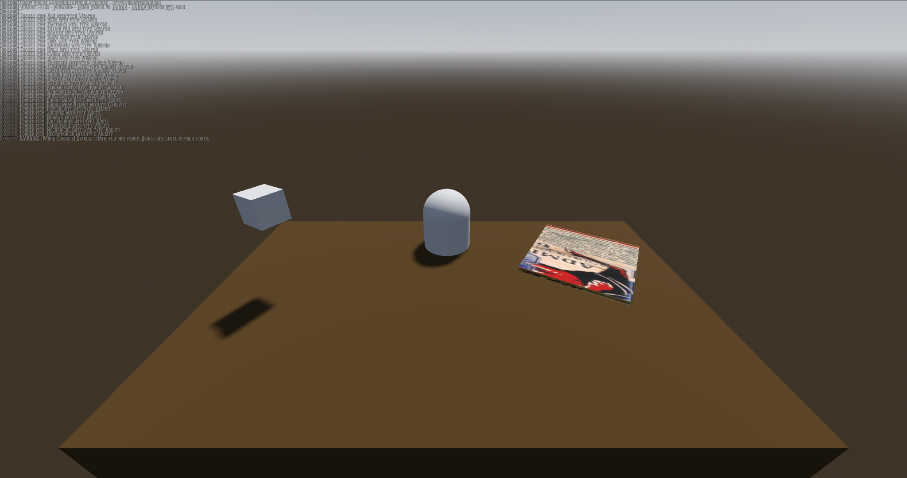
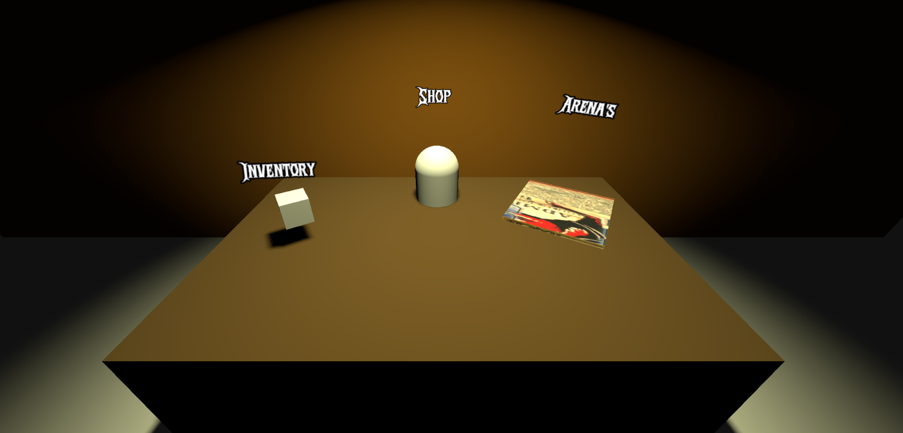
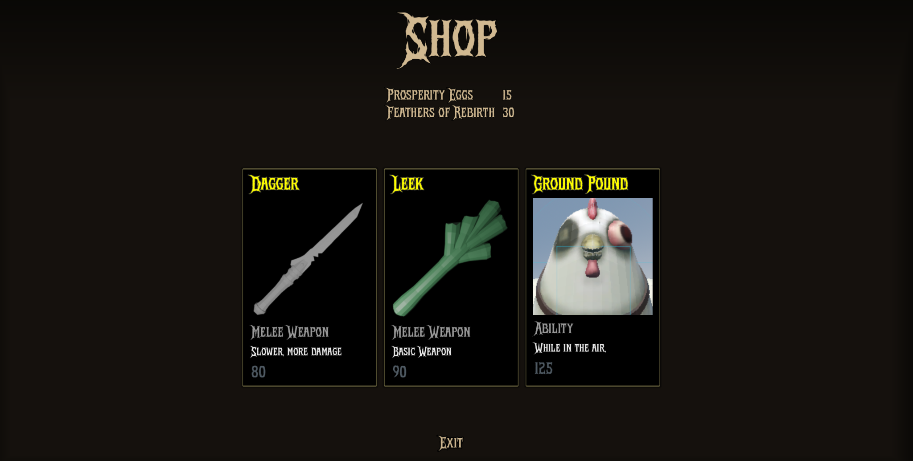
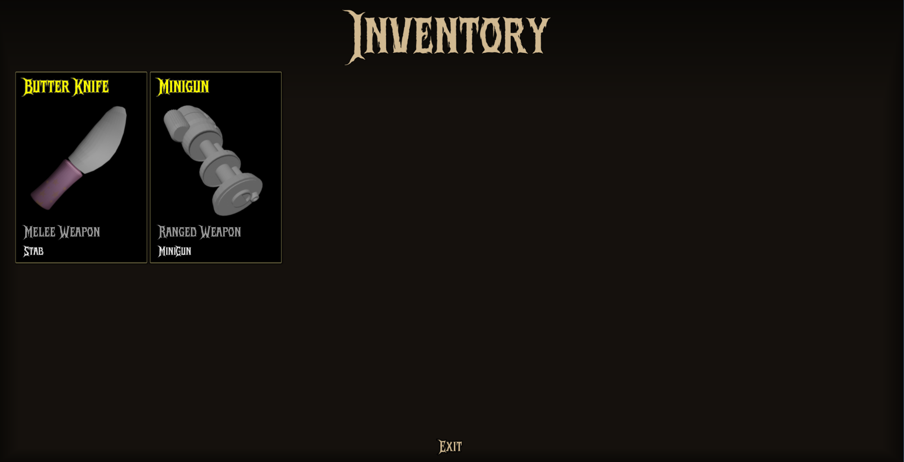
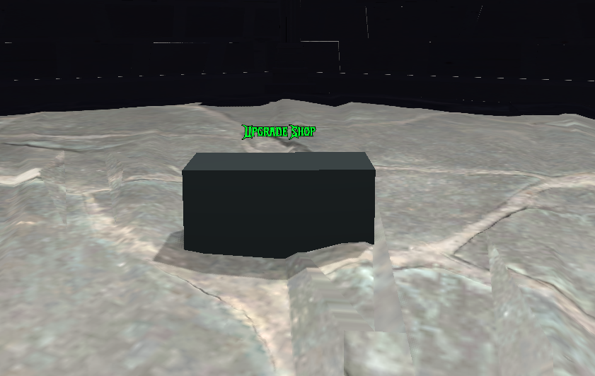
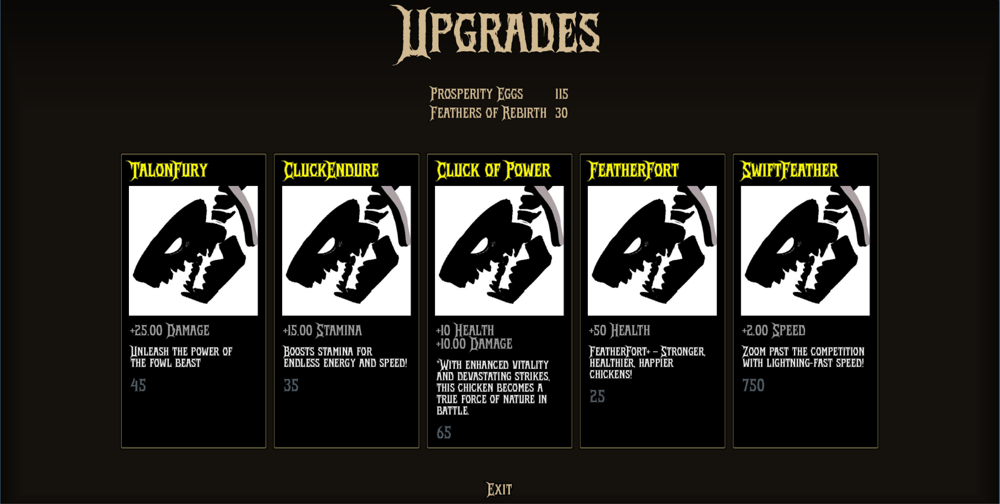

## Poultry Man Menu

The Poultry Man menu serves as an in-game interface where players can interact with various functionalities. Initially, the menu design did not match the intended atmosphere of the game. The latest update enhances the visual and interactive aspects of the menu to better fit the eerie, gritty theme of a scientist mutating and sacrificing chickens.

### Old Version

The Poultry Man menu serves as an in-game interface where players can interact with various functionalities. Initially, the menu design did not match the intended atmosphere of the game. The latest update enhances the visual and interactive aspects of the menu to better fit the eerie, gritty theme of a scientist mutating and sacrificing chickens.

### New Version

To improve the menu and align it with the game’s dark and griddy theme, several enhancements were made: - **Darkened the World**: Instead of an open-sky background, the environment is now much darker, reinforcing the eerie and unsettling atmosphere. - **Added a Wall**: A wall was introduced to enclose the menu area, making it feel more like a confined, eerie laboratory where unethical experiments take place. - **Dynamic Lighting**: A flashing light effect was added to create a more unsettling atmosphere, making the environment feel more alive and foreboding. - **Added Labels**: Labels were introduced to indicate what each item does, providing players with clear information about where each item leads. - **Hover Effects**: When players hover over an item, the label changes color and the node increases in size, making it more visually distinct and responsive. - **Keyboard & Controller Navigation**: Players can now navigate the menu using both a keyboard and a controller.

## Shop System

**Shop Update**
Each weapon comes with its own unique icon for easier browsing, which will extend to abilities at a later point. Additionally, you can now see the amount of currency you currently have, making it simpler to keep track of your spending.

## Inventory System

**Inventory Update**
We’ve made some improvements to the inventory system. Now, the items you’ve purchased will actually spawn within the arena, allowing you to see them in action. The inventory, including currency, gets saved and loaded to disk.

## In Run Upgrade Shop

**In-Arena Upgrade Shop**
Enhance your abilities in every run. In this shop, available only during intermission areas between rounds, you can purchase upgrades for damage, health, and stamina. Strengthen your character and prepare for the next round with enhancements!
