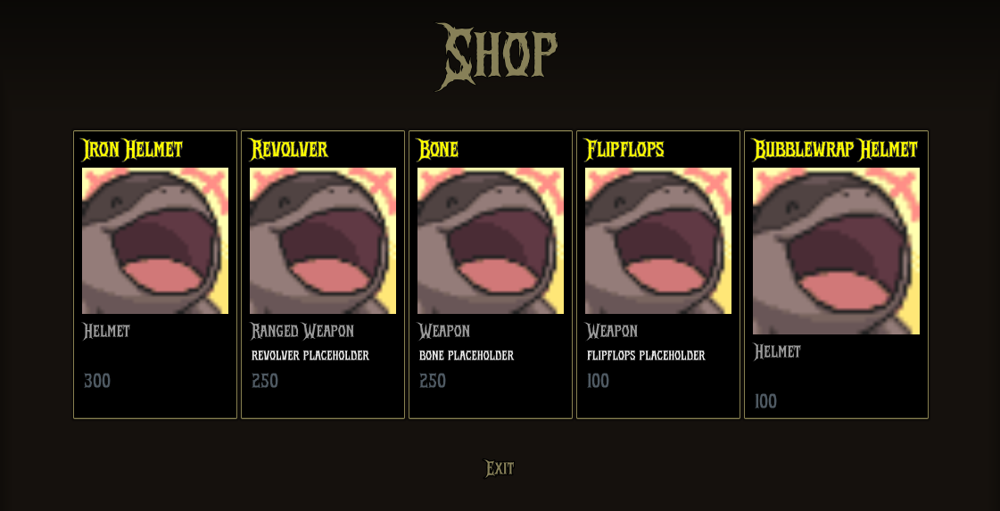
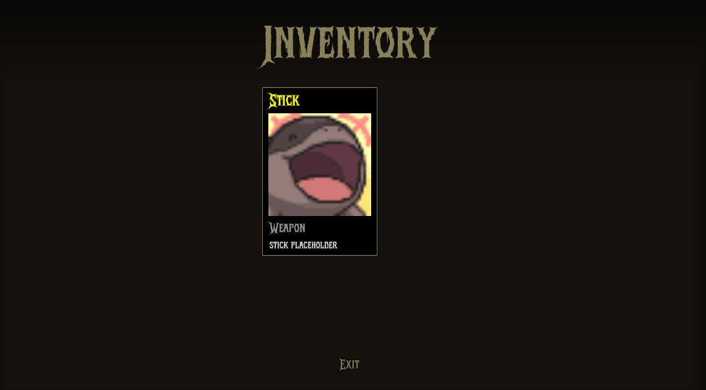
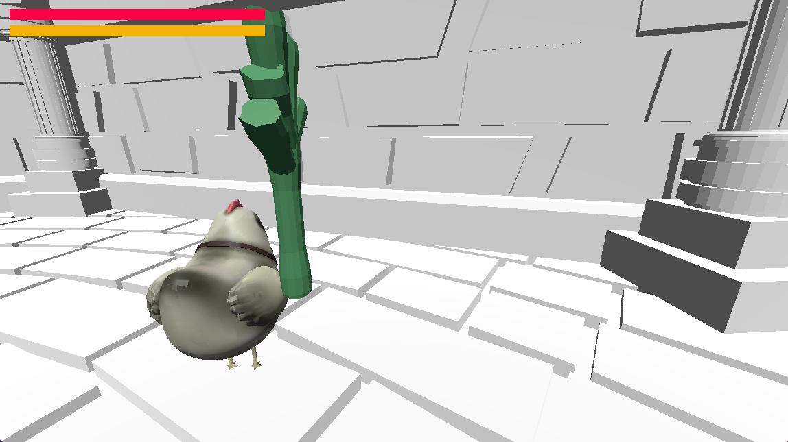

## Presentation

<object
  data="/pitch/Fowl Play - Progress Update.pptx.pdf"
  type="application/pdf"
  width="800"
  height="600"
>
  

    Your browser does not support PDFs.
    <a href="/pitch/Fowl Play - Progress Update.pptx.pdf">Download the PDF</a>.
  

</object>

## Game Systems

### Shop System

**Welcome to the Shop!**

 
Here, players can purchase items such as weapons, abilities, and armor using _Prosperity
Eggs_, the game's unique currency. Once purchased, items will automatically appear
in your inventory.

### Inventory System

**Inventory System**

 
In your inventory, you can view the items you've purchased from the store. Please
note that you can only hold one item per category at a time. Keep in mind that the
items in your inventory do not yet reflect your current loadout in the arena yet.

## Player HUD

### Current HUD

The current in-game HUD is designed to keep essential combat information accessible without cluttering the screen: - **Top Left**: the stamina and health bar. This area is reserved for quick-glance survival stats.
