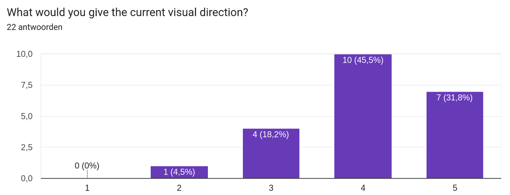
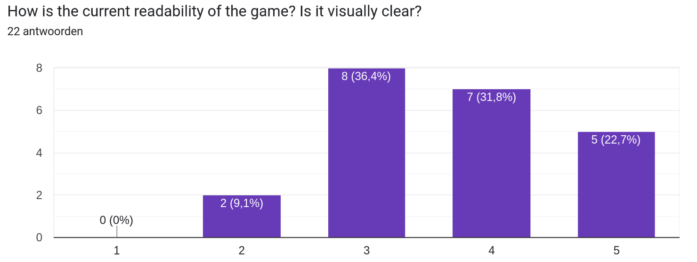

## Playtest One Setup

### Machines

Within the cubicle, we had four laptops set up for playtesting. Two Windows laptops, one Mac, and one Linux.
Each laptop had a controller plugged in, and two had a mouse plugged in as well. The game was set up to be played with a controller, but the mouse was available for those who preferred it. This was important, since controller support was not working 100% yet. The game was set to run in maximized mode, since fullscreen has not been implemented yet.
In order to prevent sonic overload, only one of the laptops was set to play sound. The other three were muted.

### Cubicle decorations

Around the cubicle, we had a [few posters and some concept art on the walls](/fowl-play/production/marketing/playtest-one/#posters). We also had a few chairs set up for the playtesters to sit in.
Some drinks, cups and snacks were available for the playtesters, and of course ourselves.

## Survey

During the playtest, we asked the playtesters to fill out a survey. The survey was created using Google Forms, and was shared with the playtesters via a printed out QR code, hanging on various walls in the cubicle.

<iframe
  src="https://docs.google.com/forms/d/e/1FAIpQLSekoUSli4NRlZTDn4AGLcAp_bXp6uqrl5nsT81-615ngc-GtQ/viewform?embedded=true"
  width="640"
  height="1001"
  frameborder="0"
  marginheight="0"
  marginwidth="0"
  style={{ height: "1001px" }}
>
  Loading…
</iframe>

### Questions

1. **How satisfying was the combat system?**  
   Rationale: Assess overall player satisfaction with the primary gameplay loop and identify whether combat feels rewarding.

2. **Could you elaborate on the answer of the previous question? What did you like and/or dislike about the combat system?**  
   Rationale: Collect qualitative details on specific strengths and weaknesses of the combat—speed, feedback, balance, responsiveness.

3. **Did you try out any abilities, if so what did you think about them and which ones did you use?**  
   Rationale: Determine which abilities players discover and engage with, and evaluate clarity, usefulness, and fun factor of each ability.

4. **How would you describe the current difficulty of the game?**  
   Rationale: Gauge whether the game’s challenge curve is appropriate, too easy, or too punishing, to inform future balance adjustments.

5. **What would you give the current visual direction?**  
   Rationale: Measure player approval of the art style, color palette, and overall aesthetic cohesion.

6. **How is the current readability of the game? Is it visually clear?**  
   Rationale: Verify that on-screen information (UI, enemy telegraphs, visual effects) is legible and unambiguous.

7. **Which aspects of Fowl Play were you satisfied with?**  
   Rationale: Identify positive highlights—features or systems that resonate well and should be preserved or expanded.

8. **How easy was it to navigate through all of the different menus?**  
   Rationale: Test the intuitiveness and responsiveness of the UI navigation and menu flow.

9. **Which aspects of Fowl Play are you unsatisfied with or think can be improved?**  
   Rationale: Pinpoint pain points and areas where polish, clarification, or redesign is needed.

10. **What score would you give the game in the current state?**  
    Rationale: Obtain an overall numeric rating to track playtest-to-playtest improvements.

11. **Do you have any further comments or suggestions?**  
    Rationale: Provide an open-ended outlet for additional ideas, observations, or features not covered by previous questions.

## Feedback

### Feedback GDD

```
Generally, you're GDD is shaping up nicely. The formatting of the document is in order and the production chapter is also already pretty detailed. Maybe move some things to an 'official' appendix, as your table of contents is currently a bit difficult to understand. Separate what's important from attachments/supports.

Sound Design is already giving plenty of insights. Could be a bit more technical and detailed beyond the mood and themes, but other than that it’s doing good.

Game programming could be a bit less descriptive and more insights into implementation instead of concepts. If reads a bit superficial currently.

The Effects and shaders chapter, a chapter about visual effects, has no visuals and only text... Again, try to break things down a little bit more, and describe less. The same goes for the AI chapter.
```

Overall, this means the GDD is in a good state for the first playtest. The GDD is far from finished, and as such a lot of chapters are still lacking details. The feedback we received is very useful, and we will be working on the GDD in the coming weeks to improve it, especially adding more visuals.

### Verbal Feedback Summary

During the playtest, we received a lot of verbal feedback from the playtesters and teachers. General feedback indicated a need for significant balancing adjustments and improvements to combat responsiveness. Key areas identified include:

**Player & Balance:**

- Player survivability is too low; feels "squishy" and dies too easily.
- Weapons, particularly melee, feel underpowered compared to enemies.
- Enemies are significantly stronger and faster than the player.

**Combat Mechanics & Feel:**

- Judging the correct attack distance is difficult.
- Lack of a blocking mechanic forces players into unfavorable trades.
- Weapon range feels inadequate.
- Attack windup animations need improvement for better feedback.
- Players reported taking damage before enemy attack animations visually connect.

**Abilities:**

- Ability usage and requirements are unclear (e.g., Ground Pound needing a jump first).
  - Suggestion: Implement visual guides (like GIFs) on hover to explain ability usage.
- Ability cooldowns need clearer visual indicators in the HUD.

**UI/UX & Gameplay Flow:**

- Keybindings are confusing or not clearly explained.
  - Suggestion: Display keybinds directly on UI icons.
- HUD elements, especially cooldown indicators, are easily overlooked.
- Many players entered the arena without first acquiring a weapon, suggesting issues with player guidance or shop accessibility.
- The weapon "Replace" menu should allow direct clicking on weapon icons instead of relying solely on "Confirm/Cancel" buttons.
- Inventory and Shop menus require explicit "Exit" buttons for clarity.

- **Player Feedback:**
  - There is very little player feedback, in terms of sound and visual effects.

**Bugs:**

- Damage application timing seems disconnected from enemy attack animations.
- The UI is not completely usable with a controller.

**Overall:**

- Focus on balancing player vs. enemy power levels.
- Improve combat responsiveness, animations, and clarity.
- Enhance UI/UX for better communication of game mechanics (keybinds, cooldowns, abilities).
- Implement a tutorial or onboarding process to guide players through the game mechanics and controls.

### Survey Results

Based on 22 responses:

**1. How satisfying was the combat system?**


- Average Rating: 3.18
- Distribution: 1 (2), 2 (5), 3 (5), 4 (9), 5 (1)

**2. Could you elaborate on the answer of the previous question? What did you like and/or dislike about the combat system?**

- **Dislikes:**
  - Attacks are slow, long cooldowns, input delay (leek).
  - Some weapons unusable (no attacking/blocking).
  - Player feels slow/flowy compared to faster enemies.
  - Weapons don't feel strong enough, slower than enemy versions.
  - Minimal damage dealt, high damage received.
  - Little feedback, badly balanced, not dynamic.
  - Breakable AI (standing on enemies).
  - Hard to deal damage without getting hit, hard to judge hit distance.
  - Attack range of enemies.
  - Melee combat unsatisfying.
  - Controls unclear, needed explanation.
- **Likes:**
  - Simple concept.
  - Choices for abilities/powerups.
  - Dodge mechanic.

**3. Did you try out any abilities, if so what did you think about them and which ones did you use?**

- **Abilities Used:**
  - Dodge/Dash (mentioned frequently, liked for speed/helpfulness).
  - Ground Pound (mentioned frequently, liked, sometimes seen as OP/easy, heaviness effect noted).
  - Fire/Flame (seen as cool but potentially OP, unclear self-damage).
  - Lettuce (seen as useless).
  - Minigun (unsatisfactory).
- **General Comments:**
  - Abilities fun but sometimes struggled with usage/intuition.
  - Some couldn't afford abilities.
  - Controls for abilities unclear.
  - Some didn't figure out how to use them.
  - Abilities are powerful.

**4. How would you describe the current difficulty of the game?**


- Average Rating: 3.59
- Distribution: 1 (1), 2 (1), 3 (10), 4 (4), 5 (6)
- **Comments:**
  - Super hard, died instantly.
  - Struggled to stay alive.
  - Too easy or too hard depending on enemy/abilities.
  - Difficult to outrun enemies.
  - Difficulty of the boss.

**5. What would you give the current visual direction?**


- Average Rating: 4.05
- Distribution: 1 (0), 2 (1), 3 (4), 4 (10), 5 (7)

**6. How is the current readability of the game? Is it visually clear?**


- Average Rating: 3.68
- Distribution: 1 (0), 2 (2), 3 (8), 4 (7), 5 (5)

**7. Which aspects of Fowl Play were you satisfied with?**

- The idea/concept (mentioned multiple times).
- Art style/graphics/visuals/designs/models (mentioned frequently).
- Shop randomizer.
- Chickens.
- Scope looks doable.
- Combat (mentioned once, contrasting other feedback).
- Feel of the game/general environment.
- Arena, Movement, Enemy Appearances.
- Dodge mechanic.
- Abilities.
- UI and gameplay (mentioned once).

**8. How easy was it to navigate through all of the different menus?**


- Average Rating: 3.00
- Distribution: 1 (3), 2 (5), 3 (6), 4 (5), 5 (3)
- **Comments:**
  - UI interaction needs improvement.
  - Clunky navigation.
  - Interface needs improvement.
  - Menus need better explanations.
  - Controller controls don't feel amazing.
  - Don't use backspace (likely for navigation).
  - Needs on-screen controls/keybinds.

**9. Which aspects of Fowl Play are you unsatisfied with or think can be improved?**

- Combat (mentioned frequently: speed, cooldowns, balancing, responsiveness, controls, feedback, AI, difficulty, damage).
- Difficulty/Balancing (player vs enemy speed, damage dealt/received).
- Controls (unclear, confusing, controller mapping, button showcase needed).
- UI/UX (HUD clarity, menu navigation, intermission duration, lack of tutorial/explanations, starting in shop).
- Abilities (balancing, clarity).
- Juicing/Sound effects.
- Need for a tutorial.
- Enemy speed.
- Better explanations.

**10. What score would you give the game in the current state?**


- Average Rating: 5.68
- Distribution: 1 (0), 2 (1), 3 (1), 4 (2), 5 (4), 6 (7), 7 (6), 8 (1), 9 (0), 10 (0)

**11. Do you have any further comments or suggestions?**

- Game idea is nice, but struggled with mechanics.
- Fix button mapping.
- Make combat more responsive.
- Some juicing and balancing would be nice.
- Love the chicken.
- Balancing, enemy speed should be more in line with player's speed, better explanations needed.
- After balancing combat, the grade would be way higher.
- More abilities needed.
- Can be a really cool game if combat is improved.
- Good work, hope for story, more arenas, polished/balanced combat.
- Don't use backspace, slower enemies, on-screen controls.
- Warn player if entering fight without a weapon.
- Hen Solo (pun).
- Looking forward to the game once combat feels nicer.
