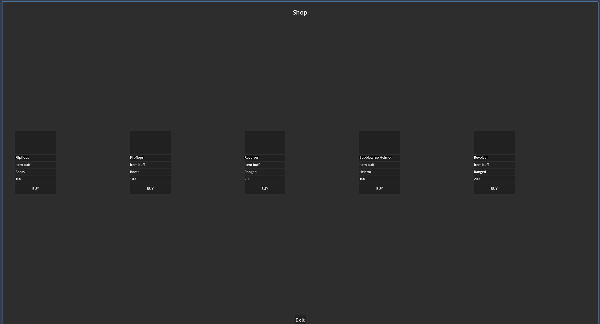
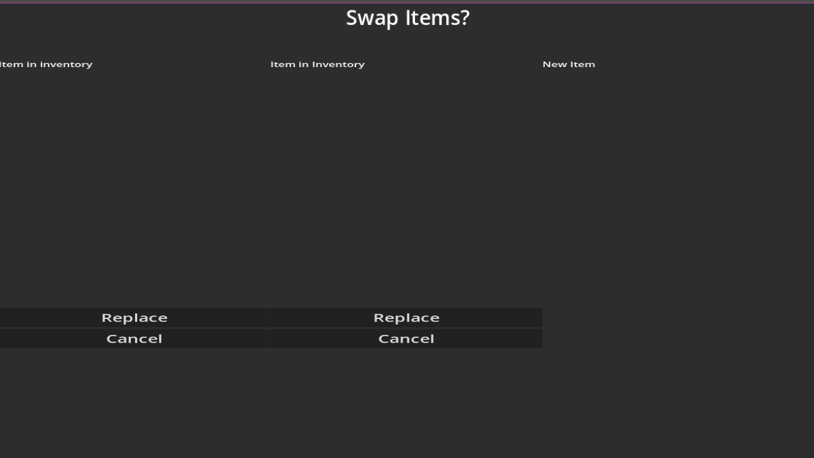

## Implementation shop

Our idea of the shop we wanted to make is an RNG shop that will display 5 different items of different rarity and types.

### Shop UI
To make this I started by making a layout for the UI of the shop. I started by making individual elements to place the items in, however I soon noticed that I would need a single item_template scene and clone it however many item slots we wanted. I needed this because I wanted to add a script to the items to randomly fill in the slots. The following image is how the shop-layout looks when running.



As you can see there are 5 different slots where the name, item buff, type, and cost are displayed with a button to buy the item. This UI is randomly changed every time you open the shop. Later on in the project, we want the shop to be locked and only changed after every arena fight.

The following code is used to refresh the shop 

```gdscript
extends Control
@onready var shop_slots: HBoxContainer = $shop_slots
func _ready():
	randomize()
	refresh_shop()

#Function to refresh the shop
func refresh_shop():
	#loop over the shop_slots to get all the Item_Templates and fill them with a item
	
	for slot in shop_slots.get_children():
		if slot == null:
			print("Error: Found a Nil slot!")
			continue
			
		if slot is Item_Template:
			var random_item = ItemDatabase.get_random_item()
			slot.set_item(random_item)
```
### Item Template

`slot.set_item(random_item)` refers to code inside of the Item_Template scene. In this function I assign the item data to the actual label inside of my item placeholder

```gdscript
extends Control
class_name Item_Template
@onready var item_name: Label = $VBoxContainer/item_name
@onready var item_cost: Label = $VBoxContainer/item_cost
@onready var item_type: Label = $VBoxContainer/item_type

func set_item(item):
	item_name.text = item.name
	item_type.text = item.type
	item_cost.text = str(item.cost)

```
The biggest and most important script in the shop is the ```_on_buy_item_pressed()``` function in the item_template.gd script. This function will handle the buying of an item and putting it in your inventory logic. Some of the decisions we made about inventory rules had big consequences on this method. We decided on capping all items on only one item per slot in the inventory. This means we have to check if an item of a certain type already exists in the inventory and if that is the case we give the user the choice to replace the existing item with the item you are trying to buy (More about the inventory under the Inventory section). Another big decision that had consequences for this method is if there is a difference between abilities since the player is allowed to have 2 abilities. If there is no difference we have an exception for item type ability which needs to be implemented in a way where the user can then proceed to choose to swap out a certain ability for another to maximize the ability to build your own kit. 

In the function, I start by checking if there is already a purchase in progress to make sure the player cannot place multiple orders at the same time causing bugs. Then I check if the player has enough prosperity eggs to purchase the item. If the user has enough prosperity eggs I save the data of the item the player is trying to purchase in a variable. I then call upon the inventory to check if the item type I am trying to purchase already exists. I made an exception for the ability to check if there are already two abilities in the inventory. When the item already exists in the inventory I call upon the ConfirmationPopup scene to show a screen where the player gets to decide on if they want to keep their already purchased item or if they want to replace it for the new item they are trying to buy. When replacing an item or buying an item type that is not yet in your inventory the cost of the item will be subtracted from the prosperity eggs amount and the item will be added to the inventory.

```gdscript
func _on_buy_item_pressed() -> void:
	
	if purchase_in_progress:
		return
		
	#Prevent the purchase from happening multiple times
	purchase_in_progress = true
	
	if Gamemanager.prosperity_eggs >= int(item_cost.text):
		var new_item = {
			"name": item_name.text,
			"type": item_type.text,
			"cost": int(item_cost.text)
		}
		
		var existing_item = Inventory.get_item_by_type(new_item.type)
		
		#Special case for ability type
		if new_item.type == "Ability":
			#check if ability already exists in inventory
			var existing_ability = Inventory.get_item_by_name(new_item.name)
			if existing_ability != null:
				print("Cannot buy the same ability twice!")
				purchase_in_progress = false
				return
				
			if existing_item == null:
				existing_item = []
			elif existing_item is Dictionary:
				existing_item = [existing_item]
				
			if existing_item.size() < 2:
				Inventory.add_item(new_item)
				Gamemanager.update_prosperity_eggs(-int(item_cost.text))	
				print("item bought")
				purchase_in_progress = false
				return
			else:
				#Disconnect any previous signal
				_disconnect_confirmation_signals()
				
				ConfirmationPopup.confirmed.connect(_on_confirmation_accepted)
				ConfirmationPopup.canceled.connect(_on_confirmation_canceled)
				
				ConfirmationPopup.show_confirmation(existing_item, new_item)
			
		#for non-ability types and type ability that has 2 in inventory		
		elif existing_item:
			if ConfirmationPopup:
				_disconnect_confirmation_signals()
				
				ConfirmationPopup.confirmed.connect(_on_confirmation_accepted)
				ConfirmationPopup.canceled.connect(_on_confirmation_canceled)
				
				ConfirmationPopup.show_confirmation(existing_item, new_item)
			
			else:
				print("Error: Confirmation popup not found!")
		
		else:
			Inventory.add_item(new_item)
			Gamemanager.update_prosperity_eggs(-int(item_cost.text))
			print("Item Bought!")
			purchase_in_progress = false
		
	else:
		print("Not enhough proseperity eggs.")
		purchase_in_progress = false
```

### ConfirmationPopup

The confirmation popup will be shown whenever an item-type is bought that already exists in the inventory. The player will normally get the choice to either replace the existing item in the inventory or cancel the transaction if they want to keep their item. When the player tries to buy a third ability they get to choose between the two existing abilities in the inventory on which one they want to replace.




### Item Database

The itemdatabase is a global script where all purchasable items will be stored and their logic will be defined

```gdscript
extends Node

enum Rarity {COMMON, UNCOMMON, RARE, EPIC, LEGENDARY}

var items = [
	{"name": "Stick", "rarity": Rarity.COMMON, "type": "Melee", "cost": 100},
	{"name": "Lake", "rarity": Rarity.COMMON, "type": "Melee", "cost": 100},
	{"name": "Flipflops", "rarity": Rarity.COMMON, "type": "Melee", "cost": 100},
	{"name": "Bone", "rarity": Rarity.COMMON, "type": "Melee", "cost": 100},
	{"name": "Hammer", "rarity": Rarity.UNCOMMON, "type": "Melee", "cost": 200},
	{"name": "Knife", "rarity": Rarity.UNCOMMON, "type": "Melee", "cost": 200},
	{"name": "Frying Pan", "rarity": Rarity.UNCOMMON, "type": "Melee", "cost": 200},
	{"name": "Sword", "rarity": Rarity.RARE, "type": "Melee", "cost": 1000},
	{"name": "Axe", "rarity": Rarity.RARE, "type": "Melee", "cost": 1000},
	{"name": "Lightsaber", "rarity": Rarity.RARE, "type": "Melee", "cost": 1000},
	{"name": "Slingshot", "rarity": Rarity.COMMON, "type": "Ranged", "cost": 100},
	{"name": "Crossbow", "rarity": Rarity.COMMON, "type": "Ranged", "cost": 100},
	{"name": "Revolver", "rarity": Rarity.UNCOMMON, "type": "Ranged", "cost": 200},
	{"name": "Pistol", "rarity": Rarity.UNCOMMON, "type": "Ranged", "cost": 200},
	{"name": "Musket", "rarity": Rarity.UNCOMMON, "type": "Ranged", "cost": 200},
	{"name": "Minigun", "rarity": Rarity.RARE, "type": "Ranged", "cost": 1000},
	{"name": "Sniper", "rarity": Rarity.RARE, "type": "Ranged", "cost": 1000},
	{"name": "Lazet eyes", "rarity": Rarity.RARE, "type": "Ranged", "cost": 1000},
	{"name": "Flamethrower", "rarity": Rarity.RARE, "type": "Ranged", "cost": 1000},
	{"name": "Cap", "rarity": Rarity.COMMON, "type": "Helemt", "cost": 100},
	{"name": "Flipflops", "rarity": Rarity.COMMON, "type": "Boots", "cost": 100},
	{"name": "Bubblewrap Helmet", "rarity": Rarity.COMMON, "type": "Helemt", "cost": 100},
	{"name": "Bubblewrap Boots", "rarity": Rarity.UNCOMMON, "type": "Boots", "cost": 200},
	{"name": "Rollerblades", "rarity": Rarity.RARE, "type": "Boots", "cost": 500},
	{"name": "Jordans", "rarity": Rarity.RARE, "type": "Boots", "cost": 1000},
	{"name": "Helmet", "rarity": Rarity.RARE, "type": "Helmet", "cost": 1000},
	{"name": "Mohawk", "rarity": Rarity.RARE, "type": "Helmet", "cost": 1000},
	{"name": "Helicoter blades", "rarity": Rarity.RARE, "type": "Ability", "cost": 1000},
	{"name": "Mechenical butt", "rarity": Rarity.RARE, "type": "Ability", "cost": 1000},
	{"name": "Chamovlage Mutation", "rarity": Rarity.RARE, "type": "Ability", "cost": 1000},
	{"name": "Necromancer Mutation", "rarity": Rarity.RARE, "type": "Ability", "cost": 1000},
	{"name": "Blink Mutation", "rarity": Rarity.RARE, "type": "Ability", "cost": 1000},
	
]
#Function to get a random item from the list above
func get_random_item():
	var rarity_chances = { Rarity.COMMON: 60, Rarity.UNCOMMON: 30, Rarity.RARE: 10}
	var roll = randi() % 100
	var selected_rarity = Rarity.COMMON
	var cumulative = 0
	#Get a random rarity accordingly to the chances
	for rarity in rarity_chances.keys():
		cumulative += rarity_chances[rarity]
		if roll < cumulative:
			selected_rarity = rarity
			break
			
	print("Selected rarity:", selected_rarity)
	#List of items that match the rarity
	var filtered_items = items.filter(func(item): return item.rarity == selected_rarity)
			
	#Select item
	if filtered_items.size() > 0:
		var selected_item = filtered_items[randi() % filtered_items.size()]
		print("Selected item:", selected_item["name"])
		return selected_item			
		
			
```
In this script, early on I made the choice to use a Dictionary to store all items in so that I could start testing the shop. This system to store all items will later on in the project be replaced by resources. In this script, I made a function ```func get_random_item()``` to return a random item keeping in mind what the rarity chances are.


