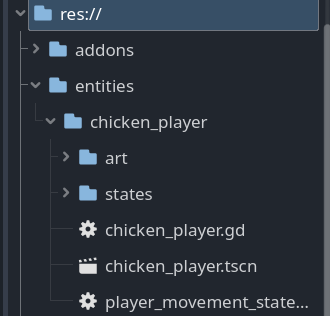

## Cooperation Agreement

### Introduction & Purpose

This agreement is made between the following team members:

<table>
  <tr>
    <td>
      <strong>Name</strong>
    </td>
    <td>
      <strong>Student Number</strong>
    </td>
  </tr>
  <tr>
    <td>Tjorn Brederoo</td>
    <td>22092420</td>
  </tr>
  <tr>
    <td>Nick Frietman</td>
    <td>21055378</td>
  </tr>
  <tr>
    <td>Jun Yi Xie</td>
    <td>22012524</td>
  </tr>
  <tr>
    <td>Sly Moertanom</td>
    <td>22003908</td>
  </tr>
  <tr>
    <td>Finn Korf</td>
    <td>24168025</td>
  </tr>
  <tr>
    <td>Joyce Stoop</td>
    <td>24168556</td>
  </tr>
  <tr>
    <td>Cenker Aydin</td>
    <td>22107177</td>
  </tr>
  <tr>
    <td>Bastiaan Smeets</td>
    <td>22068228</td>
  </tr>
</table>

<table>
  <tr>
    <td>
      <strong>Groupleaders: </strong>
    </td>
    <td>Nick Frietman (1st) and Tjorn Brederoo (2nd)</td>
  </tr>
</table>

The purpose of this agreement is to outline the roles, responsibilities and expectations for the development of our game project as part of our minor at The Hague University of Applied Sciences in Zoetermeer.

##

### Communication

We will be using WhatsApp and Discord as our primary communication platforms for team discussions and updates. For document sharing, we use Google Drive. For code-sharing, we will be using GitHub and for Project Management, we will be using Trello. Project documentation will be maintained and is accessible at [https://docs.studiofishbones.com/](https://docs.studiofishbones.com/).

As of 17 February 2025, we will be at school for meetings and to work on the project on Mondays and Thursdays. If needed, we will plan online or on-location meetings each week.

### Communication Style

Since all team members have Dutch as their first language, most internal communication will be in Dutch. External communication, such as presentations and deliverables, will be in English, in accordance with the course main language.

Within the defined communication platforms, we will be communicating semi-formally. This means joking around is allowed, within limits and the correct channels. Any form of discrimination will not be tolerated. The same goes for crossing each other's boundaries, once a team member defines their boundary, and it gets crossed, appropriate actions will be taken.

The choice for semiformal communication was made to keep a light atmosphere in the group and enhance collaboration and creativity. Communication outside the group will be more formal. All communication, internal and external, will be suitable for school.

### Roles & Responsibilities

All team members are responsible for:

- Attending scheduled meetings
- Completing assigned tasks on time
- Providing feedback and communicating clearly

With clear communication, we mean to communicate any hindrance ahead of time when possible. For example, if one cannot attend a scheduled meeting, they give a heads-up as soon as possible, preferably at least the day before. When someone is sick, they send a message at least an hour before the scheduled meeting, so others are aware.

While each team member will have their primary roles, they are expected to be flexible and help out others when needed. The team members will be categorized in the following categories:

#### Game Design & Producers

1. Nick Frietman
2. Tjorn Brederoo
3. Sly Moertanom
4. Cenker Aydin
5. Bastiaan Smeets

#### Game Programmers

1. Nick Frietman
2. Tjorn Brederoo
3. Jun Yi Xie
4. Sly Moertanom
5. Cenker Aydin
6. Bastiaan Smeets

#### Level & Sound Designers

1. Tjorn Brederoo
2. Finn Korf
3. Joyce Stoop
4. Cenker Aydin

#### Concept Artists

1. Finn Korf
2. Joyce Stoop

#### 3D & Animation

1. Jun Yi Xie
2. Finn Korf
3. Joyce Stoop

#### Storytelling

1. Jun Yi Xie
2. Finn Korf
3. Joyce Stoop
4. Cenker Aydin
5. Bastiaan Smeets

#### Artificial Intelligence

1. Nick Frietman
2. Sly Moertanom
3. Jun Yi Xie
4. Bastiaan Smeets

#### Effects & Shaders

1. Nick Frietman
2. Tjorn Brederoo
3. Sly Moertanom

### Decision-making Process

Important decisions will be made by majority vote (5 out of 8 votes needed). In case of a tie, the group leader will have the final say. Major decisions like game mechanics or deadlines require a full group discussion before voting, whereas minor decisions will be purely decided by their respective subteam. For example, how something is coded doesn’t require the consensus of the entire group, feedback can instead be given once it is posted in GitHub.

### Deadlines & Work Expectations

Tasks and milestones will be set using the following:

- Trello
- Post-it notes in the basement

We expect that each person completes their assigned tasks by the accepted deadline unless circumstances do not allow for this to happen, in which case this should be clearly communicated. We aim for 20–30 hours of work on the project on average per person over the course of the project.

#### Work days

Aside from the agreed upon joint work days, team members are free to plan the rest of their work hours throughout the week. Free time and other priorities are important, but we do expect members to respond within 24 hours during weekdays.

### Sanctions

If a team member fails to meet deadlines or fulfill their responsibilities, the team may issue sanctions. The following sanctions can be given, depending on the occurrence rate and severity of the issue, in order of severity:

1. Treating the group to a drink or snack
2. Group meeting to discuss behavior and potential solutions
3. Group meeting including the coach, discussing behavior and potential solutions

With occurrence, we also take frequency into account. For example, being too late three times within the same week is worse than being too late three times over the span of the entire project.

By building leeway into the sanctions, we as a team can better match each sanction to the specific case. Being half an hour too late is in our eyes less severe than missing a set deadline.

### Intellectual Property (IP) & Ownership

All assets, code, designs, and any other Intellectual Property (IP) created for this project are collectively owned by the entire team, regardless of individual contribution.

Should the project be continued beyond the minor, ownership, and revenue sharing must be discussed and agreed upon in writing by all team members before further use or distribution of any project related assets.

No team members may sell, license, or distribute any project related assets (including but not limited to code, artwork, sound, or designs) independently without the unanimous approval of all other members.

Any adaptations or modifications made to the project beyond the original scope must also be discussed and agreed upon by all team members.

**Opt-Out Clause: **Any team member may voluntarily opt out of the ownership and future involvement of the project, the team member that wants to opt out should communicate this with the team. Upon opting out, the individual gives up their rights to this project and with that any future revenues, and will no longer have a vote on this project-related decisions. Their prior contributions will remain part of the project and subject to collective ownership of the remaining team.

### Conflict Resolution

Disagreements should first be discussed within the team. If no solutions are found, mediation will be sought from the coach (Maarten Yntema). Any toxic behavior, like ghosting or refusing to collaborate, will result in a team discussion on the next steps, and might even be voted out of the group. For example, whenever a member of the team does not show up without any communication or a sufficient reason as to why they did not communicate to the rest of the team, they will get a warning. After three warnings, the coach will be brought to attention. Removal from the group should happen unanimously by the other members and after consultation with the coach.

### Exit & Accountability

If a member wants to leave, they must communicate this with the group beforehand, preferably a week before and after finishing their current assigned tasks. Their work should be documented and handed over to the team. By leaving, the member relinquishes their rights regarding project material.

##

### Agreement Duration & Signatures

This agreement is valid until Friday, June 27, 2025. By signing, each team member agrees to the terms above.

_signatures removed for privacy reasons_

##

## Role Division

Studio Fishbones consists of eight members, of which six have a background in software engineering and two in art. Due to the limited number of artists on our team, the tasks related to art will be kept manageable and realistic to achieve within the project’s scope.

A more detailed overview of what the actual tasks at hand will be for each subject is described in the ‘Planning’ header.

### Game Producers

The game producers are responsible for the following points:

- Making sure everything is submitted on time
- Creating a plan for all the assignments within the project
- Making sure all members in the team maintain the deadlines
- Globally overseeing game creation
- Checking in with all team members regularly

Nick will be the main game producer. 
  Tjorn
 will be the second in command, and take over when Nick is not available.

#### Level Designers

The level Designers are responsible for creating engaging, balanced and immersive game environments. They must consider gameplay flow, challenging placements of traps and enemies and a good pace of the level.

Cenker and 
  Tjorn
 will be responsible for the Level/Arena in Godot.

Finn and 
  Joyce
 will be responsible for making the concept of the Level/Arena in their
Art programs of choice, and Blender for the 3D models.

### Balancing (Play Testing)

By adjusting the composition of certain combat mechanics, player rewards, and overall game progression, it ensures a fair gameplay experience with the right amount of difficulty. Balancing tweaks will be done regularly during programming and after playtests. Play testing will be done regularly by each team member (on a weekly basis), as well as by external testers, such as potential players. The playtest sessions will be managed by Bastiaan.

### Marketing

All members in the team will participate in getting marketing content on [TikTok](https://www.tiktok.com/@studiofishbones), [YouTube](https://www.youtube.com/@studiofishbones), [Instagram](https://www.instagram.com/studiofishbones/), [X](https://x.com/StudioFishbones), [Bluesky](https://bsky.app/profile/studiofishbones.com) and our [Website](https://www.studiofishbones.com/). The ones responsible for certain aspect of the marketing of our game are as followed:

- Creation and management of social media accounts: Tjorn
- Video editing: Jun Yi and Tjorn
- Creation of marketing material: Joyce and Finn
- Social media posting: Nick (coordinator), the rest of the team if necessary.
- Updating studio Fishbones website: Cenker

### Visual Design

For our visual design, Joyce and Finn will be responsible, with Jun Yi as extra help. However, this will be a big task for them since they are our only designers. The programming team will try to make most, if not all, the 2D UI interfaces in Godot themselves. This would leave mainly the 3D art, animations and icons in the game to the art team.

### Sound & Music

Music and sound effects are important to the game's feel. As mentioned previously, this will be hard. Nevertheless the sound and music assets will be created by the following team members:

- SFX design: Finn and Tjorn
- Original soundtrack: Cenker, Joyce and Tjorn

### Game Programming

The game programmers are responsible for making sure the technical aspect of the game is working as intended. Game programming will be handled by all six programmers and the tasks will be divided evenly.

Tjorn and 
  Bastiaan
 have the role of Maintainer within our GitHub organization, which means they
will oversee repository management and the overall development workflow of Fowl Play.

#### Shaders

Shaders are crucial as they improve the visual quality of our game via specialized rendering. With carefully crafted shaders we can improve the lighting, materials, and many unique visual features that set our game apart and can be done without needing a lot of art resources.

Tjorn, Sly and Nick are on the track of Shaders & Effects, but to balance our workloads,

Sly will be the dedicated shader
programmer for our project. We expect the shader creation for our game to be minimal.

#### Effects

Effects will allow players to see the impact of their moves and the strength of their attacks making the game more immersive and satisfying.

Tjorn, Sly and Nick are on the track of Shaders & Effects but to balance our workloads,

Nick will be the main developer for
creating the visual effects for our project.

#### Development of A.I.

Enemy AI is essential for our game because it directly impacts how engaging and challenging the combat rounds will be. Fowl Play is focused on rounds of fights, which means the entire feel of the game breaks if these fights are not enjoyable.

Jun Yi and 
  Sly
 will be responsible for the A.I. in our project, but the entire programming
team will implement various parts, such as state machines.

#### General Development

Beyond the assigned roles, tasks like combat, movement and other gameplay systems will be managed through Trello. Team members can freely choose tasks based on their interest and availability. However, if a task remains unclaimed for too long or has a high priority that needs to be finished, Nick or Tjorn will have the authority to assign a team member to ensure progress continues smoothly.

## Code Conventions

In essence, we will be following the standard Godot code conventions as laid out in [the Godot documentation](https://docs.godotengine.org/en/4.4/tutorials/scripting/gdscript/gdscript_styleguide.html), with some minimal adjustments and additions.

### Language

The entire project will be in English, including variable and file names and comments. The code will be written in GDScript, due to its integrated nature into the Godot editor and the relatively easy syntax. If the performance of GDScript becomes an issue, we will look into using C# for performance heavy parts.

### Naming Convention

<table>
  <tr>
    <td>
      <strong>Type</strong>
    </td>
    <td>
      <strong>Convention</strong>
    </td>
    <td>
      <strong>Example</strong>
    </td>
  </tr>
  <tr>
    <td>File names</td>
    <td>snake_case</td>
    <td>player_character.gd</td>
  </tr>
  <tr>
    <td>Folder names</td>
    <td>snake_case</td>
    <td>player_character</td>
  </tr>
  <tr>
    <td>Class names</td>
    <td>PascalCase</td>
    <td>PlayerCharacter</td>
  </tr>
  <tr>
    <td>Node names</td>
    <td>PascalCase</td>
    <td>Player</td>
  </tr>
  <tr>
    <td>Functions</td>
    <td>snake_case</td>
    <td>move_and_slide()</td>
  </tr>
  <tr>
    <td>Variables</td>
    <td>snake_case</td>
    <td>player_speed</td>
  </tr>
  <tr>
    <td>Signals</td>
    <td>snake_case + past tense</td>
    <td>animation_finished</td>
  </tr>
  <tr>
    <td>Constants</td>
    <td>CONSTANT_CASE</td>
    <td>MAX_HEALTH</td>
  </tr>
  <tr>
    <td>Enum names</td>
    <td>PascalCase</td>
    <td>ItemType</td>
  </tr>
  <tr>
    <td>Enum members</td>
    <td>CONSTANT_CASE</td>
    <td>ITEM_SWORD</td>
  </tr>
</table>

### Code Order

<table>
  <tr>
    <td>1</td>
    <td># docstring</td>
  </tr>
  <tr>
    <td>2</td>
    <td>tool</td>
  </tr>
  <tr>
    <td>3</td>
    <td>class_name</td>
  </tr>
  <tr>
    <td>4</td>
    <td>extends</td>
  </tr>
  <tr>
    <td>5</td>
    <td>Signals (when not in the signal manager)</td>
  </tr>
  <tr>
    <td>6</td>
    <td>enums</td>
  </tr>
  <tr>
    <td>7</td>
    <td>constants</td>
  </tr>
  <tr>
    <td>8</td>
    <td>exported variables</td>
  </tr>
  <tr>
    <td>9</td>
    <td>public variables</td>
  </tr>
  <tr>
    <td>10</td>
    <td>private variables</td>
  </tr>
  <tr>
    <td>11</td>
    <td>onready variables</td>
  </tr>
  <tr>
    <td>12</td>
    <td>optional built-in virtual _init method</td>
  </tr>
  <tr>
    <td>13</td>
    <td>built-in virtual _ready method</td>
  </tr>
  <tr>
    <td>14</td>
    <td>remaining built-in virtual methods</td>
  </tr>
  <tr>
    <td>15</td>
    <td>public methods</td>
  </tr>
  <tr>
    <td>16</td>
    <td>private methods</td>
  </tr>
</table>

### Coding Style

All code should be statically typed, including explicit return type declarations. This improves code reliability and helps catch errors early. Most importantly, it improves Godot performance.

String literals should be avoided as much as possible. This means that instead of directly embedding strings within your code, you should define them as constants or enums. GDScript tends to rely heavily on strings, for example with group names.

Godot has a global script feature in the form of Autoload. Autoloads should exclusively be used for code that is actually needed globally, such as signals and currency count. When possible, put the code outside of an autoload.

### File Structure

For example, the Player folder will contain the `player.tscn`, `player.gd` and subfolders for player art:

By adopting this folder structure, all relevant assets for a game object are logically grouped. When working on an entity like an enemy, you'll often need to modify various aspects. If art assets were completely separated from the scripts and scene files, navigating through multiple, deeply nested folders to find and manage these related components would become a significant distraction. This localized structure keeps everything within easy reach.

### Comments

Code should be descriptively commented to explain the ‘why’ behind the code, not just the ‘what’. Use comments to explain:

- The purpose of a function or method.
- Any assumptions or constraints.
- Potential side effects.

Avoid commenting obvious code or simply restating what the code already says. Keep comments concise and up-to-date. Explaining code in more detail, especially the “why”, should be done on the documentation site.

##

## GitHub Repository

The [codebase of Fowl Play will be hosted on GitHub](https://github.com/Fishbones-Studio/fowl-play) and can be accessed by everyone. We choose GitHub for its collaboration features and version control.

### Workflow Management

We use GitHub's project management features to maintain an organized workflow. This includes:

- **Labels**: Categorize issues and PRs by type, priority, and status
- **Milestones**: Group related issues and PRs toward specific project goals
- **Pull Requests**: Submit code changes for review before merging
- **Issues**: Track bugs, enhancements, and tasks
- **Code Reviews**: Ensure quality through peer review

### Branch Naming

Each branch should start with its type and have a descriptive name, using kebab-case:

- **feature**: For new features.
- **fix**: For bug fixes.
  - **hotfix**: For important small and quick changes
- **refactor**: For code refactoring.
- **docs**: For documentation changes.

### Pull Requests

To maintain a structured and efficient workflow, we have created a _`pull_request.md`_ template for each member to use, along with defined detailed guidelines for pull requests:

1. **Title**: Use a clear, descriptive title that summarizes the changes
2. **Description**: Follow the provided template, including:
   - Summary of changes
   - Screenshots for UI changes
   - The type of change, as mentioned in the branch name.
   - Link to matching Trello/GitHub issue
3. **Size**: Keep PRs focused on a single issue
4. **Reviews**: Require at least one approving review before merging
5. **Merge Strategy**: Use squash merging to maintain a clean history
   - Merge to the correct branch, which is `dev` most times.

### Label Usage

Within our GitHub repository, we have added a variety of labels to help categorize pull requests and issues. This system allows our programmers to quickly identify the focus of each task, ensuring a more organized and efficient workflow. The following labels are used to classify different types of work:

1. **AI** - For tasks related to artificial intelligence (e.g., NPC behavior, pathfinding).
2. **Animation** - For tasks related to character animations, cutscenes, or procedural animations.
3. **Assets** - Creation of asset or modification.
4. **Audio** - Music, sound effects, and audio implementation..
5. **Bug** - Something isn't working.
6. **Combat** - Issues related to combat mechanics (if applicable).
7. **Documentation** - Improvements or additions to documentation.
8. **Duplicate** - This issue or pull request already exists.
9. **Enhancement** - Suggested improvements to existing features or gameplay.
10. **Feature** - For requests or work related to adding a new feature.
11. **Help wanted** - Extra attention is needed.
12. **Physics** - Physics, collisions, or related systems.
13. **Priority** - Indicates the urgency of an issue.
14. **Refactor** - Code refactoring without changing functionality.
15. **Regression** - Issues where a previously fixed bug reappears or functionality stops working after a change.
16. **UI/UX** - For issues related to the user interface and user experience design.
17. **Won't fix** - This will not be worked on.

## Planning

As a team, our goal is to complete all core functionality and have a fully playable version of our game by week 14. The remaining weeks will be used for polishing, bug fixing, and refining key aspects of the game, including art, audio, and gameplay balance to ensure the game is ready for launch.

### Milestones

These are our project goals, which we as a team aim to have completed within the specified timeframe. It helps us track our progress and ensure that we stay on schedule to achieve our objectives throughout the project.

#### Progression Checkpoint

This is our first milestone for the project. The goal for this milestone is to establish the core gameplay features and showcase the key elements of the game. The deadline for this milestone is _March 30th in week 6_.

- Complete all basic player mechanics (movement and combat)
- Finish initial 3D models for player character and enemies
- Implement UI fundamentals
- Present vertical slice demonstrating core gameplay loop
  - Playable fight in an arena
- Team review and update on project status

#### Play Testing 1

This is our second milestone for the project. The goal for this milestone is to have a playable version of our game. The deadline for this milestone is _April 20th in week 10_.

- Arena implementation complete
- Basic enemy AI functioning
- Core gameplay systems operational
- UI shop and upgrade systems working
- Environmental hazards implemented
- Player data saving/loading functional
- First formal playtest with external testers

#### Play Testing 2

This is our third milestone for the project. The goal for this milestone is to finalize all gameplay elements and enter the polishing phase. The deadline for this milestone is _May 18th in week 14_.

- All enemy AI behaviors finalized
- Complete effect & shader implementation
- Music and sound design integration
- All menu functions operational
- Second round of playtesting with external testers
- Begin polish phase

#### Finalization and Polishing

This is our fourth milestone for the project. The goal for this milestone is to ensure the game is fully polished and ready for launch. The deadline for this milestone is _June 22nd in week 19_.

- Bug fixing and performance optimization
- Final balancing adjustments
- Final visual additions and changes
- Final build preparation
  - Deliverable/launch in week 18
- Expo preparations

###

### Tasks/Epics

<table>
  <tr>
    <td>
      <strong>Requirement</strong>
    </td>
    <td>
      <strong>Department</strong>
    </td>
    <td>
      <strong>Deadline</strong>
    </td>
  </tr>
  <tr>
    <td>3D Model Chicken</td>
    <td>Art</td>
    <td>Week 5</td>
  </tr>
  <tr>
    <td>Player Movement Mechanics</td>
    <td>Programming</td>
    <td>Week 5</td>
  </tr>
  <tr>
    <td>3D Enemy Models & Animations</td>
    <td>Art</td>
    <td>Week 6</td>
  </tr>
  <tr>
    <td>Player Combat Mechanics</td>
    <td>Programming</td>
    <td>Week 6</td>
  </tr>
  <tr>
    <td>UI Art</td>
    <td>Art</td>
    <td>Week 6</td>
  </tr>
  <tr>
    <td>Basic Chicken Animations</td>
    <td>Programming</td>
    <td>Week 7</td>
  </tr>
  <tr>
    <td>Environmental Hazards Props</td>
    <td>Art</td>
    <td>Week 7</td>
  </tr>
  <tr>
    <td>Attachments Functions</td>
    <td>Programming</td>
    <td>Week 7</td>
  </tr>
  <tr>
    <td>Arena Design</td>
    <td>Art</td>
    <td>Week 8</td>
  </tr>
  <tr>
    <td>UI Functions (Shop / Upgrades)</td>
    <td>Programming</td>
    <td>Week 8</td>
  </tr>
  <tr>
    <td>Equipment Effects Visual</td>
    <td>Art</td>
    <td>Week 8</td>
  </tr>
  <tr>
    <td>Temporary Upgrades</td>
    <td>Programming</td>
    <td>Week 8</td>
  </tr>
  <tr>
    <td>Temporary Upgrades to UI (Assets)</td>
    <td>Art</td>
    <td>Week 8</td>
  </tr>
  <tr>
    <td>Environmental Hazards</td>
    <td>Programming</td>
    <td>Week 9</td>
  </tr>
  <tr>
    <td>Equipment Effect Function</td>
    <td>Programming</td>
    <td>Week 9</td>
  </tr>
  <tr>
    <td>Arena Implementation</td>
    <td>Programming</td>
    <td>Week 10</td>
  </tr>
  <tr>
    <td>Main Menu Functions</td>
    <td>Programming</td>
    <td>Week 10</td>
  </tr>
  <tr>
    <td>Saving Player Data</td>
    <td>Programming</td>
    <td>Week 10</td>
  </tr>
  <tr>
    <td>Loading Player Data</td>
    <td>Programming</td>
    <td>Week 10</td>
  </tr>
  <tr>
    <td>Icons (for Items, Skills, etc.)</td>
    <td>Art</td>
    <td>Week 12</td>
  </tr>
  <tr>
    <td>AI for Enemies</td>
    <td>Programming</td>
    <td>Week 13</td>
  </tr>
  <tr>
    <td>Main Menu Art</td>
    <td>Art</td>
    <td>Week 13</td>
  </tr>
  <tr>
    <td>Shaders</td>
    <td>Programming</td>
    <td>Week 14</td>
  </tr>
  <tr>
    <td>Effects</td>
    <td>Programming</td>
    <td>Week 14</td>
  </tr>
  <tr>
    <td>Music</td>
    <td>Music and Sound Design</td>
    <td>Week 19</td>
  </tr>
  <tr>
    <td>SFX</td>
    <td>Music and Sound Design</td>
    <td>Week 19</td>
  </tr>
</table>
