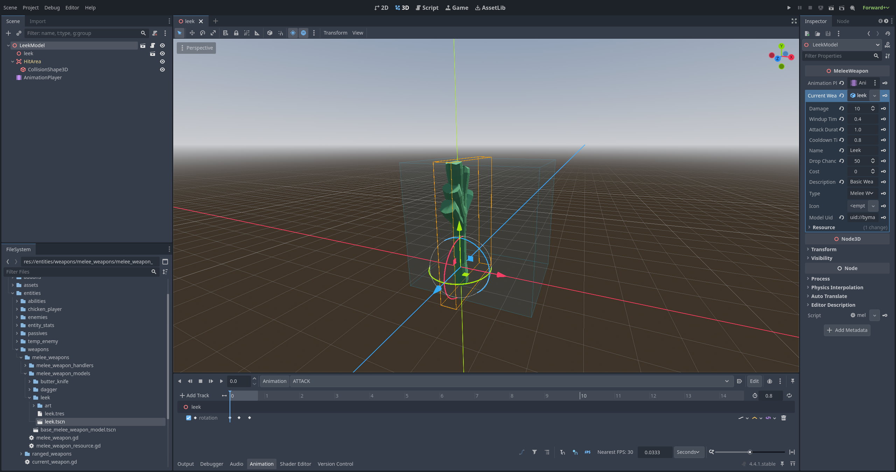

## Why This Approach?

The melee weapon system is structured this way for several reasons:

- **Inheritance from base scene**: Using inheritance ensures all melee weapons share the same core functionality and removes some duplication.
  - The `AnimationPlayer` can not be put in the base scene, since each weapon needs different animations.
- **Standardized folder structure**: Organizing weapons in dedicated subfolders keeps the project tidy and makes it easier to find and manage assets as the number of weapons grows. It also allows us to loop over the folders, so new weapons can automatically be loaded in.
- **Resource-based design**: Using `MeleeWeaponResource` separates the weapon's properties from its visual side. This makes balancing easier and allows weapons to persist in save files, without complex serialization, since resources can be directly saved to disk in Godot.
  - Pre-saving the weapon resources as .tres files significantly improves loading times in shop inventories.

This architecture makes it easy to add new weapons without modifying core game systems or needing to specify each new model location somewhere.

## Folder Structure

All new melee weapons should be placed in a new subfolder in `entities/weapons/melee_weapons/melee_weapon_models`, so following this folder structure:

## Create the melee weapon scene

Within the `entities/weapons/melee_weapons/melee_weapon_models` folder, there is a scene called `base_melee_weapon_model.tscn`.

### Step-by-step process:

1. **Create an inherited scene**

   - Right-click on `base_melee_weapon_model.tscn` and select "New Inherited Scene"
   - Save it in a new subfolder with a descriptive name (e.g., `leek`)
   - Within the new subfolder, import or create an art file for the `.glb` 3D model

2. **Add required nodes to the scene**

   - Add the `.glb` asset as a child of the root node
     - Scale it accordingly
   - Add an `AnimationPlayer` node if not already present
     - Create animations for the weapon states as needed
   - Under the `HitArea` node, add a `CollisionShape3D`
     - Shape it to match the weapon's striking area (e.g., blade for swords)
     - Adjust the size and position to match the visual representation

3. **Configure the weapon properties**

   - Select the scene root node
   - Assign the `AnimationPlayer` to the appropriate property
   - Create a new `MeleeWeaponResource` under the "Current Weapon" property
     - Fill in the fields.
       - **Model UID**: It is important to copy over the UID of the weapon scene, for save/load functionality
4. **Save the resource file (Recommended)**

   - Save the `MeleeWeaponResource` as a `.tres` file in the same folder
   - This improves shop loading performance, since loading a `.tres` file is faster than instantiating the weapon scene to get the required properties

5. **Test your weapon**
   - Verify animations play correctly and hit detection works as expected
   - Check that damage values are appropriate for game balance

Your new melee weapon should automatically be loaded in the shop and other weapon-selection interfaces throughout the game. When done, the weapon should look something like this:

## Best Practices

- Create consistent scale relative to other weapons
- Balance new weapons against existing ones
  - Make sure the new weapon is not just a rehash of a different one.
- Use descriptive names for your weapon folders and resources
