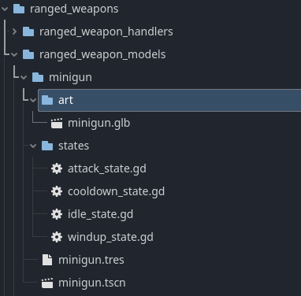
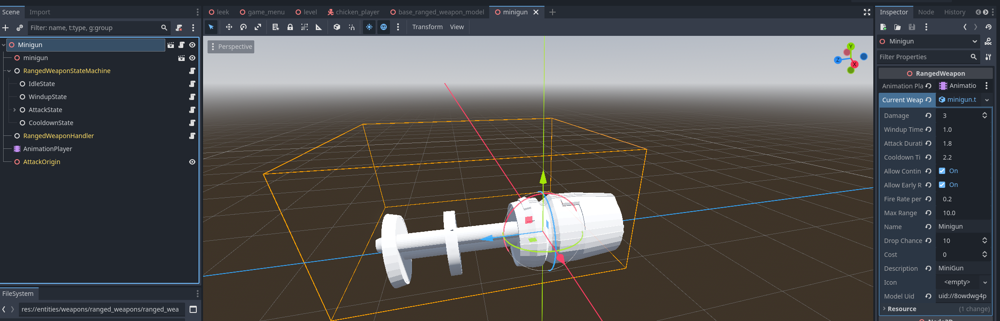

Ranged weapons are a bit more complicated to implement than [melee weapons](/guides/create-melee-weapon/), but the same principles apply. The main difference is, that with ranged weapons, the state machine is on the weapon itself, rather than the player. This is done to make each ranged weapon unique, since it allows for more complex weapon mechanics.

## Why This Approach?

The ranged weapon system is structured this way for several reasons:

- **Inheritance from base scene**: Using inheritance ensures all ranged weapons share the same core functionality and removes some duplication.
  - The `AnimationPlayer` can not be put in the base scene, since each weapon needs different animations.
- **Standardized folder structure**: Organizing weapons in dedicated subfolders keeps the project tidy and makes it easier to find and manage assets as the number of weapons grows. It also allows us to loop over the folders, so new weapons can automatically be loaded in.
- **Resource-based design**: Using `RangedWeaponResource` separates the weapon's properties from its visual side. This makes balancing easier and allows weapons to persist in save files, without complex serialization, since resources can be directly saved to disk in Godot.
  - Pre-saving the weapon resources as .tres files significantly improves loading times in shop inventories.
    This architecture makes it easy to add new weapons without modifying core game systems or needing to specify each new model location somewhere.

## Folder Structure

All new ranged weapons should be placed in a new subfolder in `entities/weapons/ranged_weapons/ranged_weapon_models`, following the same folder structure as melee weapons, but with a states directory:

## Create the ranged weapon scene

Within the `entities/weapons/ranged_weapons/ranged_weapon_models` folder, there is a scene called `base_ranged_weapon_model.tscn`.

### Step-by-step process:

1. **Create an inherited scene**
   - Right-click on `base_ranged_weapon_model.tscn` and select "New Inherited Scene"
   - Save it in a new subfolder with a descriptive name (e.g., `minigun`)
   - Within the new subfolder, import or create an art file for the `.glb` 3D model
   - Create a new folder called `states` within the weapon folder
     - This is where the weapon's states will be stored
   - `AttackOrigin` is the node that will be used to spawn the projectile
     - It is important to set the position of this node correctly, since the attacks will be spawned at this position
2. **Add required nodes to the scene**
   - Add the `.glb` asset as a child of the root node
     - Scale it accordingly
   - Add an `AnimationPlayer` node if not already present
     - Create animations for the weapon states as needed
   - Under the `HitArea` node, add a `CollisionShape3D`
     - Shape it to match the weapon's striking area (e.g., barrel for guns)
     - Adjust the size and position to match the visual representation
   - Create a new Node under the state machine for each state (e.g., `idle`, `aiming`, `attacking`, etc.)
     - Save them in the `states` folder
     - Make sure to set the default state in the state machine
     - Should look something like:
       
3. **Configure the weapon properties**
   - Select the scene root node
   - Assign the `AnimationPlayer` to the appropriate property
   - Create a new `RangedWeaponResource` under the "Current Weapon" property
     - Fill in the fields.
       - **Model UID**: It is important to copy over the UID of the weapon scene, for save/load functionality
       - **Damage**: Set the damage value for the weapon
       - **Range**: Define the effective range of the weapon
       - **Fire Rate**: Specify how quickly the weapon can fire
4. **Save the resource file (Recommended)**
   - Save the `RangedWeaponResource` as a `.tres` file in the same folder
     - This improves shop loading performance, since loading a `.tres` file is faster than instantiating the weapon scene to get the required properties
5. **Test your weapon**
   - Verify animations play correctly and hit detection works as expected
