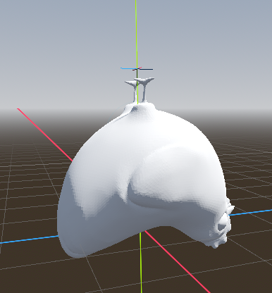

## Introduction

Studio Fishbones presents: **Prototype Chicken Fighter**, a low-poly 3D arena fighting game developed as part of a minor at **The Hague University of Applied Sciences in Zoetermeer**.

In this prototype, we are focusing on building the core **battle system** for the game, where your chicken will fight it out with 3D combat. The game is being developed in **Godot Engine 4.3** with a **low-poly aesthetic**, aiming for a fun and chaotic brawler experience.

This prototype serves as the foundation for future gameplay features, where we plan to add more depth to the chicken fighters and their abilities.

## Setup Guide

To get **Prototype Chicken Fighter** up and running locally, follow these steps:

### 1. Clone the Repository

First, clone the repository to your local machine:

```bash
git clone https://github.com/Fishbones-Studio/ChickenFighterPrototype.git
```

### 2. Open the project in godot

After cloning the repo, open the project in **Godot Engine**:

Launch Godot and open the `chickenfighterprototype` folder in the project folder.

### 3. Run the Game

You can now run the prototype from within Godot by clicking the `Play` button (or pressing `F5`).

## Gameplay Screenshots

### Battle Arena


_The low-poly battle arena in action._

### Chicken Fighter


_Your mighty chicken fighter, ready for battle._

### Main Enemy

The current main enemy is just an upside down chicken, using the same model as the player.

_The current main enemy for our mighty chicken to fight against._

### Prototype video


## Code for Our Game

### 1. **Player Script (`player.gd`)**

The **Player Script** controls the player's movement, jumping, sprinting, and stamina. It utilizes the `CharacterBody3D` class in Godot for movement and physics.

#### Key Functionalities:

##### 1. Movement

The player's movement is handled using the `transform.basis` of the character, which corresponds to the directions (forward, backward, left, right) relative to the character's rotation. The player's direction is updated based on input, and movement is applied accordingly.

```gdscript
func move_forward():
    direction -= transform.basis.z
```

the node goes forward

```gdscript
func move_backward():
    direction += transform.basis.z
```

the node goes backwards

```gdscript
func move_left():
    direction -= transform.basis.x
```

the node goes left

```gdscript
func move_right():
    direction += transform.basis.x
```

the node goes right

##### 2. Stamina

The stamina system is designed to add a layer of strategy to gameplay by limiting the player's ability to sprint and forcing them to manage their stamina during fights.

```gdscript
func check_if_sprint(delta: float):
    if Input.is_action_pressed("sprint") and STAMINA > 0:
        is_sprinting = true
        SPEED = SPRINT_SPEED
        sprint_timer += delta
        if sprint_timer >= 1.0:
            STAMINA -= STAMINA_DRAIN_RATE
            STAMINA = max(STAMINA, 0)
            sprint_timer = 0.0
```

This code handles stamina draining when the player is sprinting. If the sprint button is pressed and there is stamina, the player will sprint, and stamina will decrease over time.

```gdscript
else:
    SPEED = NORMAL_SPEED
    is_sprinting = false
    sprint_timer += delta
    if sprint_timer >= 1.0:
        STAMINA += STAMINA_RECOVER_RATE
        STAMINA = min(STAMINA, MAX_STAMINA)
        sprint_timer = 0.0

```

When the player is not sprinting, stamina recovers. The code increases stamina over time until it reaches the maximum value, ensuring the player can't exceed their stamina limit.

##### 3. Jump

```gdscript
func handle_jump():
	if Input.is_action_just_pressed("jump") and is_on_floor():
		velocity.y = JUMP_VELOCITY
```

with this code the node will jump

### 2. **Enemy Script (`enemy.gd`)**

The **Enemy Script** controls the behavior of the enemy, including its movement toward the player. It extends the `CharacterBody3D` class in Godot, similar to the player script, to handle movement and physics interactions.

#### Key Functionalities:

**Movement Toward the Player**: The enemy constantly tracks the player's position and moves toward it, using a simple path-following system.

```gdscript
@onready var player = get_node("../Player")
```

tells what node he needs to target

```gdscript
func _physics_process(delta):
    if player:
        move_towards_player(delta)
```

This function checks if the player exists and, if so, calls the movement function to move the enemy toward the player.

```gdscript
func move_towards_player(delta):
    var direction = (player.global_position - global_position).normalized()
    velocity = direction * SPEED
    move_and_slide()
```

In this part, the enemy calculates the direction toward the player's position and updates its velocity to move toward the player. The movement is smoothed out using **move_and_slide()** to ensure fluid motion.

This basic enemy AI allows the enemy to chase the player in the game world, creating a simple but functional threat for the player to deal with.

---

### 3. Hazard


_For this prototype, we added a single hazard type: Spikes._

#### Spikes

Spikes are a static hazard placed in the arena. When the player comes into contact with the spikes, they take damage. This is done through a signal in `enemy.gd`, to ensure separation of concern:

```gdscript
extends StaticBody3D

@export var DAMAGE: int = 5

func _on_spike_area_body_entered(body: Node3D) -> void:
	if body is ChickenPlayer:
		SignalManager.hurt_player.emit(DAMAGE)
```

Which is then connected to the `health_component.gd` and reflected in the ui.

```gdscript
extends Node3D

@export var MAX_HEALTH := 100.0
var health : float

func _ready():
	health = MAX_HEALTH
	SignalManager.hurt_player.connect(_on_damage_taken)

func _process(_delta):
	if health <= 0:
		die()

func die():
	get_parent().queue_free()

func _on_damage_taken(damage: int):
	health -= damage
```

##### Behavior:

- **Damage on Contact:** If the player's character collides with the spikes, the player's health is reduced.
- **Static Placement:** The spikes are placed in fixed locations within the arena and do not move.
- **Visual Feedback:** The player receives feedback, a knock back effect.

---

## Future Features to Be Added

### 1. _Combat System for the Player and Enemy_

Currently, the player and enemy only move around the arena. In the future, we plan to implement a **combat system** where both the player and the enemy can perform attacks, block, and interact with each other in combat.

#### Key Features to Add:

- **Player Attacks**: The player will be able to perform basic attacks, such as punches or kicks, that deal damage to enemies.
- **Enemy Attacks**: The enemy will also have attacks that can damage the player, requiring the player to dodge or block.
- **Health System**: Both the player and enemy will have health bars that decrease when they are hit by attacks.
- **Hit Detection**: The combat system will involve collision detection to ensure that attacks land and cause damage properly.

This feature will create a more dynamic gameplay experience where players can engage in intense battles with enemies.

---

### 2. _Lock-On System_

To enhance combat and provide better targeting during battles, we plan to implement a **lock-on system**. This will allow the player to focus on a specific enemy, keeping them in view even as they move around the arena.

#### Key Features to Add:

- **Lock-On Mechanic**: When activated, the camera will focus on the locked-on enemy, and the player’s controls will adjust to make it easier to track and fight that enemy.
- **Camera Adjustments**: The camera will adjust to keep the locked-on enemy in the center of the screen.
- **Switching Targets**: Players will be able to switch between enemies if multiple foes are present in the arena.
- **Lock-On Indicator**: A UI element will show the player which enemy is currently locked on, giving them clear feedback.

The lock-on system will improve combat precision and make it easier for the player to focus on specific enemies in chaotic battles.

---

### 3. _Random Objects Around the Arena_

To make the arena more dynamic and challenging, we plan to introduce multiple **random objects** that can appear during combat. These objects will hinder the player's movement or provide new strategic opportunities for both the player and enemies.

#### Key Features to Add:

- **Obstacles**: Random objects, such as rocks, boxes, or barrels, will spawn in the arena. These can block the player’s movement.
- **Hazards**: Certain objects could deal damage to the player or enemy if they are hit or interacted with (e.g., spikes or a bear trap).
- **Interactive Objects**: Some objects may be moved or interacted with by the player, such as pushing a crate to block an enemy's path.
- **Dynamic Arena**: The placement of these objects will be random, ensuring that each battle in the arena feels unique.

These objects will add variety to each match, creating opportunities for environmental tactics and making each battle unpredictable.

---

These features will enhance the game's complexity and provide a more engaging experience for the player as they face off against enemies in ever-changing environments.

## Conclusion

This is just the beginning of our **Prototype Chicken Fighter**. Our focus was on getting the basic combat, movement, and enemy behavior working. There’s still a lot we would like to add, like upgrades/mutations, an economy, and an egg-hatching system where you can get different kinds of chickens. We also would like to add a fun, interactive UI where the player can manage their fleet of mighty chickens. This prototype gave us a good start, and we are excited to keep working on it and make the game even better.
