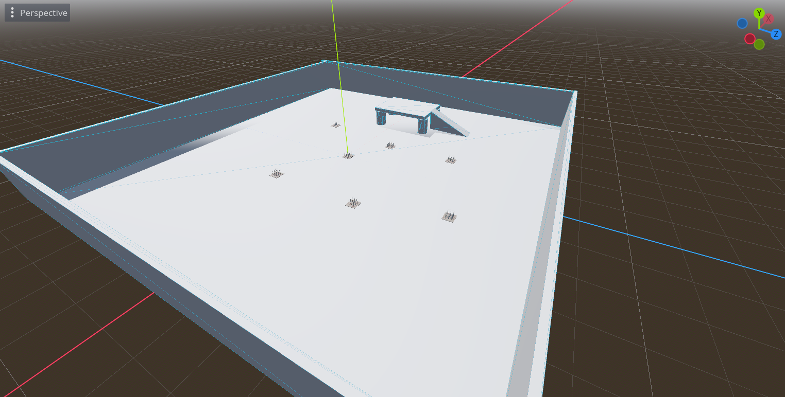
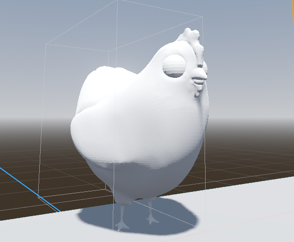
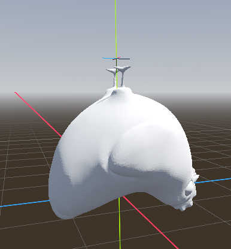

## Introduction

Fishbones Studio presents **Prototype Chicken Fighter**, a low-poly 3D arena fighting game developed as part of a minor at **De Haagse Hogeschool in Zoetermeer**.

In this prototype, we are focusing on building the core **battle system** for the game, where your chicken will fight it out with a 3D combat. The game is being developed in **Godot Engine 4.3** with a **low-poly aesthetic**, aiming for a fun and chaotic brawler experience.

This prototype serves as the foundation for future gameplay features, where we plan to add more depth to the chicken fighters and their abilities.

## Setup Guide

To get **Prototype Chicken Fighter** up and running locally, follow these steps:

### 1. Clone the Repository
First, clone the repository to your local machine:
```bash
git clone https://github.com/Fishbones-Studio/ChickenFighterPrototype.git
```
### 2. Open the project in godot

After cloning the repo, open the project in **Godot Engine**:

Launch Godot and open the `chickenfighterprototype` folder in the project folder.

### 3. Run the Game

You can now run the prototype from within Godot by clicking the `Play` button (or pressing `F5`).


## Gameplay Screenshots

### Battle Arena

*The low-poly battle arena in action.*

### Chicken Fighter

*Your mighty chicken fighter, ready for battle.*

### Main Enemy

*The current main enemy for the chickens to fight against.*

## Code for Our Game

### 1. **Player Script (`player.gd`)**

The **Player Script** controls the player's movement, jumping, sprinting, and stamina. It utilizes the `CharacterBody3D` class in Godot for movement and physics.

#### Key Functionalities:

##### 1. **Movement**
The player's movement is handled using the `transform.basis` of the character, which corresponds to the directions (forward, backward, left, right) relative to the character's rotation. The player's direction is updated based on input, and movement is applied accordingly.

```gd
func move_forward():
    direction -= transform.basis.z
```
the node goes forward

```gd
func move_backward():
    direction += transform.basis.z
```
the node goes backwards

```gd
func move_left():
    direction -= transform.basis.x
```
the node goes left

```gd
func move_right():
    direction += transform.basis.x
```

the node goes right

##### 2. **Stamina**
The stamina system is designed to add a layer of strategy to gameplay by limiting the player's ability to sprint and forcing them to manage their stamina during fights.

```gd
func check_if_sprint(delta: float):
    if Input.is_action_pressed("sprint") and STAMINA > 0:
        is_sprinting = true
        SPEED = SPRINT_SPEED
        sprint_timer += delta
        if sprint_timer >= 1.0:
            STAMINA -= STAMINA_DRAIN_RATE
            STAMINA = max(STAMINA, 0)
            sprint_timer = 0.0
```
This code handles stamina draining when the player is sprinting. If the sprint button is pressed and there is stamina, the player will sprint, and stamina will decrease over time.

```gd
else:
    SPEED = NORMAL_SPEED
    is_sprinting = false
    sprint_timer += delta
    if sprint_timer >= 1.0:
        STAMINA += STAMINA_RECOVER_RATE
        STAMINA = min(STAMINA, MAX_STAMINA)
        sprint_timer = 0.0

```
When the player is not sprinting, stamina recovers. The code increases stamina over time until it reaches the maximum value, ensuring the player can't exceed their stamina limit.

##### 2. **Jump**

```gd
func handle_jump():
	if Input.is_action_just_pressed("jump") and is_on_floor():
		velocity.y = JUMP_VELOCITY
```
with this code the node will jump

### 2. **Enemy Script (`enemy.gd`)**

The **Enemy Script** controls the behavior of the enemy, including its movement toward the player. It extends the `CharacterBody3D` class in Godot, similar to the player script, to handle movement and physics interactions.

#### Key Functionalities:

 **Movement Toward the Player**: The enemy constantly tracks the player's position and moves toward it, using a simple path-following system.


```gd
@onready var player = get_node("../Player")
```
tells what node he needs to target

```gd
func _physics_process(delta):
    if player:
        move_towards_player(delta)
```
This function checks if the player exists and, if so, calls the movement function to move the enemy toward the player.

```gd
func move_towards_player(delta):
    var direction = (player.global_position - global_position).normalized()
    velocity = direction * SPEED
    move_and_slide()
```
In this part, the enemy calculates the direction toward the player's position and updates its velocity to move toward the player. The movement is smoothed out using **move_and_slide()** to ensure fluid motion.

This basic enemy AI allows the enemy to chase the player in the game world, creating a simple but functional threat for the player to deal with.

## Future Features to Be Added

### 1. **Combat System for the Player and Enemy**

Currently, the player and enemy only move around the arena. In the future, we plan to implement a **combat system** where both the player and the enemy can perform attacks, block, and interact with each other in combat.

#### Key Features to Add:
- **Player Attacks**: The player will be able to perform basic attacks, such as punches or kicks, that deal damage to enemies.
- **Enemy Attacks**: The enemy will also have attacks that can damage the player, requiring the player to dodge or block.
- **Health System**: Both the player and enemy will have health bars that decrease when they are hit by attacks.
- **Hit Detection**: The combat system will involve collision detection to ensure that attacks land and cause damage properly.
- **Cooldowns/Timers**: Attacks will have cooldowns to prevent spamming, making combat more strategic.

This feature will create a more dynamic gameplay experience where players can engage in intense battles with enemies.

---

### 2. **Lock-On System**

To enhance combat and provide better targeting during battles, we plan to implement a **lock-on system**. This will allow the player to focus on a specific enemy, keeping them in view even as they move around the arena.

#### Key Features to Add:
- **Lock-On Mechanic**: When activated, the camera will focus on the locked-on enemy, and the player’s controls will adjust to make it easier to track and fight that enemy.
- **Camera Adjustments**: The camera will adjust to keep the locked-on enemy in the center of the screen.
- **Switching Targets**: Players will be able to switch between enemies if multiple foes are present in the arena.
- **Lock-On Indicator**: A UI element will show the player which enemy is currently locked on, giving them clear feedback.

The lock-on system will improve combat precision and make it easier for the player to focus on specific enemies in chaotic battles.

---

### 3. **Random Objects Around the Arena**

To make the arena more dynamic and challenging, we plan to introduce **random objects** that can appear during combat. These objects will hinder the player's movement or provide new strategic opportunities for both the player and enemies.

#### Key Features to Add:
- **Obstacles**: Random objects, such as rocks, boxes, or barrels, will spawn in the arena. These can block the player’s movement or act as cover.
- **Hazards**: Certain objects could deal damage to the player or enemy if they are hit or interacted with (e.g., explosive barrels or spikes).
- **Interactive Objects**: Some objects may be moved or interacted with by the player, such as pushing a crate to block an enemy's path.
- **Dynamic Arena**: The placement of these objects will be random, ensuring that each battle in the arena feels unique.

These objects will add variety to each match, creating opportunities for environmental tactics and making each battle unpredictable.

---

These features will enhance the game's complexity and provide a more engaging experience for the player as they face off against enemies in ever-changing environments.


## Conclusion

**Prototype Chicken Fighter** is just the beginning of an exciting project, focusing on building the core gameplay mechanics for an engaging, chaotic, and fun chicken-themed fighting game. In this prototype, we've focused on the basic movement system, stamina management, and setting the stage for future features such as combat, AI enhancements, and interactive environments.

While the current prototype is limited, it serves as a foundation for expanding the game's depth and providing a more dynamic and thrilling experience. As we continue development, we plan to implement various features like a combat system, lock-on mechanics, and environmental objects that can influence gameplay, with the ultimate goal of creating a fully immersive, fast-paced fighter.

We welcome feedback, suggestions, and contributions as we work to refine and expand **Prototype Chicken Fighter** into a more complete and polished game.

Thank you for taking the time to explore the prototype! Stay tuned for updates as we continue to develop and improve the game.
